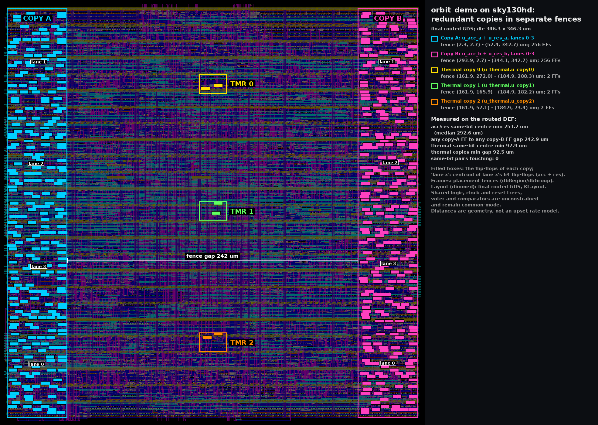

# Copy-separated layout: orbit_demo on sky130hd

Generated by `scripts/pdsep_summary.py` (`make pd-sep-report`) from the routed run `build/pd_sep/results/sky130hd/orbit_demo/sep/` and the unconstrained baseline of the pd area (`build/pd/results/sky130hd/orbit_demo/base/6_final.def`, `reports/pd/sky130hd/checks.json`).

## Result

- Separation targets on the final routed DEF: **all met**.
- Copy A vs copy B (every accumulator/result pair): same-bit centre distance min **251.2 um** (target >= 20), median of the group medians 292.6 um; smallest edge gap between any copy-A and any copy-B flip-flop of a group **242.9 um** (target >= 10).
- Thermal triple: same-bit centre distance min **97.9 um**; smallest edge gap between flip-flops of different copies **92.5 um**.
- Same-bit pairs in touching or overlapping cells: **0** of 262 (baseline: 13).
- Timing: clock period **7.20 ns**, setup WNS 0.031 ns, hold WNS 0.436 ns (baseline 7.00 ns, WNS 0.066 ns).
- Flow checks (pd/collect_pd.py, read-only): setup timing PASS, hold timing PASS, max slew/cap/fanout PASS, detailed-route DRC PASS, antenna PASS, KLayout DRC PASS, KLayout LVS PASS, LEC synth vs post-CTS repair PASS, LEC synth vs final PASS, storage audit (6_final.v) PASS, final GDS written PASS. None failing.
- Post-route gate-level simulation (pd/gls harness, zero-delay: checks function and the per-copy fault injection, not timing): GLS PASS: 30000 cycles, 0 mismatches.

## Method

**Mechanism: OpenDB placement fences (`dbRegion` + `dbGroup`).** `pd/sky130hd_sep/regions.tcl` runs as the ORFS `POST_FLOORPLAN_TCL` hook, i.e. at the end of the floorplan step, after the core rows exist and before tap cells, PDN and any placement. It creates one region per copy (`odb::dbRegion_create`, one `odb::dbBox_create` box snapped to the site grid and row boundaries, type EXCLUSIVE = DEF `FENCE`) and one group per region (`odb::dbGroup_create`), and adds the instances of the kept `orbit_keep_reg` copies to their group by hierarchical name. It checks the flip-flop count of every group against docs/SPEC.md section 7 (256/256/2/2/2) and stops the flow otherwise.

What honours the fences (measured, not assumed):

- `global_placement` (both the `-skip_io` pass and the timing/routability-driven pass) builds one Nesterov region per group and places the members inside their box; the fence areas are only discouraged for top-level cells, not forbidden: in the mechanism test 44 non-member cells were still fully inside a fence after global placement (0 after detailed placement).
- `detailed_placement` (placement, the CTS re-legalisations and the global-route repair legalisation) keeps every member fully inside its box and pulls a member that was moved out back in. Non-members are kept from being placed fully inside a fence, but they may still overlap a fence edge with part of their width, from either side of the edge (clock-tree, port and repair buffers and a few logic cells next to the fences do; see the counts under Separation). None of them is a redundant flip-flop.
- `improve_placement` (ORFS `ENABLE_DPO`, detailed-placement optimisation) does **not** keep the placement legal with the fences: in the mechanism test its own row-segment model already needs 163 um of X movement to fit the fenced rows (DPL-0200/0201 below), and `check_placement` fails after it (overlapping and off-site cells); in an exploratory run with INCLUSIVE regions it moved 47 of 1560 members out of their region. The separated flow therefore sets `ENABLE_DPO=0`.

Mechanism test (`make pd-sep-mechanism`: `scripts/pdsep_mechanism_test.tcl` adds the fences to the unconstrained baseline's pin-placed database and runs the ORFS placement steps; published as `mechanism_test.txt`):

```
MECH regions: 5 (pdsep_copyA, pdsep_copyB, pdsep_th0, pdsep_th1, pdsep_th2)
MECH after global_placement                 members inside their fence 1560, outside   0; non-members fully inside a fence  44, straddling a fence edge  46
MECH after detailed_placement               members inside their fence 1560, outside   0; non-members fully inside a fence   0, straddling a fence edge  80
MECH after detailed_placement: check_placement passed
[WARNING DPL-0200] Unexpected displacement during legalization.
[WARNING DPL-0201] Placement check failure during legalization.
MECH after improve_placement (DPO)          members inside their fence 1560, outside   0; non-members fully inside a fence   0, straddling a fence edge  15
[WARNING DPL-0005] Overlap check failed (2).
[WARNING DPL-0011] Padding check failed (2).
[WARNING DPL-0006] Site aligned check failed (28).
[ERROR DPL-0033] detailed placement checks failed during check placement.
MECH after improve_placement (DPO): check_placement FAILED (DPL-0033)
MECH after restoring the legal placement    members inside their fence 1560, outside   0; non-members fully inside a fence   0, straddling a fence edge  80
MECH forced g_lane[0].u_lane.u_acc_a/q[0]$_SDFFE_PN0P_ to 318780 171360 (inside the copy-B fence)
MECH after the forced move                  members inside their fence 1559, outside   1; non-members fully inside a fence   0, straddling a fence edge  80
MECH after re-legalisation                  members inside their fence 1560, outside   0; non-members fully inside a fence   0, straddling a fence edge  80
MECH moved flip-flop now at (37.26, 174.08) um
MECH after re-legalisation: check_placement passed
```

Differences from the baseline flow (pd/sky130hd), all in `pd/sky130hd_sep/`:

| Setting | Baseline | Separated | Why |
|---|---|---|---|
| `POST_FLOORPLAN_TCL` | none | `regions.tcl` | creates the fences |
| `ENABLE_DPO` | 1 (default) | 0 | `improve_placement` breaks legality with fences |
| `SLEW_MARGIN` / `CAP_MARGIN` | none | 20 / 20 % | long comparator/OR-tree nets left post-route max-slew/cap violations without a margin (run e7) |
| clock period | 7.0 ns | 7.2 ns | shortest period that closes with the fences (see Timing) |

Everything else is the same: same RTL, same `SYNTH_KEEP_MODULES` so every copy stays a distinct kept instance (the storage audit re-checks all 521 flip-flops on the routed netlist), same `CORE_UTILIZATION`/aspect ratio/margin (same die), same SDC apart from the clock period, same pin, CTS and routing settings. Shared logic (multipliers, adders, comparators, voter, control) is not constrained.

## Floorplan

Die 346.295 x 346.295 um, core 341.780 x 340.000 um (baseline die 346.295 x 346.295 um). Regions as written in the routed DEF (`REGIONS`/`GROUPS`), coordinates in um from the die origin:

| Region | Holds | Box (x0, y0) - (x1, y1) | Size (um) | Cells in group | Flip-flops |
|---|---|---|---|---|---|
| pdsep_copyA | Copy A of every accumulator/result pair (u_acc_a + u_res_a, lanes 0-3) | (2.30, 2.72) - (52.44, 342.72) | 50.1 x 340.0 | 768 | 256 |
| pdsep_copyB | Copy B of every accumulator/result pair (u_acc_b + u_res_b, lanes 0-3) | (293.94, 2.72) - (344.08, 342.72) | 50.1 x 340.0 | 768 | 256 |
| pdsep_th0 | Thermal state copy 0 (u_thermal.u_copy0) | (161.92, 272.00) - (184.92, 288.32) | 23.0 x 16.3 | 8 | 2 |
| pdsep_th1 | Thermal state copy 1 (u_thermal.u_copy1) | (161.92, 165.92) - (184.92, 182.24) | 23.0 x 16.3 | 8 | 2 |
| pdsep_th2 | Thermal state copy 2 (u_thermal.u_copy2) | (161.92, 57.12) - (184.92, 73.44) | 23.0 x 16.3 | 8 | 2 |

Gaps between the fences (edge to edge, um):

| Regions | Gap |
|---|---|
| pdsep_copyA / pdsep_copyB | 241.50 |
| pdsep_copyA / pdsep_th0 | 109.48 |
| pdsep_copyA / pdsep_th1 | 109.48 |
| pdsep_copyA / pdsep_th2 | 109.48 |
| pdsep_copyB / pdsep_th0 | 109.02 |
| pdsep_copyB / pdsep_th1 | 109.02 |
| pdsep_copyB / pdsep_th2 | 109.02 |
| pdsep_th0 / pdsep_th1 | 89.76 |
| pdsep_th0 / pdsep_th2 | 198.56 |
| pdsep_th1 / pdsep_th2 | 92.48 |

Arrangement (not to scale):

```
+--------+----------------------------------+--------+
|        |            [TMR 0]               |        |
| COPY A |   shared: multipliers, adders,   | COPY B |
| acc_a  |   comparators, control, voter    | acc_b  |
| res_a  |            [TMR 1]               | res_b  |
| lanes  |                                  | lanes  |
|  0-3   |            [TMR 2]               |  0-3   |
+--------+----------------------------------+--------+
```



Each copy group holds the complete kept copy: its flip-flops and the per-copy load-enable/reset gates (`mux2i`/`nor2b`) that `orbit_keep_reg` synthesises to (the synthesis buffers that ORFS removes before global placement leave 768 cells per acc/res copy group). Buffers added later by the resizer and CTS are not group members.

## Separation before / after

Measured on the final routed DEFs by `scripts/pdsep_separation.py` (independent of the pd area's `pd/copy_separation.py`, which was also run read-only on the separated DEF: `copy_separation_pd_script.txt`, which agrees; its line 'Placement was NOT constrained' is fixed text of that script, written for the baseline). Centre = centre to centre; gap = edge to edge between cell boxes.

| Group | Pair | Centroid dist. before / after | Same-bit centre min before / after | Same-bit centre median before / after | Same-bit touching before / after | Min gap any FF of one copy to any FF of the other, before / after |
|---|---|---|---|---|---|---|
| Accumulator lane 0 | A vs B | 17.3 / 291.0 | 3.56 / **262.67** | 24.67 / 291.55 | 1 / 0 | 0.00 / **243.80** |
| Accumulator lane 1 | A vs B | 26.9 / 289.0 | 2.76 / **254.85** | 30.69 / 289.10 | 3 / 0 | 0.00 / **243.40** |
| Accumulator lane 2 | A vs B | 46.2 / 292.9 | 2.87 / **252.55** | 55.16 / 293.58 | 1 / 0 | 0.00 / **244.26** |
| Accumulator lane 3 | A vs B | 29.5 / 288.3 | 6.10 / **253.37** | 30.83 / 288.54 | 1 / 0 | 0.00 / **243.34** |
| Result lane 0 | A vs B | 24.1 / 292.4 | 2.87 / **261.87** | 24.52 / 290.88 | 3 / 0 | 0.00 / **244.50** |
| Result lane 1 | A vs B | 32.3 / 290.0 | 7.43 / **251.17** | 27.86 / 295.42 | 0 / 0 | 0.00 / **243.40** |
| Result lane 2 | A vs B | 46.3 / 296.0 | 2.76 / **255.82** | 53.08 / 295.71 | 2 / 0 | 0.00 / **243.58** |
| Result lane 3 | A vs B | 33.4 / 293.4 | 4.58 / **251.17** | 30.72 / 293.70 | 1 / 0 | 0.00 / **242.94** |
| Thermal TMR | 0 vs 1 | 8.8 / 100.7 | 5.52 / **97.92** | 9.26 / 100.82 | 0 / 0 | 2.72 / **92.54** |
| Thermal TMR | 0 vs 2 | 5.5 / 206.7 | 5.74 / **206.72** | 5.83 / 206.72 | 1 / 0 | 0.00 / **201.31** |
| Thermal TMR | 1 vs 2 | 11.0 / 106.1 | 10.97 / **103.62** | 11.48 / 106.21 | 0 / 0 | 8.16 / **97.92** |

All copy-A flip-flops vs all copy-B flip-flops (any lane): min edge gap 0.00 um before, 242.94 um after. Group members outside their fence: 0. Non-member cells (excluding fill and tap cells) fully inside a fence: 2 (diode_2 2); these are antenna-repair diodes, which the router's antenna repair inserts after placement without looking at the fences; straddling a fence edge: 107 (clkbuf_16 43, clkdlybuf4s50_1 22, clkbuf_8 12, clkbuf_1 11, buf_4 5, bufinv_16 2, a211oi_4 1, a21oi_1 1).

Non-member cells overlapping each fence (fill and tap cells excluded): pdsep_copyA 53 (origin inside the fence 53, largest overlap 23.8 um^2 = 95 % of `clkbuf_leaf_12_clk` (clkbuf_16)); pdsep_copyB 42 (origin inside the fence 1, largest overlap 23.8 um^2 = 95 % of `clkbuf_leaf_23_clk` (clkbuf_16)); pdsep_th0 5 (origin inside the fence 2, largest overlap 7.5 um^2 = 86 % of `_6363_` (xor2_1)): `_6363_` (xor2_1), `_6587_` (a22o_1), `place1641` (buf_4), `_6786_` (xnor3_1), `place1782` (buf_4); pdsep_th1 3 (origin inside the fence 2, largest overlap 23.8 um^2 = 95 % of `clkbuf_0_clk` (clkbuf_16)): `clkbuf_0_clk` (clkbuf_16), `_6324_` (a211o_1), `_6741_` (nand4_1); pdsep_th2 6 (origin inside the fence 2, largest overlap 6.3 um^2 = 83 % of `rebuffer2153` (buf_4)): `rebuffer2153` (buf_4), `_4057_` (a21oi_2), `_4058_` (xnor2_2), `_4056_` (a21oi_1), `_4027_` (a211oi_4), `place1819` (buf_4).

Acceptance check on the routed DEF: **PASS** (every target met).

## Timing

Final: period 7.20 ns (138.9 MHz), setup WNS 0.031 ns / TNS 0.000 ns, hold WNS 0.436 ns / TNS 0.000 ns, STA fmax 139.5 MHz, clock skew 0.054 ns. Baseline: 7.00 ns, WNS 0.066 ns, STA fmax 144.2 MHz.

Runs (from `period_exploration.md`; `sep` is the production run of `make pd-sep` with the committed constraint, the others are exploration runs with `scripts/run_pd_sep.sh --variant ... --floorplan ... --period ...`; runs without a margin predate the `SLEW_MARGIN`/`CAP_MARGIN` setting):

| Variant | Floorplan | Slew/cap repair margin | Period (ns) | Setup WNS (ns) | Setup TNS (ns) | Hold WNS (ns) | STA fmax (MHz) | Route DRC | Max slew/cap viol. | Wirelength (um) | Cell area (um^2) | Power (mW, default activity) | Status |
|---|---|---|---|---|---|---|---|---|---|---|---|---|---|
| e7 | edges | none | 7.00 | -0.140 | -2.117 | 0.438 | 140.1 | 0 | 6/3 | 244090 | 63901 | 54.91 | FAILS |
| e71 | edges | 20% | 7.10 | -0.094 | -0.731 | 0.423 | 139.0 | 0 | 0/0 | 248308 | 62621 | 52.92 | FAILS |
| e72 | edges | 20% | 7.20 | 0.031 | 0.000 | 0.436 | 139.5 | 0 | 0/0 | 244368 | 62300 | 52.11 | CLOSED |
| sep | edges | 20% | 7.20 | 0.031 | 0.000 | 0.436 | 139.5 | 0 | 0/0 | 244368 | 62300 | 52.11 | CLOSED |
| m7 | mid | none | 7.00 | -0.101 | -1.475 | 0.441 | 140.8 | 0 | 0/0 | 227040 | 64005 | 55.68 | FAILS |

Worst setup path: `in_a[27] (input port clocked by clk)` -> `g_lane[3].u_lane.u_res_a/q[29]$_SDFFE_PN0P_`, slack 0.03 ns (MET); full path in `worst_setup_path.txt`.

### Why the period changed

Best closed period with the fences (floorplan `edges`, same flow settings): **7.2 ns** (138.9 MHz), against 7.0 ns (142.9 MHz) for the unconstrained baseline, i.e. 2.8 % lower clock frequency. The next shorter period tried, 7.1 ns, fails (setup WNS -0.094 ns).

The worst path is the same kind of path as in the baseline: an input port through the shared 8x8 multiplier of a lane and the copy's 32-bit adder into an accumulator/result flip-flop. Baseline: `in_a[29]` -> `g_lane[3].u_lane.u_res_a/q[30]$_SDFFE_PN0P_`, 27 cells, 440 um travelled (Manhattan distance summed from the port through every cell of the path), data arrival 7.44 ns. Separated: `in_a[27]` -> `g_lane[3].u_lane.u_res_a/q[29]$_SDFFE_PN0P_`, 30 cells, 501 um travelled, data arrival 7.73 ns against 7.76 ns required at 7.2 ns (port at x = 346 um, flip-flop at x = 44 um).

At the baseline's 7.0 ns (run e7, same floorplan, slew/cap repair margin none) the worst path `in_a[31]` -> `g_lane[3].u_lane.u_acc_a/q[30]$_SDFFE_PN0P_` travels 641 um and arrives at 7.64 ns against 7.50 ns required (baseline: 7.44 against 7.51 ns), so the separation costs about 0.20 ns on that path.

The fences hold the two copies of every lane 242 um apart, but each lane's multiplier is shared by both copies' adders, so its product has to reach both fences: wherever the multiplier sits, one copy's adder is far from it, and the operand ports (placed on the die edge by the pin placer) can end up on the far side of the die from the copy they feed. The resizer buffers the longer nets, and the buffers and wire load add delay to what was already the critical path of the baseline.

Moving the fences closer helps a little but does not buy the period back: at 7.0 ns (both runs without the slew/cap margin) floorplan `edges` (copy fences 242 um apart, run e7) setup WNS -0.140 ns; floorplan `mid` (copy fences 132 um apart, run m7) setup WNS -0.101 ns, i.e. 0.039 ns better for a 109 um smaller gap, against a 0.206 ns loss relative to the baseline. The cost comes from splitting each lane's datapath around a shared multiplier more than from the exact gap, so the wider arrangement was kept. The `mid` arrangement was not tried at 7.1 ns with the margin.

Other effects of the separation: routed wirelength and switching power go up (table below). Routed wirelength by what the net connects to (summed from the DEF wire segments), baseline -> separated: copy flip-flop outputs 29.4 -> 86.1 mm (+56644 um, 67 % of the increase); adder sums into the copy load muxes 6.3 -> 18.5 mm (+12222 um, 15 % of the increase); copy enable/reset pins 17.2 -> 17.0 mm (-195 um); clock 8.5 -> 6.9 mm (-1563 um); other signal nets 98.8 -> 115.8 mm (+17025 um, 20 % of the increase). Most of the increase is on the copy flip-flop outputs, which have to reach the shared A/B comparators (bit k of copy A and bit k of copy B meet in one XOR), the accumulate adders and the output buffers across the gap. The mismatch OR tree also stretches across the core; in run e7 (no margin) its long nor4 -> nand4 nets were the ones left with max-slew/capacitance violations, which is why the flow repairs max slew/capacitance with a 20 % margin.

## Area, wiring, power

| Quantity | Baseline | Separated |
|---|---|---|
| die size (um) | 346.295 x 346.295 | 346.295 x 346.295 |
| cell area excl. fill and tap cells (um^2) | 59632.170 | 60392.970 |
| utilization (cell area excl. fill / core area) | 0.530 | 0.536 |
| instances excl. fill and tap | 6166 | 6270 |
| flip-flop cells (ORFS class sequential_cell) | 521 | 521 |
| routed wirelength (um) | 160241 | 244368 |
| vias | 40150 | 45501 |
| power total (mW, default-activity estimate) | 47.487 | 52.109 |
| power switching (mW) | 21.712 | 25.746 |
| IR drop VDD worst (mV, same activity) | 0.551 | 0.454 |

Power is OpenSTA's `report_power` with the ORFS default switching activity (no simulation activity): a default-activity estimate, only good for comparing the two layouts.

## Checks on the routed design

| Check | Result | Detail |
|---|---|---|
| setup timing | PASS | period 7.200 ns: setup WNS 0.031 ns, TNS 0 ns |
| hold timing | PASS | hold WNS 0.436 ns, TNS 0 ns |
| max slew/cap/fanout | PASS | violations: slew 0, cap 0, fanout 0 |
| detailed-route DRC | PASS | TritonRoute DRC errors after the last iteration: 0 |
| antenna | PASS | violating nets 0, pins 0, repair diodes 20 |
| KLayout DRC | PASS | 0 markers (6_drc.lyrdb, ORFS deck sky130hd.lydrc) |
| KLayout LVS | PASS | netlists match |
| LEC synth vs post-CTS repair | PASS | kepler-formal: Circuits are IDENTICAL, 1177 compared outputs |
| LEC synth vs final | PASS | kepler-formal: Circuits are IDENTICAL, 1177 compared outputs |
| storage audit (6_final.v) | PASS | 521 flip-flop cells; RESULT: PASS (18/18 checks passed) |
| final GDS written | PASS | build/pd_sep/results/sky130hd/orbit_demo/sep/6_final.gds (8.2 MB) |
| copy separation targets (scripts/pdsep_separation.py) | PASS | 0 misses |
| post-route GLS (pd/gls harness, zero-delay) | PASS | GLS PASS: 30000 cycles, 0 mismatches; injections: 702 duplicated-copy flips (702 stopped), 234 thermal-copy flips (234 repaired); 518 of 518 redundant bits hit |

## Limitations

- Only the redundant storage is separated. The clock tree, the reset (`rst_n`) tree, the shared 8x8 multiplier of each lane (which feeds both copies), the A/B comparators and mismatch OR tree, the thermal voter and next-state logic, the enable/clear distribution, the input pins and port buffers, and the unprotected `phase`, `out_valid_q` and `fault_q` flip-flops are single points and remain common-mode. A strike on any of them can corrupt both copies identically, which duplicate-and-compare does not detect (docs/SPEC.md section 8).
- Clock and reset distribution were not protected or duplicated (the brief's page 3 also asks for that); CTS built one tree that reaches both fences.
- Distances are geometry only. No radiation transport, charge-collection or upset-rate model was applied; a larger distance lowers the chance that one particle track or charge-sharing event upsets two copies, but this report does not quantify it.
- sky130 is not radiation-characterised; nothing here is a radiation-hardness claim.
- Timing is at the single ORFS sky130hd corner (TT 25C 1.80V). Power is a default-activity estimate.
- `improve_placement` (detailed-placement optimisation) is off in the separated flow because it does not honour the fences.
- The fences bind the group members only. In this flow OpenROAD's detailed placer kept other cells from lying fully inside a fence but not from overlapping one: 109 non-member cells overlap a fence in the routed DEF, 87 of them with at least half of their area (mostly clock-tree leaf buffers and CTS dummy loads next to the flip-flops they clock, and port buffers; at the thermal fences a few logic gates, repair buffers and, in this run, the clock-tree root buffer; listed under Separation), and the router's antenna repair can put diodes inside. These are shared, unprotected cells either way; none is a redundant flip-flop.

## Reproduce

```
make pd-sep            # full run: ORFS with the fences, DRC, LVS, GLS, reports
make pd-sep-report     # re-extract the reports of an existing run
```

Files: `pd/sky130hd_sep/{config.mk,constraint.sdc,regions.tcl}`, `scripts/run_pd_sep.sh`, `scripts/pdsep_separation.py`, `scripts/pdsep_render.py`, `scripts/pdsep_summary.py`, `scripts/pdsep_mechanism_test.tcl`, `mk/pdsep.mk`. Outputs under `build/pd_sep/`.

