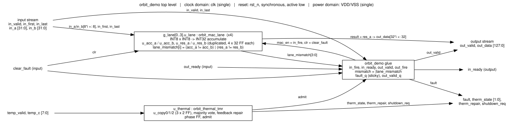

# orbit_demo design overview

Package section 01_overview of `orbit_demo_design_review`, written 2026-10-06 from the package files and the repository at commit 3dfffbb. Links are relative to this file. Cited `reports/...` files are linked to their byte-identical copies in 07_verification. Unlinked repository paths under `rtl/`, `pd/`, `tb/`, `fault/` and `scripts/` are copied in [04_digital_design/source/](../04_digital_design/source/). Only `build/...` files without a package copy (the copies are listed in [README.md](../README.md) under How the package was built), `docs/research/...` and ORFS image paths (`platforms/...`, `flow/scripts`) are outside the package. Discrepancies are listed in the discrepancy register (09_review_notes).

Status labels: **VERIFIED** = a tool log or report shows it. **REPRODUCED 2026-10-06** = re-run for this package. **TARGET** = design goal, not measured. **ASSUMPTION**. **CLAIM (unverified)** = stated in a document, no log found. **MISSING**. **N/A** = not applicable (reason given).

## Design revision covered by this package

| Item | Revision / identifier | Note |
|---|---|---|
| Design | orbit_demo (ORBIT-AI 4-lane INT8 digital demonstrator) | top module `orbit_demo`, LANES=4 |
| RTL | rtl/orbit_demo.v, orbit_mac_lane.v, orbit_thermal_tmr.v, orbit_keep_reg.v at git commit 26d71a8 (originally committed 2026-09-29 18:54 UTC; see the note on commit dates below); unchanged through the package commit | sha256 a3fffb22… / efef3d33… / bba77a5a… / ea05bdc1… (full hashes in MANIFEST.sha256 at the package root) |
| Specification | docs/SPEC.md at 26d71a8 (never revised) | sha256 aef5d9fb… |
| Concept brief | docs/orbit-ai-design-brief.pdf, "ORBIT-AI v0.1, 29 September 2026" (never revised; describes an earlier project state, see discrepancy register) | sha256 9d5f33d3… |
| Reviewed layout | ORFS sky130hd, variant `sep` (copy-separation fences), run 2026-09-29 21:56–22:12 UTC, outputs build/pd_sep/results/sky130hd/orbit_demo/sep/ | 6_final.gds sha256 cd19afa9…; 6_final.def f5c544f3…; 6_final.v 68093c41…; 6_final.spef 014e655a… |
| Layout configuration | pd/sky130hd_sep/config.mk and regions.tcl at 5e54769; constraint.sdc at 3e8dad1 (`set clk_period 7.2`) | The run (21:56 UTC) used config.mk/regions.tcl as in d8ead98, identical to 5e54769 once comments are stripped. It used the working-tree constraint.sdc with period 7.2 ns, which is the version in commit 3e8dad1 (originally committed at 22:00 UTC, after the run had started) and is byte-identical to the flow copy build/pd_sep/sdc/sky130hd/sep.sdc (written 21:56 UTC). d8ead98's constraint.sdc has a 7.0 ns period, so a rebuild must not use it |
| Flow / tools | ORFS docker image tag openroad/orfs:latest; the only local image is sha256:2e5bf6fe865e… (created 2026-09-29 02:00 UTC, before the run). Linking the run to this digest is an ASSUMPTION: the run logged no digest. OpenROAD prints version "unknown". KLayout 0.30.12 (DRC/LVS). Yosys 0.69+154 (local sims/schematics) | No PDK commit is recorded in the logs |
| Process / library | SkyWater SKY130, sky130_fd_sc_hd, liberty sky130_fd_sc_hd__tt_025C_1v80 (the single corner ORFS optimised at) | — |
| Package assembled | 2026-10-06; design inputs copied from the repository tree at commit 3dfffbb (branch claude/hopeful-rubin-0yf8io) | Every later commit on the branch changes only review/ or the repository landing page README.md (added after packaging; not a design input), or is empty (git diff --name-only 3dfffbb..HEAD outside review/ lists only README.md). Re-runs made for this package are dated 2026-10-06 |

Other implementations in the repo (sky130hd baseline at 7.0 ns, variant `base`; IHP SG13G2) are reference runs only and are NOT the reviewed layout.

Note on commit dates: the commit identifiers above are on the current branch and have the same file trees as the commits the package was built from ([COMMIT_MAP.tsv](../COMMIT_MAP.tsv) lists them with tree hashes). All dates in this package come from the tool logs and run records, which are dated 2026-09-29 to 2026-10-06, except times marked "originally committed", which are the commit times of the commits the package was built from (same period). The author and committer dates in the branch's commit metadata do not match these and should not be read as the development timeline (D-54).

Notes on this table, checked for this document:

- `MANIFEST.sha256`, cited in the RTL row, is at the package root: [MANIFEST.sha256](../MANIFEST.sha256), generated last on 2026-10-06 (see [README.md](../README.md) section Manifest; discrepancy register (09_review_notes) D-53). The four RTL sha256 values recomputed at 3dfffbb equal those in [fault/summary.md](../07_verification/fault/summary.md) lines 16-19 and in [04_digital_design/README.md](../04_digital_design/README.md); e.g. `rtl/orbit_demo.v` a3fffb229df3e166694d9259cee45411537118aa2673f84bb26b0f4108f3183a.

## Purpose and scope

`orbit_demo` is the "BUILT / DIGITAL DEMONSTRATOR" box of the ORBIT-AI v0.1 concept brief, not the 16-tile chip ([SPEC.md](../04_digital_design/source/docs/SPEC.md) lines 3-7; [brief](../04_digital_design/source/docs/orbit-ai-design-brief.pdf) p.1). It is a standard-cell digital block: four independent signed INT8 multiply / INT32 accumulate lanes behind a valid/ready input stream, a one-result output buffer, duplicated accumulator and result storage with a sticky mismatch fault-stop, and a three-copy (TMR) thermal state machine that throttles, stops and recovers input admission from a digital temperature input ([orbit_demo.v](../04_digital_design/source/rtl/orbit_demo.v) lines 1-16). It was taken through OpenROAD-flow-scripts on sky130hd to a routed GDS and was not fabricated (brief p.1 "No physical chip fabricated."; `finish__design__instance__count__padcells 0` in [6_report.json](../07_verification/orfs_logs/6_report.json) line 60). There are no analog blocks, no pad ring and no package. SPEC.md lines 9-10: "Nothing here is radiation-qualified, timing-signed-off for flight or thermally validated. Thresholds are illustrative."

| Item | Demonstrator `orbit_demo` (built, reviewed here) | ORBIT-AI concept chip (brief only, not built) |
|---|---|---|
| Compute | 4 lanes x 1 INT8 MAC, INT32 accumulate | 16 tiles x 32 x 32 = 16384 INT8 MACs: TARGET |
| Clock | no requirement (MISSING); 7.2 ns met at TT (ORFS optimised at TT only): VERIFIED; re-time of the same layout passes at ff_n40C_1v95 and fails setup at ss_100C_1v60 (WNS -6.131 ns): REPRODUCED 2026-10-06 | 200-800 MHz, 6.55-26.21 TOPS: TARGET ("No timing measurement supports these clock targets", p.2) |
| Storage | 521 flip-flops; no SRAM or ECC (`rtl/ecc/` exists but is not instantiated: N/A here) | 32 MiB SRAM with SECDED 64+8: TARGET |
| Protection | duplicate + compare fault-stop (512 bits), TMR + repair (6 bits), 3 unprotected flip-flops, no replay | duplication, checkpoint/retry, tile quarantine: TARGET |
| Power | no budget (MISSING); 52.1092 mW default-activity estimate: VERIFIED tool output | 40 W "for conceptual sizing only": ASSUMPTION |
| Process | SKY130 / sky130_fd_sc_hd via ORFS: VERIFIED | "process, package ... remain undecided" (p.2) |

## Requirements and verification status

Evidence keys (location and test conditions):

| Key | Evidence | Conditions | Status |
|---|---|---|---|
| E-FV | [formal_summary.md](../07_verification/formal_rerun_2026-10-06/formal_summary.md) | `make formal`, 12 SymbiYosys tasks: k-induction k = 1-8, abc pdr, suprove liveness, cover depth 24/8; Yosys 0.69+154, SBY v0.69, Yices 2.7.0, bitwuzla 0.9.1; reference model, inputs free after reset in cycle 0. `datapath_pdr` re-run 2026-10-06: PASS, 941 s ([make_formal-extra.log](../07_verification/rerun_2026-10-06/formal_extra/make_formal-extra.log), [summary_extra.md](../07_verification/rerun_2026-10-06/formal_extra/summary_extra.md)); published result in [formal/summary.md](../07_verification/formal/summary.md) | REPRODUCED 2026-10-06 |
| E-VAC | [formal_vacuity.md](../07_verification/formal_rerun_2026-10-06/formal_vacuity.md) | 19 one-line RTL mutants, 19 CAUGHT | REPRODUCED 2026-10-06 |
| E-SIM | [directed_icarus.log](../05_simulation/rerun_logs_2026-10-06/directed_icarus.log), [directed_verilator.log](../05_simulation/rerun_logs_2026-10-06/directed_verilator.log) | `tb/tb_orbit_demo.v`; Icarus 14.0 (devel) and Verilator 5.053; seed 1; zero-delay RTL, 10 ns sim clock; 14 scenarios, 133601 cycles, 0 errors | REPRODUCED 2026-10-06 |
| E-RND | [random_icarus_summary.md](../05_simulation/rerun_logs_2026-10-06/random_icarus_summary.md) | cocotb; seeds 1-5 x 20000 cycles + `wrap_soak` (149226 cycles); 7544 results, 0 mismatches | REPRODUCED 2026-10-06 |
| E-WAV | [waveforms/README.txt](../05_simulation/waveforms/README.txt), [negctl_summary.txt](../05_simulation/waveforms/negctl_summary.txt) | 5 self-checking VCD scenarios (Icarus 14.0, RTL zero-delay), all PASS; each FAILs on an RTL copy with its targeted bug | REPRODUCED 2026-10-06 |
| E-GLSF | [gls.log](../07_verification/published_reports/gls.log) | `pd/gls/tb_gls.v`: RTL and routed sep `6_final.v` in lockstep, zero-delay, 30000 cycles, seed 1, one flip per 32 cycles into the 518 redundant bits; run 2026-09-29 | VERIFIED |
| E-FI | [fault/summary.md](../07_verification/fault/summary.md), [fault/logs/](../07_verification/fault/logs/); re-run [formal_results.md](../07_verification/rerun_2026-10-06/fault/formal_results.md), [make_fault.log](../07_verification/rerun_2026-10-06/fault/make_fault.log) | generated RTL copies, single upset per trace (any lane/bit/cycle); prove k-induction k = 4, negatives BMC depth 12; SBY v0.69, Yices 2.7.0. Re-run 2026-10-06 (19 tasks, 0 unexpected), in 07_verification/rerun_2026-10-06/fault/ | REPRODUCED 2026-10-06 |
| E-SEU | [fault/campaign.md](../07_verification/fault/campaign.md); re-run [campaign_report.md](../07_verification/rerun_2026-10-06/fault/campaign_report.md) (byte-identical) | `fault/tb_seu_campaign.v`, Icarus 14.0, seed=1 tpb=12 tpb_unprot=200, 6836 trials, flips at the falling edge | REPRODUCED 2026-10-06 |
| E-AUD | [storage_audit.txt](../07_verification/published_reports/storage_audit.txt); [synth/storage_audit.txt](../07_verification/synth/storage_audit.txt) | `pd/audit_storage.py` on sep `6_final.v` (18/18 with the older script; current script 19/19, re-run 2026-10-06: [storage_audit_current_script.txt](../07_verification/rerun_2026-10-06/pd_sep/storage_audit_current_script.txt)); `scripts/storage_audit.py` on the generic Yosys 0.69+154 netlist | VERIFIED |
| E-MUT | [mutation/summary.md](../07_verification/mutation/summary.md) | 40 RTL mutants x 5 make targets; evidence bench [tb_mutation_gaps.v](../07_verification/mutation/tb_mutation_gaps.v) | VERIFIED |
| E-PIN | [pinout.csv](../08_pinout_packaging/pinout.csv), [rtl_ports.json](../08_pinout_packaging/rtl_ports.json) | `parse_pins.py` on sep `6_final.def`; Yosys 0.69+154 elaboration | REPRODUCED 2026-10-06 |
| E-STA | [sta_corners_sep_2026-10-06/](../07_verification/sta_corners_sep_2026-10-06/sta_corners_sep.txt) | `pd/sta_corners.tcl` on sep `6_final.{odb,sdc,spef}`, 7.2 ns, nominal OpenRCX SPEF at every corner | REPRODUCED 2026-10-06 |

SPEC sections 2-9 (the §9 claim number is given in brackets), then the brief's claims and targets:

| Requirement | Source | Status | Evidence |
|---|---|---|---|
| R2 18 ports, names/directions/widths per §2 (80 in, 135 out bits) | SPEC 25-45 | REPRODUCED 2026-10-06 | E-PIN: RTL and DEF both 18 ports / 215 signal bits, 0 mismatches (see Interfaces) |
| R3.1 exact signed 8 x 8 product, sign-extended to 32 bits [9.1] | SPEC 52-57 | REPRODUCED 2026-10-06 | E-FV P1 (`product` k = 1 over all 2^16 operand pairs; `datapath` k = 6); E-SIM `signed_edges`; E-VAC `zext_product` |
| R3.2 accumulate mod 2^32, no saturation or overflow flag [9.5] | SPEC 56 | REPRODUCED 2026-10-06 | E-FV P1, wrap covers C20-C22; E-SIM `int32_wrap`; E-RND `wrap_soak` |
| R3.3 `in_last` -> result, `out_valid` next cycle; `in_first && in_last` legal; sums continue across `in_last`; lanes independent | SPEC 59-64 | REPRODUCED 2026-10-06 | E-FV P1, P2; E-SIM `first_and_last`, `continue_after_last`; E-WAV `a_mac3` |
| R4.1 §4 `out_valid`/`in_ready` equations; full buffer blocks every beat [9.2] | SPEC 68-74 | REPRODUCED 2026-10-06 | RTL orbit_demo.v 64, 70-71 identical to SPEC; E-FV P2, P4; E-VAC `no_backpressure`; E-SIM `backpressure`; E-WAV `b_backpressure` |
| R4.2 `in_last` with `out_fire` in one cycle replaces the result, no bubble | SPEC 75-76 | REPRODUCED 2026-10-06 | E-FV P2 (incl. `live`); E-SIM `back_to_back` |
| R4.3 `out_data` stable while `out_valid && !out_ready` (no-fault case) | SPEC 77 | REPRODUCED 2026-10-06 | E-FV P3. SPEC omits that reset/`clear_fault` withdraw a presented result (see discrepancy register (09_review_notes)) |
| R4.4 `out_ready` -> `in_ready` combinational | SPEC 78 | REPRODUCED 2026-10-06 | RTL 70-71; timed in-to-out, TT slack 2.577 ns ([supplement](../07_verification/sta_corners_sep_2026-10-06/sta_corners_sep_supplement.txt)). `clear_fault` -> `in_ready` is also combinational and undocumented (see discrepancy register (09_review_notes)) |
| R5.1 two copies each of acc and result per lane, own feedback, shared product; `out_data` from copy A | SPEC 82-84 | VERIFIED | RTL [orbit_mac_lane.v](../04_digital_design/source/rtl/orbit_mac_lane.v) 25-60; E-AUD. Copy-A source checked only by `tb_mutation_gaps.v` T2 (E-MUT: mutant m07 survives all make targets) |
| R5.2 mismatch blocks `out_valid`/`in_ready` in the same cycle; `fault` from the next cycle [9.3] | SPEC 86-92 | REPRODUCED 2026-10-06 | E-FI `acc_a`/`acc_b`/`res_a`/`res_b` prove PASS; E-SEU 6136 of 6136 detected at latency 1; E-WAV `c_fault` |
| R5.3 `fault` sticky until clear/reset | SPEC 88, 92 | REPRODUCED 2026-10-06 | E-WAV `c2_fault_sticky` and its negative control. No make target checks it (E-MUT: m22 `fault_not_sticky` survives) |
| R5.4 one acc/result upset never transfers a wrong `out_data`; it stops | SPEC 93-94 | REPRODUCED 2026-10-06 | E-FI `D_out_fire_matches_ref` proven; E-SEU 0 escapes in 6144 trials; E-GLSF 702 of 702 flips stopped on the routed netlist |
| R5.5 `clear_fault`/reset clear `fault_q`, `out_valid_q`, zero both copies, keep thermal state; no replay | SPEC 95-98 | REPRODUCED 2026-10-06 | E-FV P8 (`clear` from an unconstrained state); E-VAC `clear_keeps_fault`, `clear_keeps_acc`; E-SIM `clear_fault`, `reset_midrun` |
| R6.1 copies `u_thermal.u_copy0/1/2`, vote, rewrite every cycle, reset STOP; §6 next-state table, signed t [9.4] | SPEC 102-116 | REPRODUCED 2026-10-06 | E-FV P5; E-VAC threshold mutants; E-SIM `throttle`, `stop_and_recover`, `negative_temps`; E-WAV `d_thermal` (383 checks) |
| R6.2 admission: NORMAL always, THROTTLE alternate (first admits), STOP never; drain in STOP | SPEC 118-124 | REPRODUCED 2026-10-06 | E-FV P6, P4; E-SIM `throttle`, `drain_in_stop`. SPEC `phase` wording differs from [orbit_thermal_tmr.v](../04_digital_design/source/rtl/orbit_thermal_tmr.v) line 77 (see discrepancy register (09_review_notes)) |
| R6.3 voted code 3 behaves as STOP | SPEC 43, 115, 124 | VERIFIED | only `tb_mutation_gaps.v` T3 (E-MUT); formal code-3 branches are vacuous; mutant m27 survives every make target |
| R6.4 a single upset thermal copy is outvoted and repaired; `therm_repair` | SPEC 126-127 | REPRODUCED 2026-10-06 | E-FI `therm_c0/c1/c2` PASS; E-SEU 72 of 72 REPAIRED; E-GLSF 234 of 234 repaired |
| R7 521 flip-flop bits, 518 in 9 groups, 3 unprotected; synthesis keeps copies distinct [9.6] | SPEC 129-145, 174 | VERIFIED | E-AUD: routed 521 `sky130_fd_sc_hd__dfxtp_1`, "RESULT: PASS (18/18 checks passed)" (19/19 with the current script); generic 9/9; without `keep_hierarchy` copies merge (521 -> 517 bits, audit FAIL) |
| R8.1 measure `out_valid_q` escapes | SPEC 156 | REPRODUCED 2026-10-06 | E-SEU 200 of 200 escape (38 LOST, 162 EXTRA); E-FI `neg_out_valid_q` FAIL as expected |
| R8.2 measure `fault_q` 1->0 | SPEC 157-158 | MISSING | single-upset flows cannot reach it; needed: a double-upset scenario |
| R8.3 measure `phase` | SPEC 159 | REPRODUCED 2026-10-06 | E-SEU 156 MASKED, 44 TIMING; shifted vs doubled admission not separated |
| R8.4 measure shared multiplier | SPEC 160 | REPRODUCED 2026-10-06 | E-FI `neg_product`: wrong `out_data` with `fault = 0` |
| R8.5 measure comparators, voter, clock, reset, sensor/handshake inputs, common-mode | SPEC 160-162 | MISSING | not injected in any flow; needed: transient injection on vote/next-state, `in_fire`, `clr`, `mismatch`, clock, reset |
| R9.7 faults only in generated copies; no fault ports in production RTL | SPEC 175-176 | REPRODUCED 2026-10-06 | E-PIN: 18 functional ports, no test port |
| B1 "521 flip-flop bits"; "Nine storage groups audited" | brief p.4 | VERIFIED | R7 |
| B2 "4,356 generic logic cells" | brief p.4 | CLAIM (unverified) | not reproduced: Yosys 0.69+154 gives 4373, YoWASP 0.69 gives 4384 ([synth/summary.md](../07_verification/synth/summary.md) lines 12, 21); no script given (see discrepancy register (09_review_notes)) |
| B3 bounded results: "24 bounded SAT time steps", fault "8 time steps", wrap "6 time steps" | brief p.4 | CLAIM (unverified) | no script or log; the repo's unbounded proofs (R3-R6) cover the behaviour |
| B4 "No PDK mapping or physical area estimate"; "OpenROAD was not run" | brief p.4-5 | N/A | earlier project state, superseded by this layout (see discrepancy register (09_review_notes)) |
| B5 thresholds 80 / 95 / 70 C, "not device ratings" | brief p.3 | TARGET | RTL parameters orbit_demo.v 22-24; behaviour in R6.1 |
| B6 "Separate redundant state physically" | brief p.3 | VERIFIED | [separation.md](../07_verification/published_reports/separation.md): acc/res same-bit centre min 251.17 um, copy A-B flip-flop gap 242.94 um, thermal 97.92 um / gap 92.54 um, 0 of 262 pairs touching. Geometry only. The 20 um / 10 um acceptance limits are a TARGET with no stated rationale |
| B7 "protect clock/reset distribution" | brief p.3 | MISSING | not implemented: one CTS tree for all 521 sinks ([4_1_cts.log](../07_verification/orfs_logs/4_1_cts.log) line 17) |
| B8 16 tiles x 32 x 32 MACs, 6.55-26.21 TOPS at 200-800 MHz | brief p.1-2 | TARGET | concept chip, not built |
| B9 40 W per chip | brief p.1-2 | ASSUMPTION | "not a power estimate" (p.2) |
| B10 32 MiB SECDED SRAM; 16 GiB+ external memory | brief p.1-2 | TARGET | concept chip; N/A for `orbit_demo` (no SRAM) |
| B11 "No physical chip fabricated"; sensors, calibration, shutdown circuit not implemented | brief p.1, p.3 | N/A | scope statements; consistent with padcells 0 and the digital `temp_c` input |

## Manufacturing process

| Item | Value | Source | Status |
|---|---|---|---|
| Process | SkyWater SKY130 open PDK, ORFS platform `sky130hd` | [config.mk](../04_digital_design/source/pd/sky130hd_sep/config.mk) line 11 | VERIFIED |
| Standard cells | `sky130_fd_sc_hd` (521 x `sky130_fd_sc_hd__dfxtp_1`) | [synth_stat.txt](../07_verification/orfs_reports/synth_stat.txt) line 219 | VERIFIED |
| Liberty for synthesis, optimisation, ORFS final STA (TT only), power | `sky130_fd_sc_hd__tt_025C_1v80` (1.8 V, 25 C, process 1.0; sha256 ec0e1067a35c8bf2...) | [6_report.log](../07_verification/orfs_logs/6_report.log) line 6; [1_2_yosys.log](../07_verification/orfs_logs/1_2_yosys.log) line 213 | VERIFIED |
| Liberty for informational STA | `ss_100C_1v60`, `ff_n40C_1v95` from the `master` branch of efabless/skywater-pdk-libs-sky130_fd_sc_hd (16-hex sha256 prefixes only, no commit) | [sta_corners_sep.txt](../07_verification/sta_corners_sep_2026-10-06/sta_corners_sep.txt) lines 8-9 | REPRODUCED 2026-10-06 |
| PDK version | not recorded in any log; the TT liberty header has only `revision : 1.0000000000`. Needed: open_pdks/skywater-pdk commit per run | — | MISSING |
| Parasitics | OpenRCX, `rcx_patterns.rules`, one extraction corner; no RC corners | 6_report.log lines 16-18 | VERIFIED |
| Tool versions | OpenROAD "unknown"; Yosys 0.68+post (ORFS synthesis); KLayout 0.30.12 | 6_report.log line 1; 1_2_yosys.log line 1; [6_lvs.log](../07_verification/orfs_logs/6_lvs.log) line 1 | VERIFIED |
| ORFS image | run used tag `openroad/orfs:latest`, no digest logged; [requirements-tools.txt](../04_digital_design/source/requirements-tools.txt) line 13 pins sha256:2e5bf6fe865e..., the only local image | — | ASSUMPTION |
| ORFS/OpenROAD commit, kepler-formal version | not recorded | — | MISSING |

## Supply voltages

No supply specification exists: SPEC.md, the RTL and the brief state no core or I/O supply voltage, tolerance, temperature range or power-up sequence (MISSING; needed: a SPEC section with VDD nominal/min/max and junction temperature range). The only evidence:

| Item | Value | Source | Status |
|---|---|---|---|
| Library corner | TT, 1.80 V, 25 C. A characterisation corner, not a requirement | 6_report.log line 6 | VERIFIED |
| Supply nets in the layout | one pair. DEF `PINS 217` = 215 signal + `VDD` (USE POWER) + `VSS` (USE GROUND), met5 strap pins; `SPECIALNETS 2`: `VDD` to `VPB`/`VPWR`, `VSS` to `VNB`/`VGND` | [6_final.def.gz](../06_physical_design/layout_db/6_final.def.gz), decompressed lines 18346-18347, 18362, 19239-19240, 23252 | VERIFIED |
| Static IR analysis supply | "Supply voltage : 1.80e+00 V". Not set in `pd/sky130hd_sep/config.mk`; it is the platform default `PWR_NETS_VOLTAGES ?= VDD 1.8` (image `platforms/sky130hd/config.mk` line 145, read 2026-10-06) | 6_report.log line 32 | VERIFIED |
| Informational STA voltages | 1.60 V (SS), 1.95 V (FF) | E-STA | REPRODUCED 2026-10-06 |
| Power intent (UPF/CPF) | none; single domain in the layout. Needed: a SPEC statement that one domain is intended | — | MISSING |

## Interfaces

SPEC section 2 checked against the RTL ([orbit_demo.v](../04_digital_design/source/rtl/orbit_demo.v) lines 26-51; [rtl_ports.json](../08_pinout_packaging/rtl_ports.json)) and the routed DEF pins ([pinout.csv](../08_pinout_packaging/pinout.csv)). Status of the table: REPRODUCED 2026-10-06 (Yosys 0.69+154 elaboration, `parse_pins.py`). All 18 ports match in name, direction and width.

| Port | Dir | Width | Meaning (SPEC §2) | RTL line | DEF pins (edge) |
|---|---|---|---|---|---|
| `clk` | in | 1 | Clock | 26 | W |
| `rst_n` | in | 1 | Synchronous reset, active low | 27 | W |
| `in_valid` / `in_ready` | in / out | 1 / 1 | Input beat valid / accepted this cycle if `in_valid` | 30 / 31 | W / W |
| `in_first` / `in_last` | in | 1 / 1 | Beat starts a new sum / after this beat copy all sums to the buffer | 32 / 33 | S / W |
| `in_a`, `in_b` | in | 32 each | Signed INT8 operands, lane i at `[8*i +: 8]` | 34, 35 | `in_a` S8 N10 W6 E8; `in_b` S9 N10 W6 E7 |
| `out_valid` / `out_ready` | out / in | 1 / 1 | Buffer holds a presentable result / consumer takes it | 38 / 39 | W / W |
| `out_data` | out | 128 | Result, lane i at `[32*i +: 32]`, signed INT32 (copy A) | 40 | W82 S24 N22 |
| `temp_valid` | in | 1 | Thermal reading valid | 43 | E |
| `temp_c` | in | 8 | Signed whole degrees C (1) | 44 | E |
| `clear_fault` | in | 1 | Clear fault, zero lane storage, empty buffer | 47 | E |
| `fault` | out | 1 | Sticky mismatch flag, 1-cycle latency | 48 | W |
| `therm_state` | out | 2 | 0 NORMAL, 1 THROTTLE, 2 STOP, 3 as STOP | 49 | E |
| `therm_repair` | out | 1 | Thermal copies disagree this cycle | 50 | E |
| `shutdown_req` | out | 1 | `therm_state[1]` | 51 | E |

(1) Declared `input wire [7:0]` and reinterpreted as `wire signed [7:0] t` in [orbit_thermal_tmr.v](../04_digital_design/source/rtl/orbit_thermal_tmr.v) line 42, so comparisons are signed.

- 215 signal pins: 131 on met3 (E/W edges), 84 on met2 (N/S edges), minimum-size block-edge pins placed by `place_pins`; not a specified pinout, not bond pads. `VDD`/`VSS` are not in the SPEC table. Details: 08_pinout_packaging.
- Combinational input-to-output paths: `out_ready` -> `in_ready` (documented) and `clear_fault` -> `in_ready` (undocumented; see discrepancy register (09_review_notes)).
- I/O timing: 1.44 ns (0.2 x period) input and output delay "for the (unknown) outside world" ([constraint.sdc](../04_digital_design/source/pd/sky130hd_sep/constraint.sdc) lines 5-7, 20-27): ASSUMPTION. No `set_driving_cell`, `set_load`, `set_input_transition` or `set_clock_uncertainty` in [6_final.sdc](../06_physical_design/layout_db/6_final.sdc): MISSING (needs an interface timing budget and clock jitter spec).
- Reset protocol (minimum `rst_n` low time; no on-chip synchronizer) and sensor interface timing (update rate, synchronisation to `clk`): MISSING from SPEC.

## Target speed

No speed requirement exists for the demonstrator (MISSING; needed: target frequency and PVT range). The 7.2 ns period ([constraint.sdc](../04_digital_design/source/pd/sky130hd_sep/constraint.sdc) line 19) is the shortest period tried that closed at TT with the fences: 7.10 ns fails with setup WNS -0.094 ns ([period_exploration.md](../07_verification/published_reports/period_exploration.md)). Conditions for all rows: sep layout, 7.2000 ns (138.9 MHz), 1.44 ns I/O delay, propagated clock, nominal OpenRCX SPEF at every corner, no OCV/derate or clock uncertainty, ORFS optimisation at TT only, OpenSTA in OpenROAD "unknown".

| Result | Setup WNS / TNS (ns) | Hold WNS (ns) | Min period / fmax | Source | Status |
|---|---|---|---|---|---|
| ORFS final STA, TT 25 C 1.80 V | +0.031 / 0 | +0.436 | 7.17 ns / 139.49 MHz | [6_finish.rpt](../07_verification/orfs_reports/6_finish.rpt) lines 5, 15, 20; 6_report.json lines 32-35 | VERIFIED |
| Re-run TT `tt_025C_1v80` | +0.031 / 0.000 | +0.436 | 7.17 ns / 139.49 MHz | [sta_tt.log](../07_verification/sta_corners_sep_2026-10-06/sta_tt.log) | REPRODUCED 2026-10-06 |
| Re-run SS `ss_100C_1v60` | -6.131 / -2463.532, FAILS (516 endpoints) | +0.891 | 13.33 ns / 75.01 MHz | [sta_ss_100C_1v60.log](../07_verification/sta_corners_sep_2026-10-06/sta_ss_100C_1v60.log) lines 6-11 | REPRODUCED 2026-10-06 |
| Re-run FF `ff_n40C_1v95` | +2.276 / 0.000 | +0.281 | 4.92 ns / 203.07 MHz | [sta_ff_n40C_1v95.log](../07_verification/sta_corners_sep_2026-10-06/sta_ff_n40C_1v95.log) | REPRODUCED 2026-10-06 |

- TT worst setup path `in_a[27]` -> `g_lane[3].u_lane.u_res_a/q[29]$_SDFFE_PN0P_` includes the assumed 1.44 ns input delay; 139.49 MHz is from `report_clock_min_period -include_port_paths`. TT reg-to-reg worst slack is 1.346 ns ([supplement](../07_verification/sta_corners_sep_2026-10-06/sta_corners_sep_supplement.txt)).
- SS fails also reg-to-reg (-4.420 ns) and has 37 max-slew and 12 max-capacitance violating pins; TT and FF have none.
- Brief 200-800 MHz: TARGET for the concept chip only; 200 MHz is above the demonstrator's TT fmax.
- Throughput: no tool reports it. `docs/research/space-compute-competitors.md` line 25 "1.1 GOPS INT8 peak (4 MACs x 2 ops x 139 MHz)": CLAIM (unverified), a TT-only arithmetic bound.
- RC corners, other PVT corners, SDF-annotated simulation and multi-corner optimisation: MISSING.

## Power budget

No power budget exists for the demonstrator (MISSING; needed: a target from the design owner). The brief's 40 W per chip is a concept-chip sizing ASSUMPTION and does not apply to `orbit_demo`.

| Result | Value | Conditions / source | Status |
|---|---|---|---|
| Total power, routed sep layout | 52.1092 mW: internal 26.3633 mW, switching 25.7459 mW, leakage 0.0279 uW | OpenSTA `report_power` (OpenROAD "unknown"), 7.2 ns, TT 25 C 1.80 V, OpenRCX SPEF, default activity; [6_report.json](../07_verification/orfs_logs/6_report.json) line 49, [results.md](../07_verification/published_reports/results.md) lines 53-56 | VERIFIED (tool estimate, not a measurement) |
| By group | Sequential 5.96 mW (11.4 %), Combinational 43.2 mW (83.0 %), Clock 2.90 mW (5.6 %), Macro 0, Pad 0 | [power_default_activity.txt](../07_verification/published_reports/power_default_activity.txt); 6_finish.rpt lines 549-560 | VERIFIED |
| Activity assumed | the files state only "the tool's DEFAULT switching activity (no simulation activity annotated)". The ORFS scripts in the image call `report_power` with no `set_power_activity`, `read_vcd` or `read_saif` (grep of `flow/scripts`, 2026-10-06), so OpenSTA's built-in default applies; no log prints its toggle rate or static probability. Needed: VCD/SAIF from a representative workload read into OpenSTA | power_default_activity.txt | MISSING |
| Static IR drop, same activity | VDD 0.4539 mV, VSS 0.6275 mV worst (0.03 %) | PSM, 1.80 V; 6_report.log lines 27-49 | VERIFIED |
| Power at SS/FF, dynamic IR, electromigration | not run | — | MISSING |

## Area and cell counts

Conditions: ORFS sky130hd sep run 2026-09-29, TT liberty; ORFS synthesis by Yosys 0.68+post with `abc -D 7.2`.

| Quantity | Value | Source | Status |
|---|---|---|---|
| Die | 346.295 x 346.295 um = 119920 um^2 | [2_1_floorplan.log](../07_verification/orfs_logs/2_1_floorplan.log) line 20; DEF `DIEAREA` | VERIFIED |
| Core | (2.300, 2.720)-(344.080, 342.720) um = 341.780 x 340.000 um = 116205.2 um^2; 125 rows x 743 `unithd` sites | 2_1_floorplan.log lines 19-22 | VERIFIED |
| Utilisation | `CORE_UTILIZATION` 40 % (config); 0.403 at floorplan; 0.536 final (cell area excl. fill / core) | config.mk line 35; 2_1_floorplan.log line 24; 6_report.json line 64 | VERIFIED |
| Cell area | 62299.8 um^2 excl. fill incl. tap; 60392.97 um^2 excl. fill and tap | 6_report.log line 67; results.md lines 42-43 | VERIFIED |
| Instances | 18175: fill 10381, tap 1524, antenna 20, clock buffer 88, clock inverter 8, timing-repair buffer 1201, inverter 171, sequential 521, multi-input combinational 4261. 6270 excl. fill/tap; `6_final.v` has 6250 leaf cells | 6_report.log lines 51-61; storage_audit.txt line 3 | VERIFIED |
| Macros, pad cells | 0, 0 | 6_report.json | VERIFIED |
| Synthesised netlist | 5130 cells, 46866.1984 um^2 (sequential 10430.0032 um^2, 22.25 %); 19 kept `orbit_keep_reg` instances | synth_stat.txt lines 72, 268-269 | VERIFIED |
| Generic synthesis | 4899 cells = 4373 logic + 521 flip-flops + 5 `$scopeinfo` (Yosys 0.69+154, no area) | [synth/synth_counts.txt](../07_verification/synth/synth_counts.txt) | VERIFIED |

Only the flip-flop count (521) is the same across the generic, synthesised and routed netlists; the other counts are not comparable. Layout views: 06_physical_design.

## Top-level block diagram

*Drawn from `rtl/*.v` at 26d71a8 (Graphviz source [orbit_demo_top_level.dot](../02_block_diagram/orbit_demo_top_level.dot); [PDF](../02_block_diagram/orbit_demo_top_level.pdf)). Instance names are the RTL names. One clock domain (`clk`), one synchronous active-low reset (`rst_n`), one supply pair (`VDD`/`VSS`). Detailed diagram: [orbit_demo_block_diagram.svg](../02_block_diagram/orbit_demo_block_diagram.svg).*
