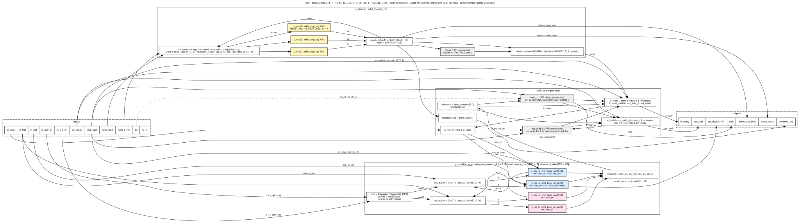

# 02 Block diagram: orbit_demo

The two diagrams in this folder describe the built digital demonstrator `orbit_demo` (top module, `LANES = 4`). They do not show the 16-tile ORBIT-AI concept chip in the brief, which is a TARGET for a different, unbuilt design.

## Design revision covered by this package

| Item | Revision / identifier | Note |
|---|---|---|
| Design | orbit_demo (ORBIT-AI 4-lane INT8 digital demonstrator) | top module `orbit_demo`, LANES=4 |
| RTL | rtl/orbit_demo.v, orbit_mac_lane.v, orbit_thermal_tmr.v, orbit_keep_reg.v at git commit 26566f0 (2026-09-29 18:54 UTC); unchanged through the package commit | sha256 a3fffb22… / efef3d33… / bba77a5a… / ea05bdc1… (full hashes in MANIFEST.sha256 at the package root) |
| Specification | docs/SPEC.md at 26566f0 (never revised) | sha256 aef5d9fb… |
| Concept brief | docs/orbit-ai-design-brief.pdf, "ORBIT-AI v0.1, 29 September 2026" (never revised; describes an earlier project state, see discrepancy register) | sha256 9d5f33d3… |
| Reviewed layout | ORFS sky130hd, variant `sep` (copy-separation fences), run 2026-09-29 21:56–22:12 UTC, outputs build/pd_sep/results/sky130hd/orbit_demo/sep/ | 6_final.gds sha256 cd19afa9…; 6_final.def f5c544f3…; 6_final.v 68093c41…; 6_final.spef 014e655a… |
| Layout configuration | pd/sky130hd_sep/config.mk and regions.tcl at c10c59b; constraint.sdc at 21917cf (`set clk_period 7.2`) | The run (21:56 UTC) used config.mk/regions.tcl as in ed553f8, identical to c10c59b once comments are stripped. It used the working-tree constraint.sdc with period 7.2 ns, which was committed in 21917cf at 22:00 UTC and is byte-identical to the flow copy build/pd_sep/sdc/sky130hd/sep.sdc. ed553f8's constraint.sdc has a 7.0 ns period, so a rebuild must not use it |
| Flow / tools | ORFS docker image tag openroad/orfs:latest; the only local image is sha256:2e5bf6fe865e… (created 2026-09-29 02:00 UTC, before the run). Linking the run to this digest is an ASSUMPTION: the run logged no digest. OpenROAD prints version "unknown". KLayout 0.30.12 (DRC/LVS). Yosys 0.69+154 (local sims/schematics) | No PDK commit is recorded in the logs |
| Process / library | SkyWater SKY130, sky130_fd_sc_hd, liberty sky130_fd_sc_hd__tt_025C_1v80 (the single corner ORFS optimised at) | — |
| Package assembled | 2026-10-06; design inputs copied from the repository tree at commit 0495cfa (branch claude/hopeful-rubin-0yf8io) | Every later commit on the branch changes only review/ or is empty (git diff --name-only 0495cfa..HEAD outside review/ is empty). Re-runs made for this package are dated 2026-10-06 |

Other implementations in the repo (sky130hd baseline at 7.0 ns, variant `base`; IHP SG13G2) are reference runs only and are NOT the reviewed layout.

`MANIFEST.sha256`, named in the RTL row, is not at the package root (checked 2026-10-06): MISSING, register D-53. The full hashes are in [../04_digital_design/README.md](../04_digital_design/README.md) section 1.

## Files

| File | Content | Size (bytes) | Pages | Produced by |
|---|---|---|---|---|
| [orbit_demo_top_level.dot](orbit_demo_top_level.dot) | Editable source, top-level view | 2,117 | — | Hand-written Graphviz |
| [orbit_demo_top_level.svg](orbit_demo_top_level.svg) | Render of the .dot | 11,439 | 1 | `dot -Tsvg`, Graphviz 2.43.0 |
| [orbit_demo_top_level.pdf](orbit_demo_top_level.pdf) | Render of the .dot, 1641 x 417 pt | 18,030 | 1 | `dot -Tpdf`, cairo 1.18.0 |
| [orbit_demo_block_diagram.dot](orbit_demo_block_diagram.dot) | Editable source, detailed view | 5,988 | — | Hand-written Graphviz |
| [orbit_demo_block_diagram.svg](orbit_demo_block_diagram.svg) | Render of the .dot | 43,452 | 1 | `dot -Tsvg`, Graphviz 2.43.0 |
| [orbit_demo_block_diagram.pdf](orbit_demo_block_diagram.pdf) | Render of the .dot, 3640 x 1194 pt (50.6 x 16.6 in) | 28,301 | 1 | `dot -Tpdf`, cairo 1.18.0 |

Both diagrams were drawn by hand in Graphviz from `rtl/*.v` at commit 26566f0. They are not generated from a netlist. The `.dot` files are the editable sources. The SVG and PDF files are renders of them and should not be edited. The `.dot` files were corrected and all four renders regenerated on 2026-10-06 at 21:26 UTC (commit 0477235) to fix BD-1 to BD-3 (see [Discrepancies](#discrepancies-and-drawing-limitations)). Sizes and page sizes above are for these files.

The RTL has not changed since 26566f0: `git diff 26566f0 HEAD -- rtl/orbit_demo.v rtl/orbit_mac_lane.v rtl/orbit_thermal_tmr.v rtl/orbit_keep_reg.v` is empty. The package copies in [../04_digital_design/source/rtl/](../04_digital_design/source/rtl/) are byte-identical to the repo files. Status: REPRODUCED 2026-10-06. RTL line references below (e.g. orbit_demo.v:73) apply to both `rtl/` and these copies.

### Regenerating

Run this from this folder with Graphviz installed:

```
dot -Tpdf orbit_demo_top_level.dot     -o orbit_demo_top_level.pdf
dot -Tsvg orbit_demo_top_level.dot     -o orbit_demo_top_level.svg
dot -Tpdf orbit_demo_block_diagram.dot -o orbit_demo_block_diagram.pdf
dot -Tsvg orbit_demo_block_diagram.dot -o orbit_demo_block_diagram.svg
```

Checked on 2026-10-06 with `/usr/bin/dot` (Graphviz 2.43.0), repeated on the corrected `.dot` files of commit 0477235:

- Both SVGs regenerate byte-identically.
- Both PDFs regenerate with the same page size and extracted text. The bytes differ only in the PDF metadata.
- Both packaged PDFs open with pypdf 6.19.0, are non-empty and have one page each.

Status: REPRODUCED 2026-10-06.

## Top-level diagram


Graph title: "clock domain: clk (single) | reset: rst_n, synchronous, active low | power domain: VDD/VSS (single)".

| Block in diagram | RTL instance / module | Content shown |
|---|---|---|
| `g_lane[0..3].u_lane : orbit_mac_lane (x4)` | `g_lane[i].u_lane`, generate loop, rtl/orbit_demo.v:77-90 | INT8 x INT8 -> INT32 accumulate. Duplicated `u_acc_a`/`u_acc_b` and `u_res_a`/`u_res_b`, 4 x 32 flip-flops per lane. Output `lane_mismatch[i]`. |
| `orbit_demo glue` | top-level logic, rtl/orbit_demo.v:54-125 | `in_fire`, `in_ready`, `out_valid`, `out_fire`, <code>mismatch = &#124;lane_mismatch</code>, sticky `fault_q`, `out_valid_q`, `shutdown_req = therm_state[1]` |
| `u_thermal : orbit_thermal_tmr` | `u_thermal`, rtl/orbit_demo.v:93-105 | `u_copy0/1/2` (3 x 2 flip-flops), majority vote, feedback repair, `phase` flip-flop, `admit` |

The plaintext nodes are the port groups: the input stream, the output stream, `out_ready`, `temp_valid`/`temp_c`, `clear_fault`, the status outputs and `in_ready`. Edges carry the RTL net names.

## Detailed block diagram

[orbit_demo_block_diagram.svg](orbit_demo_block_diagram.svg) (the image is wide; open the PDF or SVG to zoom)



Graph title: "orbit_demo (LANES=4, T_THROTTLE=80, T_STOP=95, T_RECOVER=70)". Colour coding:

| Fill | Meaning |
|---|---|
| Blue | Copy A: `u_acc_a`, `u_res_a` |
| Pink | Copy B: `u_acc_b`, `u_res_b` |
| Yellow | Thermal copies `u_copy0/1/2` |
| Grey | Unprotected single flip-flops: `fault_q`, `out_valid_q`, `phase` |

The diagram has five clusters: `inputs`, `outputs`, `orbit_demo glue logic`, `g_lane[i].u_lane : orbit_mac_lane` (one lane drawn, x4) and `u_thermal : orbit_thermal_tmr`.

### Signal paths

| # | Path | RTL names (as drawn) | RTL source |
|---|---|---|---|
| 1 | Input handshake | `in_fire = in_valid & in_ready` drives `mac_en` of every lane | orbit_demo.v:73, :82 |
| 2 | Lane operands | `a = in_a[8*i +: 8]`, `b = in_b[8*i +: 8]`, `first = in_first`, `last = in_last` | orbit_demo.v:83-86 |
| 3 | Shared multiplier | `prod = $signed(a) * $signed(b)` [15:0], `prod32` sign-extended to 32 bits. Both copies use it. | orbit_mac_lane.v:25-26 |
| 4 | Two adders | `acc_a_sum = (first ? 0 : acc_a) + prod32`, same for `acc_b_sum` | orbit_mac_lane.v:33-34 |
| 5 | Storage enables | <code>acc_en = clr &#124; mac_en</code> for `u_acc_a`/`u_acc_b`; <code>res_en = clr &#124; (mac_en &amp; last)</code> for `u_res_a`/`u_res_b`; `d = clr ? 0 : acc_*_sum` | orbit_mac_lane.v:36-57 |
| 6 | Result output | `result = res_a` -> `out_data[32*i +: 32]`. Copy B is used only for comparison. | orbit_mac_lane.v:60; orbit_demo.v:87 |
| 7 | Compare / fault stop | Lane <code>mismatch = (acc_a != acc_b) &#124; (res_a != res_b)</code> -> `lane_mismatch[i]` -> <code>mismatch = &#124;lane_mismatch</code> (combinational). This gates `out_valid` and `in_ready` in the same cycle and sets sticky `fault_q` -> `fault`. | orbit_mac_lane.v:59; orbit_demo.v:55, 64, 70, 115-116, 124 |
| 8 | Output buffer | `out_valid_q` is set on `in_fire & in_last` and cleared on `out_fire`; `out_valid = out_valid_q & ~fault_q & ~mismatch` | orbit_demo.v:64-66, 117-120 |
| 9 | Input admission | <code>in_ready = admit &amp; ~fault_q &amp; ~mismatch &amp; ~clear_fault &amp; (~out_valid_q &#124; out_ready)</code>. The `out_ready` -> `in_ready` path is combinational, as documented in SPEC section 4. | orbit_demo.v:70-71; SPEC.md:78 |
| 10 | Thermal TMR | `temp_valid`, `t = signed temp_c` -> `nxt` -> `u_copy0/1/2` -> <code>voted = (c0&amp;c1)&#124;(c1&amp;c2)&#124;(c0&amp;c2)</code> -> `nxt` (feedback repair); <code>repair = (c0!=c1)&#124;(c1!=c2)</code> | orbit_thermal_tmr.v:40-68, 82 |
| 11 | Throttle | `phase` toggles in THROTTLE and is 0 otherwise; <code>admit = (voted==NORMAL) &#124; ((voted==THROTTLE) &amp; ~phase)</code> | orbit_thermal_tmr.v:72-81 |
| 12 | Status outputs | `state` -> `therm_state`, `repair` -> `therm_repair`, `shutdown_req = therm_state[1]` (glue) | orbit_demo.v:102-104, 125 |

The thresholds in the `nxt` node (95, 80, 70) are the parameter values `T_STOP`, `T_THROTTLE` and `T_RECOVER` from rtl/orbit_demo.v:22-24. The RTL describes them as "illustrative prototype values, not device ratings" (orbit_thermal_tmr.v:7). Status: TARGET (design parameters, not measured).

## Interfaces

18 ports, 215 bits: 80 input bits and 135 output bits. Sources: rtl/orbit_demo.v:26-51 and [SPEC section 2](../04_digital_design/source/docs/SPEC.md). Status: VERIFIED. The same 18 ports / 215 bits appear in the Yosys elaboration [../08_pinout_packaging/rtl_ports.json](../08_pinout_packaging/rtl_ports.json) and in the DEF signal pins ([../08_pinout_packaging/pinout.csv](../08_pinout_packaging/pinout.csv)).

| Interface | Ports (dir, width) | Connects to in diagram |
|---|---|---|
| Clock / reset | `clk` (in, 1), `rst_n` (in, 1) | all flip-flops (dotted edge, graph title) |
| Input stream | `in_valid` (in, 1), `in_ready` (out, 1), `in_first` (in, 1), `in_last` (in, 1), `in_a` (in, 32), `in_b` (in, 32) | glue `in_fire` / `in_ready`; lane operands |
| Output stream | `out_valid` (out, 1), `out_ready` (in, 1), `out_data` (out, 128) | glue `out_valid` / `out_fire`; lane `result` (copy A) |
| Thermal sensor | `temp_valid` (in, 1), `temp_c` (in, 8, signed degrees C) | `u_thermal` `nxt` |
| Control / status | `clear_fault` (in, 1), `fault` (out, 1), `therm_state` (out, 2), `therm_repair` (out, 1), `shutdown_req` (out, 1) | glue, lane `clr`, `u_thermal` outputs |

These are core-block pins only. There is no pad ring, IO cell, ESD structure or package: N/A for this block-level diagram. See [../08_pinout_packaging/](../08_pinout_packaging/) for pin positions.

## Clock

There is one clock domain, `clk`. Every sequential block is `always @(posedge clk)`: orbit_demo.v:107, orbit_thermal_tmr.v:73, orbit_keep_reg.v:26. There are no clock dividers, gated clocks or second clocks in the RTL.

| Item | Value | Source | Conditions | Status |
|---|---|---|---|---|
| Clocks defined in the reviewed layout SDC | 1: `create_clock -name clk -period 7.2000 [get_ports {clk}]`, `set_propagated_clock` | [../06_physical_design/layout_db/6_final.sdc](../06_physical_design/layout_db/6_final.sdc):8-9 (build/pd_sep/results/sky130hd/orbit_demo/sep/6_final.sdc) | ORFS sep run, written by OpenROAD `write_sdc` | VERIFIED |
| Flip-flop clock pins | 521 flip-flops, 0 with a tied or missing clock, 51 distinct clock-leaf nets | [../07_verification/published_reports/storage_audit.txt](../07_verification/published_reports/storage_audit.txt):34 | pd/audit_storage.py on sep 6_final.v (18/18 version of the script) | VERIFIED |

The 7.2 ns period is the implementation constraint of the reviewed layout, not a specification. SPEC.md does not state a clock frequency (MISSING from the specification).

## Reset

`rst_n` is a synchronous, active-low reset that reaches every flip-flop (rtl/orbit_demo.v:27; SPEC section 1). `clear_fault` is a second synchronous clear. It zeroes both copies of all lane storage, clears `fault_q` and `out_valid_q`, and holds `in_ready` low while it is high (SPEC section 5). It does not touch the thermal state.

| State | Bits | `rst_n` = 0 value | `clear_fault` = 1 effect | RTL |
|---|---|---|---|---|
| `g_lane[i].u_lane.u_acc_a/u_acc_b.q` | 4 x 2 x 32 | 0 (`RESET_VAL` default) | loaded with 0 (<code>en = clr &#124; ...</code>, `d = clr ? 0 : ...`) | orbit_mac_lane.v:36-47; orbit_keep_reg.v:17, 26-31 |
| `g_lane[i].u_lane.u_res_a/u_res_b.q` | 4 x 2 x 32 | 0 | loaded with 0 | orbit_mac_lane.v:37, 49-57 |
| `fault_q` | 1 | 0 | cleared (takes priority over `mismatch` set) | orbit_demo.v:107-116 |
| `out_valid_q` | 1 | 0 | cleared | orbit_demo.v:107-120 |
| `u_thermal.u_copy0/1/2.q` | 3 x 2 | `S_STOP` = 2'd2 | none | orbit_thermal_tmr.v:58-68 |
| `u_thermal.phase` | 1 | 0 | none | orbit_thermal_tmr.v:72-78 |

The table covers 521 flip-flop bits in total, matching SPEC section 7 and the 521 `sky130_fd_sc_hd__dfxtp_1` cells in [../07_verification/orfs_reports/synth_stat.txt](../07_verification/orfs_reports/synth_stat.txt):107. Status: VERIFIED.

Yosys confirms that the resets are synchronous. Running `proc; opt -purge` (Yosys 0.69+154; files [../03_schematics/rtl_level/*.rtl.json](../03_schematics/rtl_level/)) gives:

- `$sdffe` cells, with an active-low `SRST` from `rst_n`, for every `orbit_keep_reg` copy.
- An `$sdff` cell for `phase`.
- For `fault_q` and `out_valid_q`: `$sdffe` cells whose active-high `SRST` is `~rst_n | clear_fault` (a Yosys `combine_resets` net).

There are no asynchronous-reset cells. Status: REPRODUCED 2026-10-06 (the JSON regenerates byte-identically; see [../03_schematics/README.md](../03_schematics/README.md)).

In the sky130hd netlist the reset is logic in the D path, because `sky130_fd_sc_hd__dfxtp_1` has no reset pin. For the 518 bits inside the kept `orbit_keep_reg` instances, the reset is a `nor2b_1` (reset to 0) or `nand2_1` (reset to 1) after the `mux2i_1` enable mux (see [../03_schematics/README.md](../03_schematics/README.md)). For `fault_q`, `out_valid_q` and `u_thermal.phase` there is no `mux2i_1`; the reset is merged into the D logic: `nor2_1`, `a21oi_2` and `nor4bb_1` (`D_N = rst_n`) respectively ([../03_schematics/netlists/1_2_yosys.v.gz](../03_schematics/netlists/1_2_yosys.v.gz), D-pin drivers traced 2026-10-06). Status: REPRODUCED 2026-10-06.

The RTL contains no reset synchroniser. In the reviewed layout `rst_n` is timed as an ordinary synchronous input: `set_input_delay 1.4400 -clock [get_clocks {clk}] -add_delay [get_ports {rst_n}]` ([../06_physical_design/layout_db/6_final.sdc](../06_physical_design/layout_db/6_final.sdc):79). Status: VERIFIED. The 1.44 ns value is a fixed 20 % IO budget for "the (unknown) outside world", set by `set clk_io_pct 0.2` ([../04_digital_design/source/pd/sky130hd_sep/constraint.sdc](../04_digital_design/source/pd/sky130hd_sep/constraint.sdc):5-7, :20). Status: ASSUMPTION. SPEC.md does not state the reset source or its assertion and de-assertion requirements: MISSING. The specification would need a statement that `rst_n` is driven synchronously to `clk`, or else a reset synchroniser would have to be added.

## Power domains

| Item | Value | Source | Status |
|---|---|---|---|
| Supply nets | One power net `VDD` (`USE POWER`) and one ground net `VSS` (`USE GROUND`); `SPECIALNETS 2`, VDD to `VPB`/`VPWR`, VSS to `VNB`/`VGND` of every cell | [../06_physical_design/layout_db/6_final.def.gz](../06_physical_design/layout_db/6_final.def.gz): lines 18347, 18362, 19239-19240, 23252 | VERIFIED |
| RTL / SPEC power ports | none (RTL has no supply ports; SPEC port table has none) | rtl/orbit_demo.v:25-52; SPEC section 2 | VERIFIED |
| Power intent (UPF/CPF) | N/A: single always-on domain; no UPF/CPF file exists in the repo (`git ls-files`) | — | N/A |
| Supply voltage value | 1.80 V appears only as the liberty corner `tt_025C_1v80` and as the IR-analysis supply (`Supply voltage : 1.80e+00 V`, an ORFS platform default). SPEC.md states no supply voltage. | [../07_verification/orfs_logs/6_report.log](../07_verification/orfs_logs/6_report.log):32; SPEC.md | MISSING (specification) |

The diagrams show no power-switch, isolation or level-shifter blocks, because there are none in the design.

## Name check against the RTL

Every identifier in the node and edge labels of both `.dot` files was compared with `rtl/*.v` at 26566f0 (script-assisted token comparison plus a manual read, 2026-10-06; repeated on the corrected `.dot` files of commit 0477235). Status: REPRODUCED 2026-10-06.

- **Ports.** All 18 ports and their widths match: `in_a [31:0]`, `in_b [31:0]`, `out_data [127:0]`, `temp_c [7:0]`, `therm_state [1:0]`, and the 1-bit ports.
- **Instances.** These match: `g_lane[0..3].u_lane`, `u_acc_a`, `u_acc_b`, `u_res_a`, `u_res_b`, `u_thermal`, `u_copy0`, `u_copy1`, `u_copy2`.
- **Lane ports.** These match: `a`, `b`, `first`, `last`, `clr`, `mac_en`, `result` (orbit_mac_lane).
- **Nets.** These match: `lane_mismatch[3:0]`, `mismatch`, `fault_q`, `out_valid_q`, `in_fire`, `out_fire`, `admit`, `prod [15:0]`, `prod32`, `acc_a_sum`, `acc_b_sum`, `acc_en`, `res_en`, `acc_a`, `acc_b`, `res_a`, `res_b`, `nxt`, `voted`, `c0`, `c1`, `c2`, `phase`, `t`, `state`, `repair`.
- **Parameters.** These match: `LANES`, `T_THROTTLE`, `T_STOP`, `T_RECOVER`, `W`, `RESET_VAL`, `S_STOP`, `S_NORMAL`/`S_THROTTLE` (written as NORMAL/THROTTLE).
- **Tokens that are not RTL names.** `sext32` is SPEC section 3 notation; the RTL writes `{{16{prod[15]}}, prod}` at orbit_mac_lane.v:26. `VDD`/`VSS` come from the DEF. The rest are English words or Graphviz record-port tags (`cf`, `od`, `tv`, ...), which are not displayed.

No name mismatches were found. The drawing deviations are listed below.

## Discrepancies and drawing limitations

See discrepancy register (09_review_notes) in [../09_review_notes/](../09_review_notes/) for the package-wide list. The items below are specific to these diagrams. All are low severity: they omit connections or misplace a label, and no names are wrong. BD-1 to BD-3 were fixed in the `.dot` files in commit 0477235 (2026-10-06 21:26 UTC); BD-4 and BD-5 are open.

| ID | Diagram | Observation | Evidence |
|---|---|---|---|
| BD-1 | top level | Fixed in 0477235. Before: `shutdown_req` was drawn as an output of `u_thermal`, which has no such port. Now: `glue -> st` carries `fault, shutdown_req = therm_state[1]`, and `u_thermal` drives `state -> therm_state, repair -> therm_repair`. | orbit_thermal_tmr.v:30-32 (ports `state`, `admit`, `repair`); orbit_demo.v:125; `git diff 54745f7 0477235 -- 02_block_diagram/*.dot` |
| BD-2 | top level | Fixed in 0477235. Before: the edge `glue -> lanes` was labelled `mac_en = in_fire, clr = clear_fault`, although `clr` comes straight from the `clear_fault` port. Now it reads `mac_en = in_fire`; `clr` is drawn only as `clear_fault -> lanes`. | orbit_demo.v:81 |
| BD-3 | detailed | Fixed in 0477235. Before: `clr` edges went only to `u_acc_a`, and `mac_en` / `mac_en & last` only to `u_acc_a` / `u_res_a`. Now `clr` goes to all four copies, `mac_en` to `u_acc_a`/`u_acc_b`, `mac_en & last` and `last` to `u_res_a`/`u_res_b`, and `first` to both adders, as in the RTL. | orbit_mac_lane.v:33-57 |
| BD-4 | detailed | The `clk`/`rst_n` distribution is one dotted edge to `fault_q` labelled "clk, rst_n to all FFs", and the `rst_n` field of the input record has no edge. The graph title also states that every flip-flop is clocked and reset. | orbit_demo_block_diagram.dot, last edge |
| BD-5 | both | The diagrams do not show priorities: `rst_n` over `clear_fault`, and `clear_fault` over the `mismatch` set of `fault_q` and the `in_fire & in_last` set of `out_valid_q`. | orbit_demo.v:107-121 |

## Not shown

| Item | Status | Reason |
|---|---|---|
| ECC extension (`rtl/ecc/orbit_secded72.v`, `orbit_ecc_bank.v`) | N/A | Standalone block. `orbit_demo` does not instantiate it, and neither the `orbit_demo` synthesis nor any layout run includes it ([../04_digital_design/source/rtl/ecc/README.md](../04_digital_design/source/rtl/ecc/README.md)). It has only a standalone Yosys generic synthesis ([../07_verification/ecc/results.txt](../07_verification/ecc/results.txt):25-27). |
| Concept-brief blocks: 16 INT8 tensor tiles, ECC/scrub + DMA, external memory interface, protected supervisor, 200-800 MHz clock, 40 W per chip | TARGET | Concept targets for a different, unbuilt chip ([brief](../04_digital_design/source/docs/orbit-ai-design-brief.pdf) p.1-2; the brief calls the 40 W a sizing assumption, not an estimate). They are not part of `orbit_demo`. |
| Physical placement of the blocks and copy-separation fences | — | See [../06_physical_design/](../06_physical_design/) |
| Gate-level structure | — | See [../03_schematics/](../03_schematics/) |
