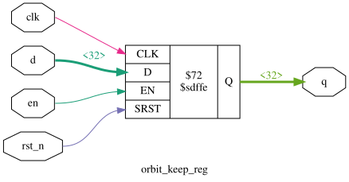
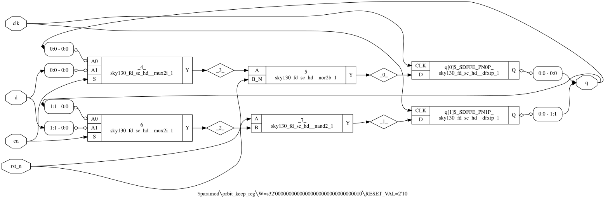

# 03 Schematics: orbit_demo

This folder holds machine-generated schematic views of the RTL and of the synthesized sky130hd netlist, plus two netlists. `orbit_demo` is a standard-cell digital design. There are no hand-drawn transistor-level or analog schematics, because there are no custom circuits (see [Transistor sizes, component values, bias](#transistor-sizes-component-values-bias)). For the hand-drawn block diagrams, see [../02_block_diagram/](../02_block_diagram/README.md).

## Design revision covered by this package

| Item | Revision / identifier | Note |
|---|---|---|
| Design | orbit_demo (ORBIT-AI 4-lane INT8 digital demonstrator) | top module `orbit_demo`, LANES=4 |
| RTL | rtl/orbit_demo.v, orbit_mac_lane.v, orbit_thermal_tmr.v, orbit_keep_reg.v at git commit 26566f0 (2026-09-29 18:54 UTC); unchanged through the package commit | sha256 a3fffb22… / efef3d33… / bba77a5a… / ea05bdc1… (full hashes in MANIFEST.sha256 at the package root) |
| Specification | docs/SPEC.md at 26566f0 (never revised) | sha256 aef5d9fb… |
| Concept brief | docs/orbit-ai-design-brief.pdf, "ORBIT-AI v0.1, 29 September 2026" (never revised; describes an earlier project state, see discrepancy register) | sha256 9d5f33d3… |
| Reviewed layout | ORFS sky130hd, variant `sep` (copy-separation fences), run 2026-09-29 21:56–22:12 UTC, outputs build/pd_sep/results/sky130hd/orbit_demo/sep/ | 6_final.gds sha256 cd19afa9…; 6_final.def f5c544f3…; 6_final.v 68093c41…; 6_final.spef 014e655a… |
| Layout configuration | pd/sky130hd_sep/config.mk and regions.tcl at c10c59b; constraint.sdc at 21917cf (`set clk_period 7.2`) | The run (21:56 UTC) used config.mk/regions.tcl as in ed553f8, identical to c10c59b once comments are stripped. It used the working-tree constraint.sdc with period 7.2 ns, which was committed in 21917cf at 22:00 UTC and is byte-identical to the flow copy build/pd_sep/sdc/sky130hd/sep.sdc. ed553f8's constraint.sdc has a 7.0 ns period, so a rebuild must not use it |
| Flow / tools | ORFS docker image tag openroad/orfs:latest; the only local image is sha256:2e5bf6fe865e… (created 2026-09-29 02:00 UTC, before the run). Linking the run to this digest is an ASSUMPTION: the run logged no digest. OpenROAD prints version "unknown". KLayout 0.30.12 (DRC/LVS). Yosys 0.69+154 (local sims/schematics) | No PDK commit is recorded in the logs |
| Process / library | SkyWater SKY130, sky130_fd_sc_hd, liberty sky130_fd_sc_hd__tt_025C_1v80 (the single corner ORFS optimised at) | — |
| Package assembled | 2026-10-06; design inputs copied from the repository tree at commit 0495cfa (branch claude/hopeful-rubin-0yf8io) | Every later commit on the branch changes only review/ or is empty (git diff --name-only 0495cfa..HEAD outside review/ is empty). Re-runs made for this package are dated 2026-10-06 |

Other implementations in the repo (sky130hd baseline at 7.0 ns, variant `base`; IHP SG13G2) are reference runs only and are NOT the reviewed layout.

`MANIFEST.sha256`, named in the RTL row, is not at the package root (checked 2026-10-06): MISSING, register D-53. The full hashes are in [../04_digital_design/README.md](../04_digital_design/README.md) section 1.

## Contents

| Folder / file | Sheets | Files | Source | Drawing tool |
|---|---|---|---|---|
| [rtl_level/](rtl_level/) | 4 (one per module) | 16 (.rtl.json, .dot, .svg, .pdf x 4) | rtl/*.v at 26566f0 | Yosys 0.69+154 `show`, after `proc; opt -purge; clean` |
| [gate_level/](gate_level/) | 2 (one per kept `orbit_keep_reg` parameterisation) | 6 (.dot, .svg, .pdf x 2) | build/pd_sep/results/sky130hd/orbit_demo/sep/1_2_yosys.v | Yosys 0.69+154 `show` |
| [netlists/](netlists/) | — | 2 | sep run results | OpenROAD / ORFS Yosys |
| [gen_schematics.sh](gen_schematics.sh) | — | 1 | regeneration script for all rtl_level/ and gate_level/ files | bash; calls Yosys and Graphviz `dot` |

All six PDFs open and are non-empty. Each has 1 page; page sizes are listed below. Checked with pypdf 6.19.0 on 2026-10-06. Status: REPRODUCED 2026-10-06.

## rtl_level/

These are Yosys 0.69+154 (git 30d62572e-dirty, oss-cad-suite 2026-09-28) `show` sheets, one sheet per RTL module.

- **How each sheet was made.** Each module was elaborated as its own top with `read_verilog -sv; hierarchy -top <module>; proc; opt -purge; clean`. Hierarchy is kept, not flattened, so each submodule instance appears as one box with its instance name. The `.dot` is the Yosys `show` export. The `.rtl.json` is the Yosys netlist (`write_json`) of the same elaboration and includes the definitions of the submodules it instantiates.
- **SVG and PDF.** These are Graphviz renders of the `.dot`, made with the `dot` bundled in oss-cad-suite (Graphviz 2.43.20190912, cairo 1.18.4). This is the same step that `show -format svg|pdf` performs.
- **Reproduction.** On 2026-10-06, the commands below (the RTL part of [gen_schematics.sh](gen_schematics.sh)) regenerated all four `.dot`, `.rtl.json` and `.svg` files byte-identically. The PDFs match the packaged ones in page size and extracted text; only the metadata bytes differ. Status: REPRODUCED 2026-10-06. The order of the commands matters: with `write_json` before `show`, the JSON is still identical, but the node numbering in the `.dot` (and so the SVG) changes.

| Sheet (module as top) | Cells on sheet | Sub-instances (boxes) | Flip-flop cells | PDF page (pt) | .rtl.json / .dot / .svg / .pdf (bytes) |
|---|---|---|---|---|---|
| [orbit_demo](rtl_level/orbit_demo.rtl_schematic.pdf) | 27 | `g_lane[0..3].u_lane` (orbit_mac_lane), `u_thermal` (`$paramod$babbef2f…\orbit_thermal_tmr`) | 2 `$sdffe` (`fault_q`, shown on net `fault`; `out_valid_q`) | 4117 x 2054 | 89,455 / 18,216 / 110,926 / 37,088 |
| [orbit_mac_lane](rtl_level/orbit_mac_lane.rtl_schematic.pdf) | 17 | `u_acc_a`, `u_acc_b`, `u_res_a`, `u_res_b` (`$paramod\orbit_keep_reg\W=s32'…100000`) | none local | 3153 x 951 | 27,503 / 10,263 / 59,290 / 24,984 |
| [orbit_thermal_tmr](rtl_level/orbit_thermal_tmr.rtl_schematic.pdf) | 28 | `u_copy0`, `u_copy1`, `u_copy2` (`$paramod\orbit_keep_reg\W=s32'…10\RESET_VAL=2'10`) | 1 `$sdff` (`phase`) | 3447 x 1159 | 30,522 / 12,157 / 74,798 / 29,682 |
| [orbit_keep_reg](rtl_level/orbit_keep_reg.rtl_schematic.pdf) | 1 | — | 1 `$sdffe`, W=32, SRST value 0 | 511 x 301 | 3,519 / 1,012 / 5,389 / 13,372 |

Cell breakdown, taken from the `.rtl.json` files:

- **orbit_demo:** `$and` 8, `$not` 5, `$mux` 2, `$reduce_or` 2, `$or` 1, `$logic_and` 1, `$reduce_bool` 1, `$sdffe` 2, plus 5 sub-instances.
- **orbit_mac_lane:** `$mul` 1, `$add` 2, `$mux` 4, `$ne` 2, `$or` 3, `$and` 1, plus 4 sub-instances.
- **orbit_thermal_tmr:** `$and` 4, `$or` 4, `$mux` 4, `$ge` 2, `$ne` 2, `$logic_not` 2, `$le` 1, `$eq` 1, `$not` 1, `$logic_or` 1, `$pmux` 1, `$reduce_and` 1, `$sdff` 1, plus 3 sub-instances.

Notes for reading the sheets:

- **orbit_keep_reg sheet.** It shows the default parameterisation (`W = 32`, `RESET_VAL = 0`), which is the lane-copy variant. The thermal variant (`W = 2`, `RESET_VAL = 2'b10` = `S_STOP`) appears on the RTL sheets only as the three boxes on the `orbit_thermal_tmr` sheet. Its gates are shown in [gate_level/](#gate_level).
- **orbit_thermal_tmr sheet.** It elaborates the module with its own default parameters (80 / 95 / 70). These equal the values `orbit_demo` passes. On the `orbit_demo` sheet the same module appears as `$paramod$babbef2f0fba3bb6fc9689f827a2cfc9dafd9a45\orbit_thermal_tmr`, because the parameters are passed explicitly.
- **Merged resets.** In the elaborated netlist (`proc; opt -purge`), `rst_n` and `clear_fault` are merged into one active-high synchronous reset, `~rst_n | clear_fault` (a `combine_resets` net), for `fault_q` and `out_valid_q`. The `fault_q` register drives the port net `fault`. Because `opt -purge` removed the duplicate internal name, `fault_q` does not appear on the sheet or in the JSON.
- **Synchronous resets only.** All flip-flops are `$sdffe`/`$sdff`, which have a synchronous reset. There are no asynchronous-reset cells.
- **Show options.** `-signed` marks signed operand ports with `*` (on `$mul`, `$ge`, `$le`). `-width` labels multi-bit wires with their width, e.g. `<32>`. `-colors 1` gives deterministic wire colours (seed 1). `-stretch` puts the module inputs at the left and the outputs at the right.

Regenerate from the repo root (`/home/user/chip`) with oss-cad-suite on `PATH`:

```
RTL="rtl/orbit_keep_reg.v rtl/orbit_mac_lane.v rtl/orbit_thermal_tmr.v rtl/orbit_demo.v"
for M in orbit_keep_reg orbit_mac_lane orbit_thermal_tmr orbit_demo; do
  yosys -q -p "read_verilog -sv $RTL; hierarchy -top $M; proc; opt -purge; clean; \
    show -format dot -prefix $M.rtl_schematic -width -signed -stretch -colors 1 $M; \
    write_json $M.rtl.json"
  dot -Tpdf $M.rtl_schematic.dot -o $M.rtl_schematic.pdf
  dot -Tsvg $M.rtl_schematic.dot -o $M.rtl_schematic.svg
done
```

`bash review/orbit_demo_design_review/03_schematics/gen_schematics.sh [OUT]` runs the same commands and the gate-level commands below, writing into `OUT` (default: this folder). It also writes a temporary `/tmp/gl.ys`.

The `src` attributes in the JSON hold repo-relative paths (`rtl/orbit_thermal_tmr.v:21.1-84.10`), so the command must run from the repo root to reproduce the files byte for byte.



## gate_level/

These are Yosys `show` sheets of the two `orbit_keep_reg` parameterisations that synthesis kept as separate modules (`(* keep_hierarchy *)` at rtl/orbit_keep_reg.v:14, plus `SYNTH_KEEP_MODULES = *orbit_keep_reg*` at pd/sky130hd_sep/config.mk:30). The cell names are the mapped `sky130_fd_sc_hd` cells.

**Source netlist:** build/pd_sep/results/sky130hd/orbit_demo/sep/1_2_yosys.v, packaged as [netlists/1_2_yosys.v.gz](netlists/1_2_yosys.v.gz). It was written by the ORFS synthesis step:

- Tool: Yosys 0.68+post (git sha1 UNKNOWN), per [../07_verification/orfs_logs/1_2_yosys.log](../07_verification/orfs_logs/1_2_yosys.log):1.
- Mapping: ABC `abc_speed.script` against `sky130_fd_sc_hd__tt_025C_1v80.lib`, delay target `-D 7.2` ("Setting clock period to 7.2", 1_2_yosys.log:4, :213).

Status: VERIFIED.

**Drawing tool:** Yosys 0.69+154 (oss-cad-suite), not the ORFS Yosys. It reads the liberty `build/pd_sep/platform/cells.lib` (library `sky130_fd_sc_hd__tt_025C_1v80`, sha256 ec0e1067…) with `-lib`, for cell port directions only. SVG and PDF were rendered from the `.dot` with the oss-cad-suite `dot`.

| Sheet | Module in 1_2_yosys.v | Used by | Cells | Area (um^2) | PDF page (pt) | .svg / .pdf (bytes) |
|---|---|---|---|---|---|---|
| [W2 thermal copy](gate_level/orbit_keep_reg_W2_thermal_copy_gate_schematic.pdf) | `$paramod\orbit_keep_reg\W=s32'00000000000000000000000000000010\RESET_VAL=2'10` | `u_thermal.u_copy0/1/2` (3 instances) | 6: `dfxtp_1` x2, `mux2i_1` x2, `nor2b_1` x1, `nand2_1` x1 | 70.0672 | 1631 x 589 | 23,205 / 20,022 |
| [W32 acc/res copy](gate_level/orbit_keep_reg_W32_acc_res_copy_gate_schematic.pdf) | `$paramod\orbit_keep_reg\W=s32'00000000000000000000000000100000` | `g_lane[0..3].u_lane.u_acc_a/u_acc_b/u_res_a/u_res_b` (16 instances) | 103: `dfxtp_1` x32, `mux2i_1` x32, `nor2b_1` x32, `buf_6` x1 and `buf_12` x3 (fan-out of `en`), `clkbuf_1` x3 (fan-out of `rst_n`) | 1243.6928 | 2652 x 5449 (36.8 x 75.7 in) | 371,627 / 73,944 |

Cell counts and areas are from [../07_verification/orfs_reports/synth_stat.txt](../07_verification/orfs_reports/synth_stat.txt):4-53 (identical to build/pd_sep/reports/sky130hd/orbit_demo/sep/synth_stat.txt). The netlist was also counted directly on 2026-10-06. Status: VERIFIED.

**Bit structure.** Each bit is built the same way:

1. A `sky130_fd_sc_hd__mux2i_1` (inverting 2:1 mux) takes `A0 = q[n]`, `A1 = d[n]` and `S = en` (buffered in the W32 module).
2. A `nor2b_1` (`B_N = rst_n`) gives a bit that resets to 0. For the one bit that resets to 1 (thermal `q[1]`, so the reset value is `2'b10` = `S_STOP`), a `nand2_1` is used instead.
3. The result goes into the `D` of a `dfxtp_1`, a positive-edge D flip-flop with no reset pin.

The flip-flop instance names keep the Yosys mapping tags: `q[n]$_SDFFE_PN0P_` (reset to 0) and `q[1]$_SDFFE_PN1P_` (reset to 1).

Regenerate from the repo root (oss-cad-suite `yosys` and `dot`):

```
yosys -q -p "read_liberty -lib build/pd_sep/platform/cells.lib; \
  read_verilog build/pd_sep/results/sky130hd/orbit_demo/sep/1_2_yosys.v; hierarchy -top orbit_demo; \
  show -format dot -prefix gl_w2  -width -stretch *RESET_VAL=2'10; \
  show -format dot -prefix gl_w32 -width -stretch *W=s32'00000000000000000000000000100000"
dot -Tsvg gl_w2.dot  -o orbit_keep_reg_W2_thermal_copy_gate_schematic.svg
dot -Tpdf gl_w2.dot  -o orbit_keep_reg_W2_thermal_copy_gate_schematic.pdf
dot -Tsvg gl_w32.dot -o orbit_keep_reg_W32_acc_res_copy_gate_schematic.svg
dot -Tpdf gl_w32.dot -o orbit_keep_reg_W32_acc_res_copy_gate_schematic.pdf
```

On 2026-10-06 this produced `.dot` files byte-identical to the packaged gate-level `.dot` sources (added to gate_level/ in commit 0477235). The SVGs are byte-identical to the packaged SVGs, and the PDFs have the same page size and text. [gen_schematics.sh](gen_schematics.sh) gives the same files. Status: REPRODUCED 2026-10-06.



### Pre-placement netlist vs final netlist

The gate-level sheets show the synthesized netlist before floorplan and placement. The final netlist build/pd_sep/results/sky130hd/orbit_demo/sep/6_final.v (packaged as [../06_physical_design/layout_db/6_final.v.gz](../06_physical_design/layout_db/6_final.v.gz), sha256 68093c41…) differs in two ways:

- It is flattened: 1 module, against 3 in 1_2_yosys.v.
- It has been through the OpenROAD repair steps: 6250 instances against 5130.

The cells inside the 19 kept instances were compared by instance name and cell type between the two netlists on 2026-10-06 (script over both Verilog files). Status: REPRODUCED 2026-10-06.

| Kept-instance cells | Count | Detail | Origin (log) |
|---|---|---|---|
| In 1_2_yosys.v (16 x 103 + 3 x 6) | 1666 | | |
| Same instance name and same cell type in 6_final.v | 1554 | 518 `dfxtp_1`, 518 `mux2i_1`, 515 `nor2b_1`, 3 `nand2_1` | No kept-module cell was resized or swapped |
| Removed (absent from 6_final.v) | 112 | 48 `buf_12`, 16 `buf_6`, 48 `clkbuf_1`: the 7 `en`/`rst_n` fan-out buffers of each W32 instance | Present in build/pd_sep/results/sky130hd/orbit_demo/sep/1_synth_lec.v, absent from 4_before_rsz_lec.v in the same folder. [3_3_place_gp.log](../07_verification/orfs_logs/3_3_place_gp.log):10 reports `[INFO RSZ-0026] Removed 182 buffers.` |
| Added inside kept instances | 11 | 5 `buf_4` named `place*` in `g_lane[0].u_lane.u_acc_a`, `g_lane[1].u_lane.u_acc_a`, `g_lane[2].u_lane.u_res_a`, `g_lane[3].u_lane.u_acc_a` and `g_lane[3].u_lane.u_acc_b`, which re-buffer the `en` net (for example, `g_lane[0].u_lane.u_acc_a/place1698` drives 17 `mux2i_1` `S` pins). 6 `conb_1` ties, 2 in each `u_thermal.u_copy*`, which drive the `mux2i_1` `S` pins (`en = 1'b1`). | `buf_4`: OpenROAD placement repair (log not traced per instance). `conb_1`: [2_1_floorplan.log](../07_verification/orfs_logs/2_1_floorplan.log):29-31, `repair_tie_fanout`, `[INFO RSZ-0042] Inserted 6 tie sky130_fd_sc_hd__conb_1 instances.` |

So the storage cells (flip-flop, enable mux and reset gate of every redundant bit) in the gate-level sheets match the routed layout exactly. The `en` and `rst_n` buffering drawn on the W32 sheet does not exist in the layout. In the final netlist the copies' `en`/`rst_n` come from tree buffers that OpenROAD inserted, and some of these are shared between copies. For example, `place1872` (`buf_4`, output `net1870`) drives the reset gates of both `u_thermal.u_copy1` and `u_thermal.u_copy2`, and of `g_lane[2].u_lane.u_acc_a`, `g_lane[2].u_lane.u_res_a` and `g_lane[3].u_lane.u_acc_a` (6_final.v:26369, checked 2026-10-06). See discrepancy register (09_review_notes). The package storage audit of 6_final.v ([../07_verification/published_reports/storage_audit.txt](../07_verification/published_reports/storage_audit.txt)) reports 521 flip-flops, 521 distinct Q nets and `RESULT: PASS (18/18 checks passed)`. Status: VERIFIED.

## netlists/

| File | Content | Compressed / uncompressed (bytes) | sha256 (uncompressed) | Status |
|---|---|---|---|---|
| [6_final.cdl.gz](netlists/6_final.cdl.gz) | LVS CDL netlist of the reviewed layout (build/pd_sep/results/sky130hd/orbit_demo/sep/6_final.cdl) | 79,395 / 714,021 | a8bc38a4…, identical to the build file | VERIFIED |
| [1_2_yosys.v.gz](netlists/1_2_yosys.v.gz) | Synthesized netlist (build/pd_sep/results/sky130hd/orbit_demo/sep/1_2_yosys.v) | 68,305 / 798,520 | a15bcc99…, identical to the build file | VERIFIED |

### 6_final.cdl

- **Origin.** Written by OpenROAD from `6_final.odb`: the header reads "CDL Netlist generated by OpenROAD", and the log is [../07_verification/orfs_logs/6_cdl.log](../07_verification/orfs_logs/6_cdl.log).
- **Contents.** One `.SUBCKT orbit_demo` with 217 terminals: 215 signal bits plus `VDD` and `VSS`. It has 7794 `X` instances, all `sky130_fd_sc_hd__*` masters: 6250 logic cells (the same count as 6_final.v), 20 `diode_2` and 1524 `tapvpwrvgnd_1`. Fill cells, which have no devices, are not listed. This was counted on 2026-10-06.
- **LVS run.** KLayout 0.30.12 with the ORFS deck `platforms/sky130hd/lvs/sky130hd.lylvs` extracted 6_final.gds (extracted netlist: [../07_verification/lvs/orbit_demo_extracted.cir.gz](../07_verification/lvs/orbit_demo_extracted.cir.gz)). It compared the result against `6_final_concat.cdl`, which is `6_final.cdl` with `platforms/sky130hd/cdl/sky130hd.cdl` appended (build/pd_sep/make_pd_sep.out:7244-7250; console log not in the package). Result: `INFO : Congratulations! Netlists match.` ([../07_verification/orfs_logs/6_lvs.log](../07_verification/orfs_logs/6_lvs.log):652). Status: VERIFIED.
- **Limitation.** The CDL and the GDS come from the same OpenROAD database, so this LVS confirms the stream-out but is not an independent reference. See discrepancy register (09_review_notes).

### 1_2_yosys.v

- **Structure.** Three modules: the two kept `orbit_keep_reg` parameterisations, and `orbit_demo`, into which `orbit_mac_lane` and `orbit_thermal_tmr` are flattened. The kept instances are named `g_lane[i].u_lane.u_acc_a` and so on.
- **Size.** 5130 cells: 3464 local to `orbit_demo` + 16 x 103 + 3 x 6. Area 46866.1984 um^2, including 521 `dfxtp_1` ([synth_stat.txt](../07_verification/orfs_reports/synth_stat.txt):156 for the area, :107 for the `dfxtp_1` count). Status: VERIFIED.
- **Baseline comparison.** The file is byte-identical to the baseline run's synthesized netlist build/pd/results/sky130hd/orbit_demo/base/1_2_yosys.v (md5 166b150a…), even though the baseline used `-D 7` (build/pd/logs/sky130hd/orbit_demo/base/1_2_yosys.log:4). Checked 2026-10-06. Status: REPRODUCED 2026-10-06.

## Transistor sizes, component values, bias

| Item | Status | Reason |
|---|---|---|
| Transistor sizes (W/L) | N/A | No custom transistor-level circuit exists. Every device sits inside a `sky130_fd_sc_hd` standard cell: all 7794 CDL instances and all 6250 6_final.v instances are `sky130_fd_sc_hd__*` masters. |
| Component values (R, C) | N/A | There are no discrete or custom passive components. |
| Bias currents / references | N/A | There are no analog blocks, bias generators or references. |
| Cell drive strength | REPRODUCED 2026-10-06 | Encoded in the cell name suffix: `_0`, `_1`, `_2`, `_4`, `_6`, `_8`, `_12`, `_16` (e.g. `dfxtp_1`, `buf_12`, `clkbuf_16`). The suffix counts in 6_final.v are: `_1` 4516, `_4` 1135, `_2` 304, `_6` 98, `_0` 95, `_16` 59, `_8` 22, `_12` 21 (6250 total; counted 2026-10-06). |
| Extracted device netlist of the reviewed layout | VERIFIED | [../07_verification/lvs/orbit_demo_extracted.cir.gz](../07_verification/lvs/orbit_demo_extracted.cir.gz): KLayout LVS extraction of 6_final.gds ("Extracted by KLayout on : 29/09/2026 22:11"); gunzip output identical to `build/pd_sep/results/sky130hd/orbit_demo/sep/orbit_demo_extracted.cir` (cmp, 2026-10-06). 138 `.SUBCKT` (`orbit_demo` + 137 `sky130_fd_sc_hd` cells), 1133 MOSFET lines. Device W/L carry a factor of 10^6: `L=150000U` is a 0.15 um device. |
| Standard-cell library transistor netlist (CDL) | MISSING from the package | Not git-tracked and not in this package. It exists in the ORFS image as `/OpenROAD-flow-scripts/flow/platforms/sky130hd/cdl/sky130hd.cdl`, and in the untracked build tree inside `build/pd_sep/objects/sky130hd/orbit_demo/sep/6_final_concat.cdl` (437 `sky130_fd_sc_hd` subcircuits with `nfet_01v8` / `pfet_01v8_hvt` W/L; e.g. `mux2i_1` nfet w=0.65 l=0.15, pfet w=1.0 l=0.15). The PDK / open_pdks version is not recorded in the logs (MISSING). To include them, copy 6_final_concat.cdl into the package and record the PDK version. |

## Discrepancies and notes

See discrepancy register (09_review_notes) in [../09_review_notes/](../09_review_notes/) for the package-wide list. Items specific to this folder:

| ID | Observation | Evidence | Severity |
|---|---|---|---|
| SC-1 | The W32 gate-level sheet shows 7 `en`/`rst_n` fan-out buffers per copy (112 in total) that are not in the routed netlist. 5 `buf_4` and 6 `conb_1` cells inside the kept instances exist only in the routed netlist. The storage cells are unchanged. | Comparison table above; 3_3_place_gp.log:10; 2_1_floorplan.log:31 | low |
| SC-2 | Resolved in commit 0477235: the gate-level `.dot` sources and the generator [gen_schematics.sh](gen_schematics.sh) are now in the package (before, only SVG and PDF were). | `ls gate_level/`; regeneration check above | resolved |
| SC-3 | Two Yosys versions are involved. The layout netlist was synthesized by ORFS Yosys 0.68+post; the schematics were drawn with Yosys 0.69+154. | 1_2_yosys.v line 1; rtl_level/*.rtl.json `creator` | info |
| SC-4 | The standard-cell library CDL (inside `build/pd_sep/objects/sky130hd/orbit_demo/sep/6_final_concat.cdl`) is not git-tracked and not in the package, and the PDK version is not recorded. The extracted device netlist is in the package ([../07_verification/lvs/orbit_demo_extracted.cir.gz](../07_verification/lvs/orbit_demo_extracted.cir.gz)). | file listing of build/pd_sep; `git ls-files` | info |
