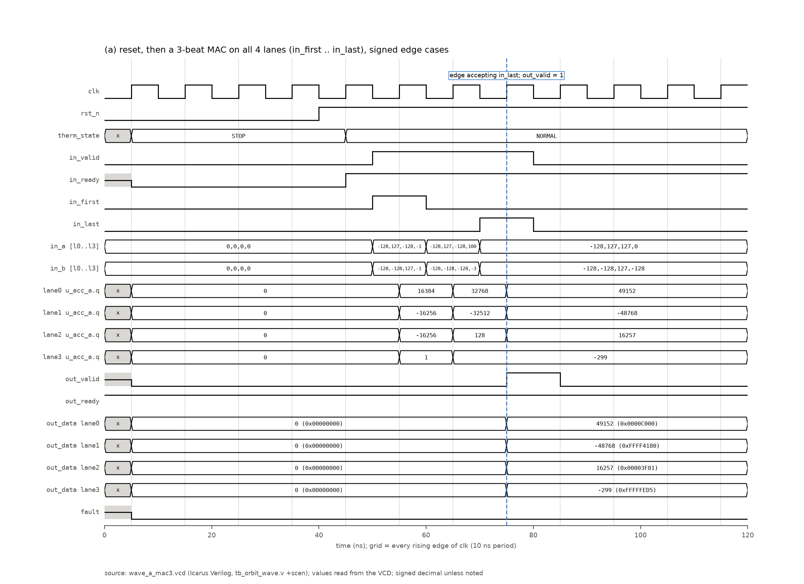
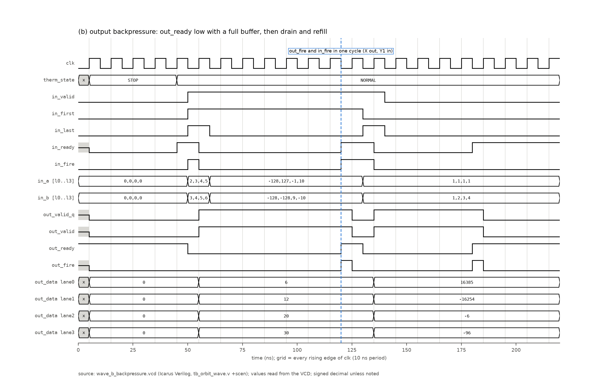
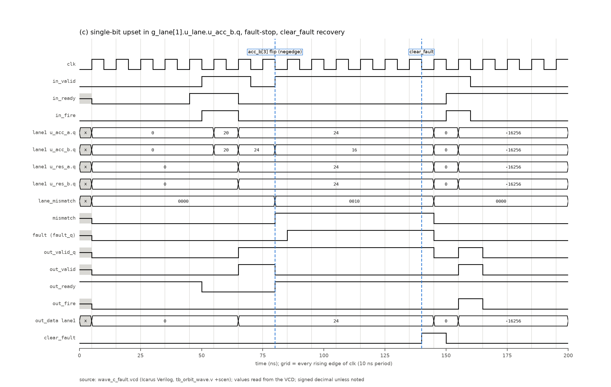
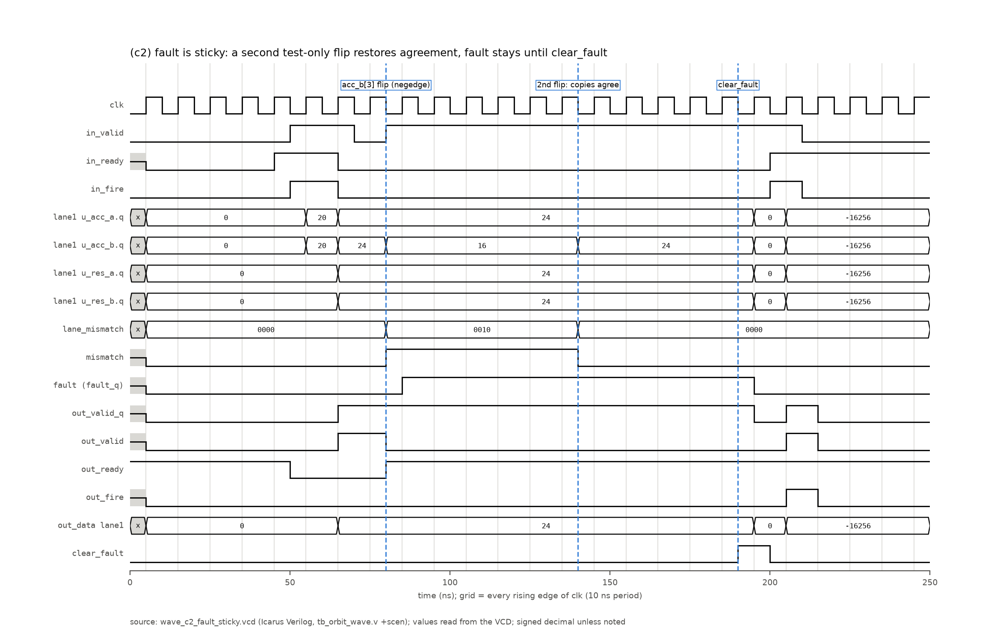
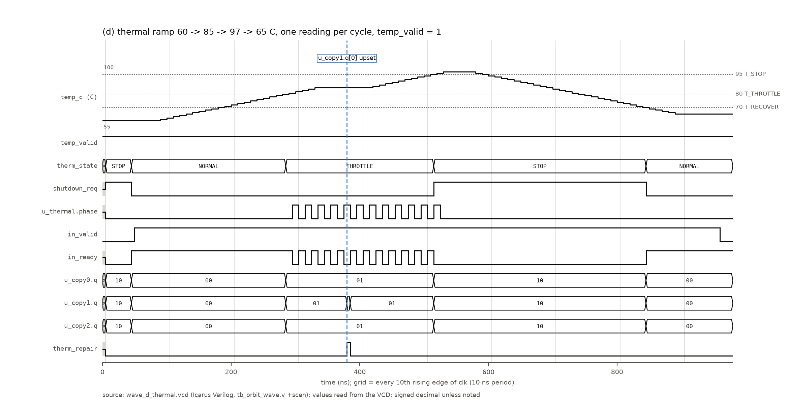
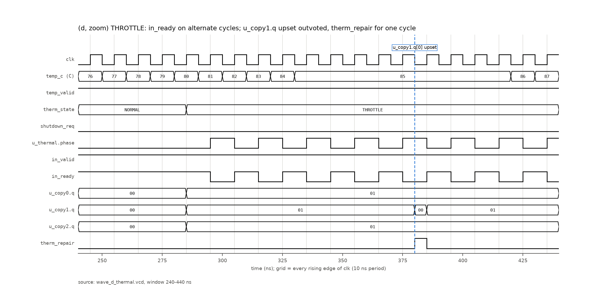

# orbit_demo simulation report

Package section 05_simulation of `orbit_demo_design_review`, written 2026-10-06. Links are relative to this file. Paths in backticks without a link (`reports/...`, `build/...`, `scripts/...`, scratch paths) are repository, build or scratch paths that are not copied into the package. Each result carries one status label: VERIFIED (a tool log or report shows it), REPRODUCED 2026-10-06 (re-run for this package), TARGET, ASSUMPTION, CLAIM (unverified), MISSING or N/A. Formal verification, multi-corner STA and physical verification are in [07_verification](../07_verification/). Discrepancies are collected in the discrepancy register ([09_review_notes](../09_review_notes/)).

## 1 Design revision covered by this package

Package revision table, verbatim from the package revision record:

| Item | Revision / identifier | Note |
|---|---|---|
| Design | orbit_demo (ORBIT-AI 4-lane INT8 digital demonstrator) | top module `orbit_demo`, LANES=4 |
| RTL | rtl/orbit_demo.v, orbit_mac_lane.v, orbit_thermal_tmr.v, orbit_keep_reg.v at git commit 26566f0 (2026-09-29 18:54 UTC); unchanged through the package commit | sha256 a3fffb22… / efef3d33… / bba77a5a… / ea05bdc1… (full hashes in MANIFEST.sha256 at the package root) |
| Specification | docs/SPEC.md at 26566f0 (never revised) | sha256 aef5d9fb… |
| Concept brief | docs/orbit-ai-design-brief.pdf, "ORBIT-AI v0.1, 29 September 2026" (never revised; describes an earlier project state, see discrepancy register) | sha256 9d5f33d3… |
| Reviewed layout | ORFS sky130hd, variant `sep` (copy-separation fences), run 2026-09-29 21:56–22:12 UTC, outputs build/pd_sep/results/sky130hd/orbit_demo/sep/ | 6_final.gds sha256 cd19afa9…; 6_final.def f5c544f3…; 6_final.v 68093c41…; 6_final.spef 014e655a… |
| Layout configuration | pd/sky130hd_sep/config.mk and regions.tcl at c10c59b; constraint.sdc at 21917cf (`set clk_period 7.2`) | The run (21:56 UTC) used config.mk/regions.tcl as in ed553f8, identical to c10c59b once comments are stripped. It used the working-tree constraint.sdc with period 7.2 ns, which was committed in 21917cf at 22:00 UTC and is byte-identical to the flow copy build/pd_sep/sdc/sky130hd/sep.sdc. ed553f8's constraint.sdc has a 7.0 ns period, so a rebuild must not use it |
| Flow / tools | ORFS docker image tag openroad/orfs:latest; the only local image is sha256:2e5bf6fe865e… (created 2026-09-29 02:00 UTC, before the run). Linking the run to this digest is an ASSUMPTION: the run logged no digest. OpenROAD prints version "unknown". KLayout 0.30.12 (DRC/LVS). Yosys 0.69+154 (local sims/schematics) | No PDK commit is recorded in the logs |
| Process / library | SkyWater SKY130, sky130_fd_sc_hd, liberty sky130_fd_sc_hd__tt_025C_1v80 (the single corner ORFS optimised at) | — |
| Package assembled | 2026-10-06; design inputs copied from the repository tree at commit 0495cfa (branch claude/hopeful-rubin-0yf8io) | Every later commit on the branch changes only review/ or the repository landing page README.md (added after packaging; not a design input), or is empty (git diff --name-only 0495cfa..HEAD outside review/ lists only README.md). Re-runs made for this package are dated 2026-10-06 |

Other implementations in the repo (sky130hd baseline at 7.0 ns, variant `base`; IHP SG13G2) are reference runs only and are NOT the reviewed layout.

Note on the table (checked 2026-10-06): `MANIFEST.sha256` is at the package root ([../MANIFEST.sha256](../MANIFEST.sha256), generated last on 2026-10-06; discrepancy register D-53). The full sha256 of the four RTL files are also listed in [04_digital_design/README.md](../04_digital_design/README.md), notes on the revision table.

### 1.1 Simulation inputs and tools

| Item | Value | Source | Status |
|---|---|---|---|
| RTL simulated | `$(RTL)` = rtl/orbit_keep_reg.v, orbit_mac_lane.v, orbit_thermal_tmr.v, orbit_demo.v. rtl/ecc/ is not part of orbit_demo and is not simulated in this section | [make_sim-directed.log](rerun_logs_2026-10-06/make_sim-directed.log) line 1; `RTL` defined in [Makefile](../04_digital_design/source/Makefile) lines 15-17 | VERIFIED |
| RTL at the waveform run | md5 dc59d4a5… (orbit_keep_reg.v), b34f737f… (orbit_mac_lane.v), b2877bc2… (orbit_thermal_tmr.v), 998888fd… (orbit_demo.v), repo HEAD 0495cfa6; equal to the current rtl/ (sha256 as in the revision table, checked 2026-10-06) | [waveforms/run_info.txt](waveforms/run_info.txt) | REPRODUCED 2026-10-06 |
| Directed bench | tb/tb_orbit_demo.v, sha256 2d7a33f4830039a7…, last changed in commit f057f38 (2026-09-30 00:31 UTC), the same commit that last changed `reports/sim/` | [tb_orbit_demo.v](../04_digital_design/source/tb/tb_orbit_demo.v); `git log -- tb/tb_orbit_demo.v reports/sim` | VERIFIED |
| Published logs | [published_logs/](published_logs/) are byte-identical copies of `reports/sim/*` (cmp, 2026-10-06), "Generated by `make sim-report` on 2026-09-30" (summary.md line 3), file times 2026-09-30 00:25 UTC. They carry no commit id, RTL hash or date | [summary.md](published_logs/summary.md) | VERIFIED |
| Re-run logs | [rerun_logs_2026-10-06/](rerun_logs_2026-10-06/): the same make targets at repo commit 0495cfa, 2026-10-06. The four RTL files of `$(RTL)` (26566f0), tb/tb_orbit_demo.v, tb/cocotb/, tb/sim_mutants.py and tb/sim_report.py (f057f38), and mk/sim.mk (3196533, 2026-09-29 20:56 UTC) are unchanged since the published run (rtl/ecc/ and tb/ecc/ changed later in e80a7b2 but are not used by the sim targets). [review_runs/](rerun_logs_2026-10-06/review_runs/) holds the review logs of `make sim`, `make sim-mutants`, `make formal-quick` and `make model MODEL_PUBLISH=` quoted in 04_digital_design section 6.3 | make_*.log in that folder | REPRODUCED 2026-10-06 |
| Icarus Verilog, re-runs | 14.0 (devel) (s20260301-500-g2e81fcccb-dirty) | [run_info.txt](waveforms/run_info.txt) line 3; [requirements-tools.txt](../04_digital_design/source/requirements-tools.txt) line 8 | VERIFIED |
| Icarus Verilog, 2026-09-30 runs | same build as the re-runs (same /opt/eda/oss-cad-suite install); the published directed and GLS logs do not print the Icarus version | — | ASSUMPTION |
| Verilator | 5.053 devel rev v5.052-233-gf5f9ddef9 (mod) | [directed_verilator.log](published_logs/directed_verilator.log) line 29; [make_lint.log](rerun_logs_2026-10-06/make_lint.log) line 2 | VERIFIED |
| Yosys | 0.69+154 (git sha1 30d62572e-dirty) | [gls_yosys_yosys.log](rerun_logs_2026-10-06/gls_yosys_yosys.log) line 1538 | VERIFIED |
| cocotb / Python | cocotb 2.1.0.dev0+41564633, Python 3.11.6 (/opt/eda/oss-cad-suite/bin/tabbypy3) | [random_icarus.md](published_logs/random_icarus.md) line 3 | VERIFIED |
| python3 for the model self-test | not printed in any log | — | MISSING |
| Published tool line | summary.md line 19 lists every tool version as "unknown" although the copied logs state them; see discrepancy register (09_review_notes) | [summary.md](published_logs/summary.md) line 19 | VERIFIED |

## 2 Test inventory

Common conditions unless stated: functional simulation, zero delay, 10 ns simulation clock (`HALF = 5`, `timescale 1ns/1ps`). The 10 ns period has no timing meaning; the reviewed layout clock is 7.2 ns ([clock_period.txt](../06_physical_design/layout_db/clock_period.txt)) and no simulation runs at it. No PVT corner applies (section 5). Formal property checking is not repeated here: see [07_verification/formal_rerun_2026-10-06/formal_summary.md](../07_verification/formal_rerun_2026-10-06/formal_summary.md).

Table 2a: tests, stimulus and tools.

| # | Test | What it checks | Stimulus / size | Simulator + version |
|---|---|---|---|---|
| S1 | Directed bench, RTL, Icarus (`make sim-directed`) | `tb/tb_orbit_demo.v`, ports only: cycle-accurate SPEC model compared every cycle on in_ready, out_valid, out_data, therm_state, shutdown_req, fault (= 0), therm_repair (= 0); scoreboard on every out_fire; scenario checks with hand-computed literals | 14 scenarios, `+seed=1` (in-bench xorshift32), 133601 cycles, 133209 beats, 401 results | Icarus 14.0 (devel), `iverilog -g2005 -Wall -Wno-timescale`, `vvp -n` |
| S2 | Directed bench, RTL, Verilator (`make sim-verilator`) | S1 bench in a 2-state simulator; summary block must equal S1 | as S1 | Verilator 5.053 devel, `--binary --timing`, -O0 |
| S3 | cocotb constrained random, Icarus (`make sim-random`) | all 7 outputs vs Python model `tb/cocotb/orbit_ref.py` every cycle; scoreboard on every out_fire; 35 required coverage points (`random_workload`), 5 (`wrap_soak`) | `random_workload` seeds 1-5 x 20000 cycles; `wrap_soak` seed 1, 149226 cycles (500 cycles after both INT32 wrap directions, limit 400000); 249226 cycles total | Icarus 14.0 (devel), cocotb 2.1.0.dev0+41564633, Python 3.11.6 |
| S4 | cocotb random, Verilator (`make sim-random-verilator`) | as S3; every coverage count must equal the Icarus run of the same seed | `random_workload` seeds 1, 2 x 20000 cycles; no `wrap_soak` | Verilator 5.053 devel, cocotb as S3 |
| S5 | Reference model self-test (`make sim-model`) | `orbit_ref.py` against hand-written cases (products, thermal table incl. code 3, reset/recovery, alternate admission, wraparound, backpressure, clear_fault) | 38 checks | python3 (version not logged); no HDL simulator |
| S6 | Directed bench on Yosys generic netlist (`make sim-gls`) | S1 bench on `synth -flatten -top orbit_demo` netlist; summary must equal S1 | as S1; netlist 4899 cells, 521 flip-flop cells (515 `$_SDFFE_PN0P_`, 3 `$_SDFFE_PN1P_`, 2 `$_SDFFE_PP0P_`, 1 `$_SDFF_PN0_`) | Yosys 0.69+154; Icarus 14.0 (devel); zero delay |
| S7 | Directed bench on routed sky130hd **BASE** netlist (published GLS; not the reviewed layout) | S1 bench on netlist N1 (base layout, 7.0 ns reference run); summary must equal S1 | as S1 | Icarus (version not logged); cell models C1; zero delay, no SDF |
| S8 | Directed bench on routed sky130hd **SEP** netlist (reviewed layout; new) | S1 bench on netlist N2 (reviewed sep layout); summary must equal S1 | as S1 | Icarus 14.0 (devel); cell models C1 (identical to C2); zero delay, no SDF; compile.log empty |
| S9 | GLS fault campaign on the SEP netlist (`make pd-sep-gls`) | `pd/gls/tb_gls.v`: RTL and netlist N2 in lockstep, all outputs compared every cycle; one redundant bit flipped in both models every 32 cycles at the falling edge; duplicated-copy flip must give out_valid = in_ready = 0 that cycle and fault = 1 after the next edge; thermal-copy flip must give therm_repair = 1 with the voted state unchanged, then 0 | 30000 cycles, seed 1, run 2026-09-29 22:12-22:14 UTC; 936 flips (702 duplicated-copy + 234 thermal-copy) over 518 redundant bits (512 + 6) | Icarus (`iverilog -g2005`, version not logged); cell models C2; 10 ns clock (tb_gls.v line 161); zero delay |
| S10 | Sim negative control (`make sim-mutants`, `tb/sim_mutants.py`) | each of 26 single-bug RTL copies must fail both benches | 26 mutants; directed `+maxerr=1`; random 1 seed x 20000 cycles | Icarus; cocotb as S3 |
| S11 | Mutation campaign (`make mutation`, `scripts/mutation_test.py`) | 40 single-point RTL mutants run through lint, sim, formal-quick, fault-quick, synth | m01-m40 + baseline m00, 2026-09-30 01:22-02:27 UTC; MUTATION_JOBS=2, MUTATION_TIMEOUT=3600 s ([mk/mutation.mk](../04_digital_design/source/mk/mutation.mk) lines 29-32) | per the m00 baseline logs (`build/mutation/m00/logs/`): Verilator 5.053 devel (lint, sim), cocotb 2.1.0.dev0+41564633 / Python 3.11.6 (sim), Yosys 0.69+154 (synth); Icarus (sim, fault-quick) and SymbiYosys (formal-quick) versions not logged |
| S12 | Waveform scenarios (new, `waveforms/tb_orbit_wave.v`) | 5 self-checking scenarios with VCD dump (section 4) | 11 / 21 / 19 / 97 / 24 cycles; 29 / 35 / 42 / 383 / 50 checks | Icarus 14.0 (devel) s20260301-500-g2e81fcccb-dirty; RTL; zero delay |
| S13 | Waveform negative control (`waveforms/run_negctl.sh`) | each scenario must FAIL on an RTL copy with its targeted bug (section 6) | 6 mutants x 5 scenarios | as S12 |
| S14 | Lint (`make lint`; static, listed because its log is in this folder) | Verilator `--lint-only -Wall` on the 4 RTL files, top orbit_demo | — | Verilator 5.053 devel rev v5.052-233-gf5f9ddef9 (mod) |

Table 2b: pass criteria, results, status and logs (same row numbers).

| # | Pass criterion | Result | Status | Log in the package |
|---|---|---|---|---|
| S1 | errors = 0, model checks > 0, out_fire > 0 → `TB_ORBIT_DEMO PASS` (tb lines 976-982); make greps that line | PASS: 133600 model checks (0 mismatches), 107 scenario checks (0 failed), 152 literal lane checks, 0 errors | REPRODUCED 2026-10-06 | [published](published_logs/directed_icarus.log); [re-run](rerun_logs_2026-10-06/directed_icarus.log) |
| S2 | PASS and summary diff vs S1 empty (mk/sim.mk) | PASS; "sim-verilator: summary identical to Icarus" | REPRODUCED 2026-10-06 | [published](published_logs/directed_verilator.log); [re-run](rerun_logs_2026-10-06/directed_verilator.log); [clean build](rerun_logs_2026-10-06/make_sim-verilator_cleanbuild.log) |
| S3 | simulator exit 0, one passing xunit testcase, errors = 0, no required coverage point at 0 (`run_random.py` lines 30-64) | `SIM_RANDOM PASS: 6 runs, 249226 cycles, 7544 results checked, 0 mismatches` | REPRODUCED 2026-10-06 | [published](published_logs/random_icarus.md); [re-run summary](rerun_logs_2026-10-06/random_icarus_summary.md); [re-run log](rerun_logs_2026-10-06/random_icarus_run.log) |
| S4 | as S3, plus "coverage identical" per seed | `SIM_RANDOM PASS: 2 runs, 40000 cycles, 1844 results checked, 0 mismatches`; coverage identical (summary.md lines 137-138) | REPRODUCED 2026-10-06 | [published](published_logs/random_verilator.md); [re-run](rerun_logs_2026-10-06/make_sim-random-verilator.log) |
| S5 | prints PASS | `orbit_ref self-test PASS (38 checks)` | REPRODUCED 2026-10-06 | [published](published_logs/model.log); [re-run](rerun_logs_2026-10-06/model.log) |
| S6 | PASS and summary identical | PASS; "sim-gls: summary identical to the RTL run" | REPRODUCED 2026-10-06 | [published](published_logs/gls_yosys.log); [re-run](rerun_logs_2026-10-06/gls_yosys.log); [Yosys log](rerun_logs_2026-10-06/gls_yosys_yosys.log) lines 1406-1418 |
| S7 | PASS and summary identical | PASS | VERIFIED | [gls_sky130hd.log](published_logs/gls_sky130hd.log); netlist named in [summary.md](published_logs/summary.md) lines 16, 59 and in the file table of `build/sim/gls/sky130hd/tb.vvp` |
| S8 | PASS and summary identical | PASS; "sim-gls: summary identical to the RTL run"; new run, no committed counterpart | REPRODUCED 2026-10-06 | [gls_sky130hd_sep_directed.log](rerun_logs_2026-10-06/gls_sky130hd_sep_directed.log); [make log](rerun_logs_2026-10-06/make_sim-gls_sky130hd_sep.log) |
| S9 | 0 mismatches and all stop/repair checks → `GLS PASS` | `GLS PASS: 30000 cycles, 0 mismatches`; 702 stopped, 234 repaired, 518 of 518 bits hit | REPRODUCED 2026-10-06 | published [07_verification/gls/gls.log](../07_verification/gls/gls.log) (= `reports/pdsep/gls.log` = `build/pd_sep/gls/sep/gls.log`); [re-run](../07_verification/rerun_2026-10-06/pd_sep/gls_rerun.log) |
| S10 | kill = `TB_ORBIT_DEMO FAIL` (directed), >= 1 model mismatch (random); all 26 killed by each bench | "directed bench killed 26/26, random bench killed 26/26" | VERIFIED | [mutants.md](published_logs/mutants.md) line 34; [summary.md](published_logs/summary.md) line 17 |
| S11 | mutant killed if a target fails; baseline passes all | 35/40 killed (87.5 %); survivors m07, m20, m21, m22, m27; sim target kills 26 | VERIFIED | [summary.md](../07_verification/mutation/summary.md), [results.json](../07_verification/mutation/results.json) (byte-identical copies of `reports/mutation/`); see discrepancy register (09_review_notes) |
| S12 | `WAVE_<name> PASS` (0 failed checks) | 5 of 5 PASS | REPRODUCED 2026-10-06 | [run_scen1.log](waveforms/run_scen1.log), [run_scen2.log](waveforms/run_scen2.log), [run_scen3.log](waveforms/run_scen3.log), [run_scen4.log](waveforms/run_scen4.log), [run_scen5.log](waveforms/run_scen5.log) |
| S13 | target scenario FAIL | 6 of 6 caught | REPRODUCED 2026-10-06 | [negctl_summary.txt](waveforms/negctl_summary.txt) |
| S14 | no `%Warning` or `%Error` line | none printed; "Built from 0.091 MB sources in 6 modules" | REPRODUCED 2026-10-06 | [make_lint.log](rerun_logs_2026-10-06/make_lint.log) |

Netlists and cell models used by the gate-level runs (sha256 computed 2026-10-06):

| Id | File | sha256 (prefix) | In the package | Status |
|---|---|---|---|---|
| N1 | `build/pd/results/sky130hd/orbit_demo/base/6_final.v` (base layout, written 2026-09-29 20:10 per summary.md line 59) | b2a28a7b19f16cab | no | VERIFIED |
| N2 | `build/pd_sep/results/sky130hd/orbit_demo/sep/6_final.v` (reviewed sep layout); S9 simulates `build/pd_sep/gls/sep/orbit_demo_gl.v`, N2 with the top renamed by `pd/gls/gen_gls.py` | 68093c41fca50e9e | [6_final.v.gz](../06_physical_design/layout_db/6_final.v.gz) decompresses to the same sha256 | VERIFIED |
| C1 | `build/pd/gls/sky130hd/cells.v` | 1d60965c2a6e3134 | no | VERIFIED |
| C2 | `build/pd_sep/gls/sep/cells.v` | 1d60965c2a6e3134 (byte-identical to C1) | no | VERIFIED |

C1 and C2 are Yosys 0.69+154 `read_liberty -ignore_miss_func ...; write_verilog` output of `sky130_fd_sc_hd__tt_025C_1v80.lib` (nom_process 1.0, nom_temperature 25, nom_voltage 1.8). Only the Boolean cell functions are used; there are no delays, timing checks or SDF.

Notes:

- S7 vs S8: the published routed-netlist GLS (S7) used the BASE layout netlist. The bench output does not name the netlist; S7, S8, S6 and S1 logs are byte-identical (md5 05a30e4e…). The generator `tb/sim_report.py` hardcodes the base path in summary.md; see discrepancy register (09_review_notes). S8 was run for this package on 2026-10-06 19:35:58-19:37:55 UTC (build file times) and is the only directed-bench GLS of the reviewed netlist in the package.
- S9 compares the RTL with the netlist under the same injection; it has no golden-result scoreboard. The claim that no wrong result is released rests on the stop checks plus the formal property `D_out_fire_matches_ref` (07_verification). Thermal code 3 is never reached (`code3 0`).
- `make synth` also runs the directed bench on its own `-noexpr` Yosys netlist (`reports/synth/gls_result.txt` = [07_verification/synth/gls_result.txt](../07_verification/synth/gls_result.txt)); it is not reviewed here.

## 3 Result details

### 3.1 Directed bench (S1, S2, S6, S7, S8)

Summary block printed identically by all five runs ([directed_icarus.log](published_logs/directed_icarus.log) lines 16-27):

```
tb_orbit_demo summary (seed 1)
  scenarios            14
  cycles               133601
  model cycle checks   133600 (mismatches 0)
  scenario checks      107 (failed 0)
  beats accepted       133209
  results transferred  401 (all compared with the scoreboard)
  literal lane checks  152
  back-to-back results 220
  results dropped by clear_fault/reset 2
  errors               0
TB_ORBIT_DEMO PASS
```

Scenarios and start times (ps, same log lines 1-14): reset_stop 10000, signed_edges 260000, multi_beat 440000, first_and_last 6830000, continue_after_last 6890000, backpressure 6960000, back_to_back 11250000, throttle 11910000, stop_and_recover 13610000, drain_in_stop 14040000, negative_temps 14210000, int32_wrap 14580000 (132106-beat sum, INT32 wrap in both directions), clear_fault 1335650000, reset_midrun 1335870000; `$finish` at 1336020000 ps.

Scope limits stated in [summary.md](published_logs/summary.md) lines 187-192 (VERIFIED as text): no upsets are injected, so `fault` and `therm_repair` are only checked to stay 0 and the mismatch/fault-stop path is not exercised; thermal code 3 is not reachable through the ports; gate-level runs are zero delay; coverage is testbench event counting only.

### 3.2 cocotb random (S3, S4)

| Test | Seed | Cycles | Results checked | Errors | Missing coverage | Icarus | Verilator |
|---|---|---|---|---|---|---|---|
| random_workload | 1 | 20000 | 866 | 0 | none | PASS | PASS |
| random_workload | 2 | 20000 | 978 | 0 | none | PASS | PASS |
| random_workload | 3 | 20000 | 976 | 0 | none | PASS | not run |
| random_workload | 4 | 20000 | 825 | 0 | none | PASS | not run |
| random_workload | 5 | 20000 | 877 | 0 | none | PASS | not run |
| wrap_soak | 1 | 149226 | 3022 | 0 | none (wrap_pos 2, wrap_neg 2) | PASS | not run |

Source: [random_icarus.md](published_logs/random_icarus.md) lines 5-12 and coverage table lines 14-59; [random_verilator.md](published_logs/random_verilator.md) lines 5-8. Conditions: cocotb `Clock(dut.clk, 10, unit="ns")`, inputs written after the rising edge, outputs sampled at the falling edge; seeds and cycle counts from [mk/sim.mk](../04_digital_design/source/mk/sim.mk) lines 35-40. Status: REPRODUCED 2026-10-06. `reset_cycles` per random_workload seed is 6 / 2 / 4 / 7 / 5, of which 2 are the initial reset, so seed 2 has no mid-run reset; `reset_cycles` is not a required coverage point.

### 3.3 GLS fault campaign (S9)

[07_verification/gls/gls.log](../07_verification/gls/gls.log), lines 1-6, VERIFIED; lines 1-6 of the 2026-10-06 re-run [gls_rerun.log](../07_verification/rerun_2026-10-06/pd_sep/gls_rerun.log) are identical (REPRODUCED 2026-10-06):

```
GLS: 30000 cycles, seed 1, 518 redundant bits, injection every 32 cycles
coverage: beats accepted 8729, results taken 1037 (1037 non-zero), resets 6, clears 733
coverage: cycles NORMAL 14075, THROTTLE 1737, STOP 14182, code3 0; throttle-blocked beats 525
injections: 702 duplicated-copy flips (702 stopped), 234 thermal-copy flips (234 repaired); 518 of 518 redundant bits hit
GLS PASS: 30000 cycles, 0 mismatches
pd/gls/tb_gls.v:262: $finish called at 300004000 (1ps)
```

The 518 targets are listed in [gl_inject.vh](../07_verification/gls/gl_inject.vh) (`N_DUP_BITS = 512`, `N_TMR_BITS = 6`), e.g. `rtl.g_lane[0].u_lane.u_acc_a.q[0]` paired with `gl.\g_lane[0].u_lane.u_acc_a/q[0]$_SDFFE_PN0P_ .IQ`. The flow is [mk/pdsep.mk](../04_digital_design/source/mk/pdsep.mk) lines 127-137 (`PDSEP_GLS_CYCLES ?= 30000`, `PDSEP_GLS_SEED ?= 1`, lines 35-36). The base netlist has its own campaign with a byte-identical log (`reports/pd/sky130hd/gls.log`), because stimulus and injection schedule depend only on seed and cycle count.

### 3.4 Sim negative control (S10)

All 26 mutants killed by both benches ([mutants.md](published_logs/mutants.md)). Weakest kills (most cycles needed, random bench): `reset_keeps_out_valid` "6 mismatches in 20000 cycles" (line 24), `no_drain_in_stop` 11804 cycles (line 29), `stop_gt` 4762 (line 9), `reset_normal` 3952 (line 14). Directed-bench first errors range from t=24000 ps to t=1335744000 ps. Status: VERIFIED. A scratch re-run on 2026-10-06 produced a byte-identical mutants table; its log is [make_mutants.log](rerun_logs_2026-10-06/review_runs/make_mutants.log) (table lines 4-37, `SIM_MUTANTS PASS` line 39), copied into the package on 2026-10-06. Status of the re-run: REPRODUCED 2026-10-06.

### 3.5 Mutation campaign (S11)

[summary.md](../07_verification/mutation/summary.md) (= `reports/mutation/summary.md`): score 35/40 (87.5 %), 35/39 (89.7 %) excluding m21 argued equivalent; kills per target lint 5, sim 26, formal-quick 29, fault-quick 21, synth 29. Survivors m07 `result_from_b`, m20 `out_valid_no_fault`, m22 `fault_not_sticky`, m27 `shutdown_only_stop` are called real test gaps; m21 `out_fire_unmasked` an equivalent mutant. Status: VERIFIED for the report content; the logged run ended with unanalysed survivors and the summary was regenerated by a run with no log, see discrepancy register (09_review_notes). This campaign and S10 both report "26" sim kills with different mutant sets.

## 4 Waveforms

All waveforms come from the wrapper [tb_orbit_wave.v](waveforms/tb_orbit_wave.v), written for this package (tb/ is not modified). Its DUT instance `dut` has the same named port connections as tb/tb_orbit_demo.v and no parameter overrides, so the internal paths are the SPEC section 7 paths (`dut.g_lane[i].u_lane.u_acc_b.q`, `dut.u_thermal.u_copy1.q`). Conditions for every figure: RTL, zero delay, Icarus 14.0 (devel) (s20260301-500-g2e81fcccb-dirty), `iverilog -g2005 -Wall -Wno-timescale` (empty [compile.log](waveforms/compile.log)), **10 ns functional clock** (rising edges at 5, 15, 25 ns ...), inputs and upsets applied at the falling edge, outputs sampled 1 ns before the rising edge. This is not the 7.2 ns layout clock; the plots show function only. Upsets are hierarchical assignments from the testbench; the RTL has no fault port. Run 2026-10-06T19:46:47Z ([run_info.txt](waveforms/run_info.txt)), scripts [run_waves.sh](waveforms/run_waves.sh) and [plot_waves.py](waveforms/plot_waves.py) (every plotted value is read from the VCD). Per-cycle values are in the CSV next to each PNG; all six pages are in [orbit_demo_waveforms.pdf](waveforms/orbit_demo_waveforms.pdf). Status of every figure: REPRODUCED 2026-10-06.



*Figure 1, scenario 1 `a_mac3`. Reset, STOP → NORMAL at 60 C, then a 3-beat sum on all 4 lanes (in_first on beat 1, in_last on beat 3). Lane results: (-128 x -128) x 3 = 49152 (0x0000C000); (127 x -128) x 3 = -48768 (0xFFFF4180); -128 x 127 + -128 x -128 + 127 x 127 = 16257 (0x00003F81); -1 x -1 + 100 x -3 + 0 x -128 = -299 (0xFFFFFED5). out_valid is set by the edge that accepts in_last (75 ns) and the result transfers at the next edge (out_ready = 1). The bench also checks u_acc_b.q = u_acc_a.q after every beat (not plotted) and fault = therm_repair = mismatch = 0. Self-check: `WAVE_a_mac3 PASS (29 checks, 11 cycles)`. Source: [wave_a_mac3.vcd](waveforms/wave_a_mac3.vcd), [run_scen1.log](waveforms/run_scen1.log), [wave_a_mac3.csv](waveforms/wave_a_mac3.csv).*



*Figure 2, scenario 2 `b_backpressure`. Result X = (6, 12, 20, 30) is held 6 cycles with out_ready = 0: out_valid = 1, out_data stable, in_ready = 0, and the offered non-last beat Y1 (in_first) is blocked. In the cycle ending at the 125 ns edge X transfers and Y1 is accepted (out_fire and in_fire in the same cycle). Y2 (in_last) enters the empty buffer; Y = (16385, -16254, -6, -96) is held 4 cycles, then transferred. 3 beats accepted, exactly 2 results. Self-check: `WAVE_b_backpressure PASS (35 checks, 21 cycles)`. Source: [wave_b_backpressure.vcd](waveforms/wave_b_backpressure.vcd), [run_scen2.log](waveforms/run_scen2.log), [wave_b_backpressure.csv](waveforms/wave_b_backpressure.csv).*



*Figure 3, scenario 3 `c_fault`. With result R = (12, 24, 36, 48) pending and out_ready = 0, `dut.g_lane[1].u_lane.u_acc_b.q[3]` is flipped at the 80 ns falling edge (lane 1 acc_b 24 → 16). In the same cycle lane_mismatch = 0010, mismatch = 1 and out_valid = in_ready = 0; fault (fault_q) = 1 after the 85 ns rising edge. For the next 5 cycles, with out_ready = 1 and a beat offered, there is no out_fire and no in_fire; out_valid_q stays 1 internally and R is never transferred. One clear_fault cycle (140-150 ns, in_ready = 0 during it) zeroes all acc/res copies, clears fault and mismatch and empties the buffer; the recovery beat (lane 1: 127 x -128 = -16256) transfers. Self-check: `WAVE_c_fault PASS (42 checks, 19 cycles)`. Source: [wave_c_fault.vcd](waveforms/wave_c_fault.vcd), [run_scen3.log](waveforms/run_scen3.log), [wave_c_fault.csv](waveforms/wave_c_fault.csv).*



*Figure 4, scenario 5 `c2_fault_sticky`. As scenario 3, plus a second, test-only flip of the same bit at 140 ns that restores acc_b = 24. lane_mismatch returns to 0000 and mismatch to 0, but fault stays 1 and out_valid and in_ready stay 0 until clear_fault (190-200 ns): the fault latch is sticky (SPEC section 5). Without this scenario a non-sticky fault latch passes scenario 3, because the persistent flip keeps mismatch high (section 6). Self-check: `WAVE_c2_fault_sticky PASS (50 checks, 24 cycles)`. Source: [wave_c2_fault_sticky.vcd](waveforms/wave_c2_fault_sticky.vcd), [run_scen5.log](waveforms/run_scen5.log), [wave_c2_fault_sticky.csv](waveforms/wave_c2_fault_sticky.csv).*



*Figure 5, scenario 4 `d_thermal`. temp_c one reading per cycle: 60 x4, 61..85, 85 x8, 86..97, 97 x4, 96..65, 65 x6 (91 readings), temp_valid = 1, single-beat sums offered every cycle, out_ready = 1. therm_state and in_ready match the SPEC section 6 table at every step. THROTTLE starts at ramp step 24 (the cycle after the 80 C reading), STOP at step 47 (after 95 C), NORMAL at step 80 (after 70 C on the way down); STOP never falls back to THROTTLE. 23 THROTTLE cycles admit 12 (alternate cycles, the first THROTTLE cycle admits). shutdown_req = therm_state[1]. 47 beats accepted, 47 results transferred. In the first STOP cycle `u_thermal.phase` is still 1 (run_scen4.log step 47); the RTL clears it at the next edge, which differs from the SPEC wording but has no effect on admission; see discrepancy register (09_review_notes). Self-check: `WAVE_d_thermal PASS (383 checks, 97 cycles)`. Source: [wave_d_thermal.vcd](waveforms/wave_d_thermal.vcd), [run_scen4.log](waveforms/run_scen4.log) (per-step table), [wave_d_thermal.csv](waveforms/wave_d_thermal.csv).*



*Figure 6, scenario 4, window 240-440 ns. NORMAL → THROTTLE at the 285 ns edge, after the 80 C reading; in_ready high on alternate cycles. `u_thermal.u_copy1.q[0]` is flipped at the 380 ns falling edge (copy1 01 → 00, copy0 = copy2 = 01): therm_repair = 1 until the 385 ns rising edge, the voted state stays THROTTLE, the admission pattern is unchanged and copy1 is rewritten from the voted next state at that edge. The log prints this event at t=381.0 ns, 1 ns after the flip. Same self-check and sources as Figure 5.*

## 5 PVT corners and timing

| Item | Status | Detail |
|---|---|---|
| PVT corners for RTL simulation (S1-S5, S12) | N/A | Functional simulation has no process, voltage or temperature. `temp_c` is a digital input of the thermal FSM, not a simulation temperature. |
| PVT corners for zero-delay GLS (S6-S9) | N/A | S7-S9: cell models are the Boolean functions of the sky130_fd_sc_hd__tt_025C_1v80 liberty (Yosys `read_liberty ... write_verilog`, [mk/pdsep.mk](../04_digital_design/source/mk/pdsep.mk) lines 68-70 and 130-131). S6: Yosys generic gates (`$_AND_`, `$_SDFFE_PN0P_` ...), no library ([mk/sim.mk](../04_digital_design/source/mk/sim.mk) lines 104-108). No delay is used, so no corner applies. |
| SDF-annotated (timing) gate-level simulation, any corner | MISSING | No `.sdf` exists under `build/` (searched 2026-10-06) and no script in mk/, pd/ or scripts/ calls `write_sdf`. Needed: OpenSTA `write_sdf` per corner from 6_final.odb and [6_final.spef.gz](../06_physical_design/layout_db/6_final.spef.gz), sky130_fd_sc_hd Verilog models with specify blocks, an SDF-capable simulator flow, and the bench clock set to 7.2 ns. |
| Multi-corner timing | REPRODUCED 2026-10-06 | Reported in 07_verification: multi-corner STA of the sep layout at 7.2 ns, [sta_corners_sep.txt](../07_verification/sta_corners_sep_2026-10-06/sta_corners_sep.txt) (TT, ss_100C_1v60, ff_n40C_1v95). ss_100C_1v60 fails setup there (WNS -6.131 ns). No simulation in this section covers or contradicts that result. |
| Simulation switching activity for power | MISSING | Power in 07_verification uses OpenSTA default activity ([power_default_activity.txt](../07_verification/published_reports/power_default_activity.txt)). No SAIF/VCD from a gate-level workload exists; the waveform VCDs are short RTL scenarios and are not usable as power activity. Needed: a SAIF/VCD dump from a representative gate-level run of the sep netlist, annotated in `report_power`. |

## 6 Negative controls (run_negctl.sh)

[run_negctl.sh](waveforms/run_negctl.sh) copies rtl/*.v to a scratch directory per mutant, applies one `sed` edit, stops if the edit did not apply (`cmp`), and runs all 5 scenarios. rtl/ is only read. Result: [negctl_summary.txt](waveforms/negctl_summary.txt), REPRODUCED 2026-10-06 (Icarus 14.0 (devel), same conditions as section 4). The per-mutant copies and diffs are in the scratch `wave_negctl/` directory, not in the package.

| Mutant | File and change | Target scenario | Target result | Other scenarios |
|---|---|---|---|---|
| zext_product | orbit_mac_lane.v: `prod32 = {16'd0, prod}` (product zero-extended) | 1 a_mac3 | FAIL, 3 of 29 checks | b FAIL 2/35, c FAIL 1/42, c2 FAIL 1/50, d PASS |
| no_backpressure | orbit_demo.v: the buffer term of in_ready (`~out_valid_q` or `out_ready`) replaced by `1'b1` | 2 b_backpressure | FAIL, 2 of 35 | all others PASS |
| out_valid_ungated | orbit_demo.v: `out_valid = out_valid_q & ~fault_q` (no `~mismatch`) | 3 c_fault | FAIL, 3 of 42 | c2 FAIL 3/50, others PASS |
| fault_not_sticky | orbit_demo.v: `fault_q <= 1'b1; else fault_q <= 1'b0;` (fault follows mismatch) | 5 c2_fault_sticky | FAIL, 3 of 50 | all others PASS, including c |
| throttle_every_cycle | orbit_thermal_tmr.v: admit `(voted == S_THROTTLE)` without `& ~phase` | 4 d_thermal | FAIL, 12 of 383 | all others PASS |
| copy1_no_repair | orbit_thermal_tmr.v: `u_copy1` `.d(nxt)` → `.d(c1)` (copy1 never rewritten) | 4 d_thermal | FAIL, 92 of 383 | a FAIL 1/29, others PASS |

`fault_not_sticky` behaves like mutation-campaign survivor m22 (`fault_q <= mismatch;` in `build/mutation/m22/rtl/orbit_demo.v`), which passes sim, formal-quick, fault-quick, synth and the full formal set ([summary.md](../07_verification/mutation/summary.md)). Scenario c2 kills it, but c2 is not part of any make target (open item 4).

Other negative controls for this section: S10 (26 sim mutants, 26/26 per bench, VERIFIED) and S11 (mutation campaign). For the S9 harness, a netlist mutant (instance `_4098_` sky130_fd_sc_hd__and2_1 → or2_1, 3000 cycles, seed 1, first MISMATCH at cycle 7, "GLS FAIL: 1148 errors") exists for the BASE netlist (`reports/pd/sky130hd/gls_mutant.log`, "#0 of 189"; the published file is cut at 8 lines and omits the verdict, which is in the full log `build/pd/gls/sky130hd/mutant/gls_mutant.log`, register D-49) and for the sep netlist ([gls_mutant.log](../07_verification/rerun_2026-10-06/pd_sep/gls_mutant.log), "#0 of 184", REPRODUCED 2026-10-06). The logs do not name their netlist; apart from that count they are identical.

## 7 Re-run comparison (committed 2026-09-30 vs re-run 2026-10-06)

| Item | Committed | Re-run 2026-10-06 | Difference |
|---|---|---|---|
| Directed, Icarus | [directed_icarus.log](published_logs/directed_icarus.log) | [directed_icarus.log](rerun_logs_2026-10-06/directed_icarus.log) | none (byte-identical, md5 05a30e4e…) |
| Directed, Verilator | [directed_verilator.log](published_logs/directed_verilator.log) lines 30-31: walltime 0.734 s, 1.819 ms/s, cpu 0.733 s, 8 MB | [directed_verilator.log](rerun_logs_2026-10-06/directed_verilator.log): walltime 1.326 s, 1.008 ms/s, cpu 1.301 s, 7 MB | runtime footer only; summary block identical. The default re-run reused the existing Verilator objects ([verilator_build.log](rerun_logs_2026-10-06/verilator_build.log): "Nothing to be done", "Built from 0.000 MB sources in 0 modules"). A clean build in a scratch BUILD ([verilator_build_clean.log](rerun_logs_2026-10-06/verilator_build_clean.log): "Built from 0.298 MB sources in 7 modules") also passed, walltime 1.253 s, 8 MB, "summary identical to Icarus" ([make_sim-verilator_cleanbuild.log](rerun_logs_2026-10-06/make_sim-verilator_cleanbuild.log)) |
| Model self-test | [model.log](published_logs/model.log) | [model.log](rerun_logs_2026-10-06/model.log) | none |
| cocotb, Icarus | [random_icarus.md](published_logs/random_icarus.md): wall s 2.4 / 2.7 / 2.7 / 2.4 / 2.5 / 19.0 | [random_icarus_summary.md](rerun_logs_2026-10-06/random_icarus_summary.md): 3.6 / 3.6 / 3.3 / 3.2 / 3.3 / 24.9 | "wall s" column only; cycles, results, errors and the full coverage table identical. `make sim-random-verilator` re-ran the Icarus step once more (3.2 / 3.5 / 3.3 / 3.3 / 3.3 / 24.6 s, same counts) |
| cocotb, Verilator | [random_verilator.md](published_logs/random_verilator.md): wall s 1.6 / 1.5 | [random_verilator_summary.md](rerun_logs_2026-10-06/random_verilator_summary.md): 2.1 / 2.1 | "wall s" only. The cocotb Verilator build of 2026-09-30 was reused (`build/sim/random_verilator/build.log`: "Nothing to be done"); not rebuilt from scratch |
| Yosys generic GLS | [gls_yosys.log](published_logs/gls_yosys.log) | [gls_yosys.log](rerun_logs_2026-10-06/gls_yosys.log) | none; 4899 cells / 521 flip-flop cells as summary.md line 58 |
| Routed-netlist GLS | [gls_sky130hd.log](published_logs/gls_sky130hd.log) (BASE netlist) | [gls_sky130hd_sep_directed.log](rerun_logs_2026-10-06/gls_sky130hd_sep_directed.log) (SEP netlist) | byte-identical logs from different netlists; the bench output does not depend on the netlist when the function matches. Not a re-run of the same input |
| Sim mutants (S10) | [mutants.md](published_logs/mutants.md) | [make_mutants.log](rerun_logs_2026-10-06/review_runs/make_mutants.log) lines 4-37 | none (table byte-identical) |
| GLS fault campaign (S9) | [gls.log](../07_verification/gls/gls.log) | [gls_rerun.log](../07_verification/rerun_2026-10-06/pd_sep/gls_rerun.log) | none: lines 1-6 identical; real 2m17.734s |

Re-run wall times (`real`, from the make_*.log files; no committed timings exist): lint 0.123 s, sim-model 0.045 s, sim-directed 6.527 s, sim-verilator 8.782 s cached / 28.536 s clean, sim-random 42.417 s, sim-random-verilator 46.156 s (includes the Icarus step), sim-gls Yosys 46.567 s, directed GLS on the sep netlist 2 min 3.381 s. The vacuity re-run log [make_formal-vacuity.log](rerun_logs_2026-10-06/make_formal-vacuity.log) in this folder belongs to 07_verification. Every functional output of the simulation re-runs with a committed counterpart (S1-S6, S9, S10) equals the committed one; the differences are limited to wall time, CPU time and memory fields. S8 and the lint run (S14) have no committed counterpart. In make_formal-vacuity.log all 19 mutants are CAUGHT, as in the committed [vacuity.md](../07_verification/formal/vacuity.md), but `zext_product_pdr` reports a different failing property and step (P8_fresh_sum_from_zero_lane2, step 6; committed P1_out_valid_data_lane1 P8_fresh_sum_from_zero_lane1, step 4) and `clear_keeps_acc_pdr` a different step (8; committed 5): abc pdr run-to-run variation, register D-43.

## 8 Open items

| # | Item | Status | Needed |
|---|---|---|---|
| 1 | Directed-bench GLS of the reviewed sep netlist exists only as this package's re-run (S8); the repo publishes the base netlist (S7) and `tb/sim_report.py` hardcodes the base path | MISSING | commit the S8 log; take the netlist path from `SIM_GLS_SRCS`. See discrepancy register (09_review_notes) |
| 2 | Timing (SDF) gate-level simulation at any corner | MISSING | see section 5 |
| 3 | Fault path in the regression suite: the sim benches never inject upsets (`fault`, `therm_repair` checked = 0 only); thermal code 3 unreachable; mutation survivors m07, m20, m22, m27 | MISSING | add the checks of [tb_mutation_gaps.v](../07_verification/mutation/tb_mutation_gaps.v) to a make target |
| 4 | Waveform scenarios c, c2 and d are not in any make target. c2 kills a non-sticky fault latch (section 6), which the regression suite misses (m22) | MISSING | add `waveforms/tb_orbit_wave.v` +scen=1..5 to `make sim` or move its checks into tb/ |
| 5 | cocotb random test on a gate-level netlist | MISSING | run `tb/cocotb/run_random.py --sources <sep 6_final.v> <cells.v>` |
| 6 | Mid-run reset coverage in the random test (seed 2 has none; not a required point) | MISSING | add reset coverage points (during out_fire, in THROTTLE, in STOP) to `REQUIRED` |
| 7 | Code / toggle coverage | MISSING | e.g. Verilator `--coverage` on S1 and S3 with a merged report |
| 8 | Switching activity for power | MISSING | see section 5 |
| 9 | Provenance in the sim logs (commit, RTL/TB hash, tool versions; summary.md says "unknown") | MISSING | have `tb/sim_report.py` write `git rev-parse HEAD`, sha256 of `$(RTL)` and the bench, and tool versions. See discrepancy register (09_review_notes) |
| 10 | Re-run evidence formerly not in the package: sim-mutants re-run (S10) | resolved in package: [make_mutants.log](rerun_logs_2026-10-06/review_runs/make_mutants.log) (REPRODUCED 2026-10-06) | — |
| 11 | From-scratch build of the cocotb Verilator model | MISSING | re-run `make sim-random-verilator` with an empty BUILD |
| 12 | cocotb is not listed in [requirements-tools.txt](../04_digital_design/source/requirements-tools.txt) (pinned only indirectly through `oss-cad-suite==2026-09-28`, line 6); Python is pinned only as `python==3.11` (line 16), and the python3 used by `make sim-model` is not logged. Line 15 says the scripts use the standard library only, although the cocotb bench needs cocotb (register D-15) | MISSING | add cocotb to requirements-tools.txt; print `python3 --version` in the model log |
| 13 | No demonstrator clock requirement: docs/SPEC.md states no frequency; all simulations use 10 ns, the layout 7.2 ns | MISSING | state the target clock and PVT range in SPEC |
| 14 | Waveform bench labels: run_scen4.log uses "cyc" for the bench cycle counter in event lines (e.g. `cyc=37`) and for the ramp step in the final line (`first THROTTLE cyc 24`); the usage comment in [tb_orbit_wave.v](waveforms/tb_orbit_wave.v) line 34 reads "+scen=1 (2, 3, 4)", omitting scenario 5 (c2_fault_sticky) that the header (lines 10-23) and run_waves.sh run | MISSING (labelling fix not applied; no result affected) | rename the final-line field to "step"; change the usage comment to "+scen=1 (2, 3, 4, 5)" |
