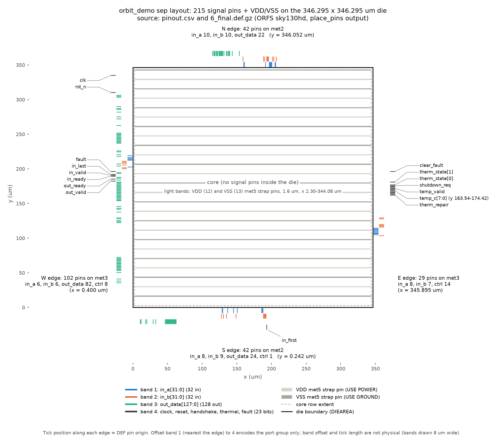
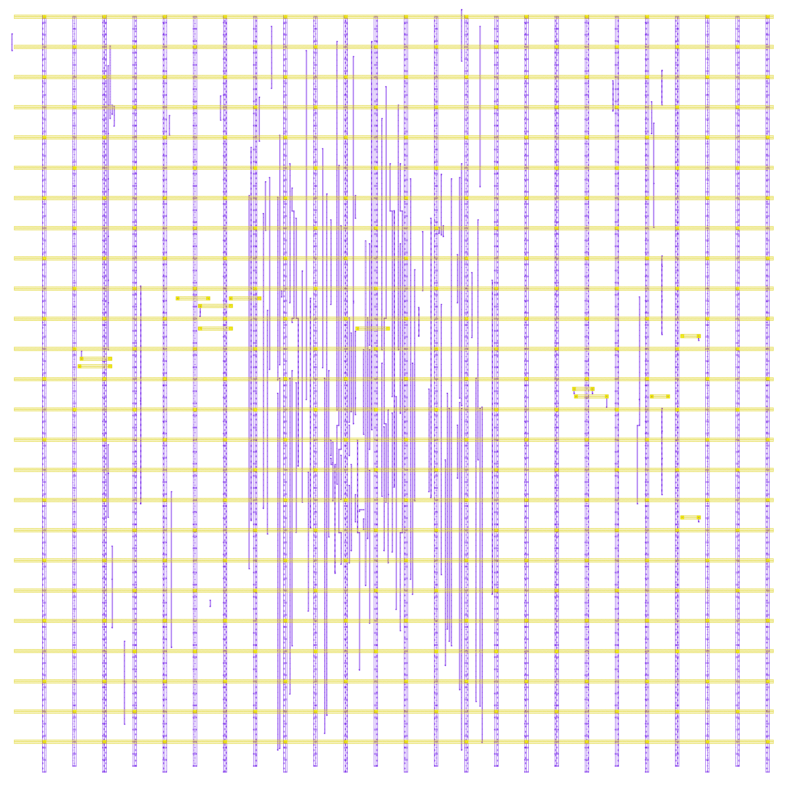

# 08 Pinout and packaging: orbit_demo, sky130hd layout variant sep

Package section 08_pinout_packaging of `orbit_demo_design_review`, written 2026-10-06 from the package files and the repository at commit 0495cfa. Links are relative to this file. Paths written as `build/...`, `viz/...`, `site/...` or `docs/research/...` are repository paths that are not copied into the package. Discrepancies are listed in the discrepancy register (09_review_notes).

Status labels: **VERIFIED** = a tool log or report shows it. **REPRODUCED 2026-10-06** = re-run for this package. **TARGET** = design goal, not measured. **ASSUMPTION**. **CLAIM (unverified)** = stated in a document, no log found. **MISSING**. **N/A** = not applicable (reason given).

orbit_demo is a core-only standard-cell block. It has 215 signal pins on the die boundary, two supply pins formed by the met5 power straps, and no pad ring, IO cells, ESD structures, seal ring or package. This section documents the pins that exist and lists, as gaps, what a packaged chip would still need.

## Design revision covered by this package

| Item | Revision / identifier | Note |
|---|---|---|
| Design | orbit_demo (ORBIT-AI 4-lane INT8 digital demonstrator) | top module `orbit_demo`, LANES=4 |
| RTL | rtl/orbit_demo.v, orbit_mac_lane.v, orbit_thermal_tmr.v, orbit_keep_reg.v at git commit 26566f0 (2026-09-29 18:54 UTC); unchanged through the package commit | sha256 a3fffb22… / efef3d33… / bba77a5a… / ea05bdc1… (full hashes in MANIFEST.sha256) |
| Specification | docs/SPEC.md at 26566f0 (never revised) | sha256 aef5d9fb… |
| Concept brief | docs/orbit-ai-design-brief.pdf, "ORBIT-AI v0.1, 29 September 2026" (never revised; describes an earlier project state, see discrepancy register) | sha256 9d5f33d3… |
| Reviewed layout | ORFS sky130hd, variant `sep` (copy-separation fences), run 2026-09-29 21:56–22:12 UTC, outputs build/pd_sep/results/sky130hd/orbit_demo/sep/ | 6_final.gds sha256 cd19afa9…; 6_final.def f5c544f3…; 6_final.v 68093c41…; 6_final.spef 014e655a… |
| Layout configuration | pd/sky130hd_sep/{config.mk, constraint.sdc, regions.tcl} at c10c59b | The run used the ed553f8 versions; with comments stripped they are identical to c10c59b (comment-only changes) |
| Flow / tools | ORFS docker image openroad/orfs@sha256:2e5bf6fe865e… (created 2026-09-29 02:00 UTC); OpenROAD prints version "unknown"; KLayout 0.30.12 (DRC/LVS); Yosys 0.69+154 (local sims/schematics) | No PDK commit is recorded in the logs |
| Process / library | SkyWater SKY130, sky130_fd_sc_hd, liberty sky130_fd_sc_hd__tt_025C_1v80 (the single corner ORFS optimised at) | — |
| Package assembled | 2026-10-06 from repo commit 0495cfa (branch claude/hopeful-rubin-0yf8io) | Re-runs made for this package are dated 2026-10-06 |

Other implementations in the repo (sky130hd baseline at 7.0 ns, variant `base`; IHP SG13G2) are reference runs only and are NOT the reviewed layout.

## Files in this folder

| File | Content | Produced by | Status |
|---|---|---|---|
| [pinout.csv](pinout.csv) | 217 rows + header: `pin, direction, use, layer, x_um, y_um, edge, spec_port, bit, spec_meaning` | [parse_pins.py](parse_pins.py) on the final DEF | REPRODUCED 2026-10-06: re-generated from `build/pd_sep/results/sky130hd/orbit_demo/sep/6_final.def`, byte-identical; parser reports `issues: []` |
| [parse_pins.py](parse_pins.py) | DEF PINS parser, edge assignment, SPEC §2 cross-check (names, widths, directions) | — | — |
| [rtl_ports.json](rtl_ports.json) | Yosys JSON of the elaborated RTL (`read_verilog rtl/*.v; hierarchy -top orbit_demo; proc; write_json`) | Yosys 0.69+154 (git sha1 30d62572e-dirty) | REPRODUCED 2026-10-06: re-generated, byte-identical |
| [pin_map.png](pin_map.png) | Pin-position plot (Figure P1) | [plot_pin_map.py](plot_pin_map.py), matplotlib 3.11.2, Python 3.11.15 (review venv) | plotted for this package from package files only |

Source layout for all pin data: [6_final.def.gz](../06_physical_design/layout_db/6_final.def.gz), which decompresses byte-identical to `build/pd_sep/results/sky130hd/orbit_demo/sep/6_final.def` (sha256 f5c544f37701038b0cf24fdc09481c58b249c425539b229d000ccb8a9df20ec1, written 2026-09-29 22:09:33 UTC). DEF 5.8, `UNITS DISTANCE MICRONS 1000`, `DIEAREA ( 0 0 ) ( 346295 346295 )` = 346.295 x 346.295 um (decompressed lines 5-6). Conditions for every DEF-derived row below: ORFS sky130hd, variant `sep`, OpenROAD "unknown" in image sha256:2e5bf6fe865e…, IO placement at the floorplan stage (3_2_place_iop).

## Pin count check: DEF pins against RTL ports

| Source | Ports | Signal bits | Supply terminals | Evidence | Status |
|---|---|---|---|---|---|
| RTL `orbit_demo`, LANES=4 | 18 | 215 (80 in incl. `clk`, 135 out) | none | [rtl_ports.json](rtl_ports.json); [orbit_demo.v](../04_digital_design/source/rtl/orbit_demo.v) lines 25-52 | REPRODUCED 2026-10-06 (Yosys 0.69+154) |
| SPEC §2 port table | 18 | 215 (`8*LANES`, `32*LANES` with LANES=4) | not listed | [SPEC.md](../04_digital_design/source/docs/SPEC.md) lines 25-45 | REPRODUCED 2026-10-06 (`parse_pins.py`: 0 missing, 0 extra, 0 direction mismatches) |
| Routed netlist `6_final.v` | 18 | 215 | none | [6_final.v.gz](../06_physical_design/layout_db/6_final.v.gz) module header | REPRODUCED 2026-10-06 (port widths summed) |
| LVS reference `6_final.cdl` | — | 215 | `VDD`, `VSS` | [6_final.cdl.gz](../03_schematics/netlists/6_final.cdl.gz) line 5: `.SUBCKT orbit_demo` with 217 terminals | REPRODUCED 2026-10-06 |
| Routed DEF | 217 pins | 215 `USE SIGNAL` (80 INPUT, 135 OUTPUT), all `PLACED`, orientation N | `VDD` (`USE POWER`), `VSS` (`USE GROUND`), both `DIRECTION INOUT`, `+ SPECIAL`, `FIXED` | 6_final.def.gz, decompressed line 18346 `PINS 217 ;` to 19238 `END PINS` | REPRODUCED 2026-10-06 |
| ORFS metrics | — | `synth__design__io` 215, `floorplan__design__io` 215 | `finish__design__io` 217 (VDD/VSS pins are added by the PDN step) | [1_synth.json](../07_verification/orfs_logs/1_synth.json) line 2; [6_report.json](../07_verification/orfs_logs/6_report.json) line 50; [results.md](../07_verification/published_reports/results.md) line 52 | VERIFIED |

Result: 217 DEF pins = 215 signal bits + `VDD` + `VSS`. Every one of the 215 signal pins has the RTL port name, bit index and direction. No test, scan or debug port exists. `VDD`/`VSS` are not in the SPEC or RTL port lists and appear only from the PDN step onward.

## Pin function table (grouped by port)

All signal pins are block-boundary routing pins: met3 0.8 x 0.3 um on the W/E edges, met2 0.14 x 0.485 um on the N/S edges (DEF `+ LAYER met3 ( -400 -150 ) ( 400 150 )` and `met2 ( -70 -242 ) ( 70 243 )`). They are not bond pads. Edge coordinates: W x = 0.400 um, E x = 345.895 um, S y = 0.242 um, N y = 346.052 um. Status of the whole table: REPRODUCED 2026-10-06 (from [pinout.csv](pinout.csv), which matches the DEF; functions quoted from [SPEC.md](../04_digital_design/source/docs/SPEC.md) §2).

| Port | Dir | Bits | Edge (pins) | Layer (pins) | Position along edge (um) | Function (SPEC §2) |
|---|---|---|---|---|---|---|
| `clk` | in | 1 | W | met3 | y 334.900 | Clock |
| `rst_n` | in | 1 | W | met3 | y 310.420 | Synchronous reset, active low |
| `in_valid` | in | 1 | W | met3 | y 190.740 | Input beat valid |
| `in_ready` | out | 1 | W | met3 | y 189.380 | Input beat accepted this cycle if `in_valid` is also high |
| `in_first` | in | 1 | S | met2 | x 192.970 | This beat starts a new sum |
| `in_last` | in | 1 | W | met3 | y 192.100 | After this beat, copy every lane's sum to the output buffer |
| `in_a[31:0]` | in | 32 | S 8, N 10, W 6, E 8 | met2 18, met3 14 | see lane table | Signed INT8 operands; lane i at `[8*i +: 8]` |
| `in_b[31:0]` | in | 32 | S 9, N 10, W 6, E 7 | met2 19, met3 13 | see lane table | Signed INT8 operands; lane i at `[8*i +: 8]` |
| `out_valid` | out | 1 | W | met3 | y 182.580 | Output buffer holds a presentable result |
| `out_ready` | in | 1 | W | met3 | y 185.300 | Consumer takes the result this cycle if `out_valid` is high |
| `out_data[127:0]` | out | 128 | W 82, S 24, N 22 | met3 82, met2 46 | see lane table | Result; lane i at `[32*i +: 32]`, signed INT32 |
| `temp_valid` | in | 1 | E | met3 | y 171.700 | Thermal reading is valid |
| `temp_c[7:0]` | in | 8 | E 8 | met3 8 | y 163.540-174.420 (bit order not monotonic) | Signed whole degrees Celsius |
| `clear_fault` | in | 1 | E | met3 | y 196.180 | Synchronous: clear fault, zero all lane storage, empty output buffer |
| `fault` | out | 1 | W | met3 | y 196.180 | Sticky: a duplicated copy disagreed |
| `therm_state[1:0]` | out | 2 | E 2 | met3 2 | y 177.140 ([0]), 181.220 ([1]) | Voted thermal state: 0 NORMAL, 1 THROTTLE, 2 STOP, 3 unused (behaves as STOP) |
| `therm_repair` | out | 1 | E | met3 | y 162.180 | The three thermal copies do not all agree this cycle |
| `shutdown_req` | out | 1 | E | met3 | y 175.780 | `therm_state[1]`: STOP (or the unused code 3) |
| `VDD` | inout (power) | — | none: 12 met5 straps over the core | met5 | straps x 2.30-344.08, centres y 29.92-329.12, pitch 27.2, width 1.6 | Core supply (not in SPEC) |
| `VSS` | inout (ground) | — | none: 13 met5 straps over the core | met5 | straps x 2.30-344.08, centres y 16.32-342.72, pitch 27.2, width 1.6 | Core ground (not in SPEC) |

`fault` (W edge) and `clear_fault` (E edge) sit on opposite die edges at the same y = 196.180 um.

### Bus split by lane

| Bus, lane | Bits | Edge, layer: bits (coordinate range, um) |
|---|---|---|
| `in_a` lane 0 | [7:0] | S met2: all 8 (x 128.57-187.45) |
| `in_a` lane 1 | [15:8] | N met2: all 8 (x 159.85-200.33) |
| `in_a` lane 2 | [23:16] | W met3: [23:19], [16] (y 202.98-219.30); N met2: [18:17] (x 204.93-205.85) |
| `in_a` lane 3 | [31:24] | E met3: all 8 (y 105.06-114.58) |
| `in_b` lane 0 | [7:0] | S met2: all 8 (x 127.65-192.05) |
| `in_b` lane 1 | [15:8] | N met2: all 8 (x 158.93-201.25) |
| `in_b` lane 2 | [23:16] | W met3: [23:19], [16] (y 200.26-211.14); N met2: [18:17] (x 203.09-206.77) |
| `in_b` lane 3 | [31:24] | E met3: [31], [29:24] (y 103.70-129.54); S met2: [30] (x 191.13) |
| `out_data` lane 0 | [31:0] | S met2: 22 bits (x 10.81-62.33); W met3: [31:27], [25:23], [15], [5] (y 35.70-168.98) |
| `out_data` lane 1 | [63:32] | N met2: 22 bits (x 114.77-153.41); W met3: [63:61], [58:57], [54], [45], [41:40], [38] (y 262.82-306.34) |
| `out_data` lane 2 | [95:64] | W met3: all 32 (y 154.02-251.94) |
| `out_data` lane 3 | [127:96] | W met3: 30 bits (y 57.46-175.78); S met2: [104], [96] (x 47.61-61.41) |

Within each bus the bit order along an edge is not monotonic. Status: REPRODUCED 2026-10-06 (computed from [pinout.csv](pinout.csv)).

### Edge totals and pitch

| Edge | Coordinate (um) | Layer | Pins | Span along edge (um) | Minimum centre spacing | Status |
|---|---|---|---|---|---|---|
| W | x = 0.400 | met3 | 102 | y 35.70-334.90 | 1.36 um (2 met3 tracks of 0.68 um) | REPRODUCED 2026-10-06 |
| S | y = 0.242 | met2 | 42 | x 10.81-192.97 | 0.92 um (2 met2 tracks of 0.46 um) | REPRODUCED 2026-10-06 |
| N | y = 346.052 | met2 | 42 | x 114.77-206.77 | 0.92 um | REPRODUCED 2026-10-06 |
| E | x = 345.895 | met3 | 29 | y 103.70-196.18 | 1.36 um | REPRODUCED 2026-10-06 |
| none | met5 straps over the core | met5 | 2 (`VDD`, `VSS`) | x 2.30-344.08 | 27.2 um strap pitch per net | REPRODUCED 2026-10-06 |

Track pitches from the DEF `TRACKS` statements (decompressed lines 136-139: met2 STEP 460, met3 STEP 680). The 2-track minimum spacing matches `PLACE_PINS_ARGS = -min_distance 2 -min_distance_in_tracks` ([config.mk](../04_digital_design/source/pd/sky130hd_sep/config.mk) line 40).

### Full CSV reference

[pinout.csv](pinout.csv) lists every pin: `x_um`/`y_um` is the DEF pin origin (the pin-shape centre for signal pins, the origin of the first strap for `VDD`/`VSS`), `edge` is the nearest die boundary, and `spec_meaning` quotes SPEC §2 with lane/bit and sign-bit annotations for `in_a`, `in_b`, `out_data` and `temp_c`. Regenerate with:

```
cd /home/user/chip
python3 -I review/orbit_demo_design_review/08_pinout_packaging/parse_pins.py \
    build/pd_sep/results/sky130hd/orbit_demo/sep/6_final.def  pinout.csv
# expected: declared 217, parsed 217, issues [], by_edge W 102 / S 42 / N 42 / E 29 / met5 straps 2,
#           by_layer met3 131 / met2 84 / met5 2
```

## Pin-position plot

{: style="width:96%"}

*Figure P1. Source: [plot_pin_map.py](plot_pin_map.py) reading [pinout.csv](pinout.csv) (215 signal pin origins, edges, ports) and [6_final.def.gz](../06_physical_design/layout_db/6_final.def.gz) (DIEAREA, ROW extent, the 12 `VDD` and 13 `VSS` met5 strap rectangles from the PINS section). The position of each tick along the edge is the real DEF pin origin. The offset band (1 = in_a, 2 = in_b, 3 = out_data, 4 = control/status) only separates the port groups and has no physical meaning. All signal pin origins lie within 0.4 um of the die boundary. Status: REPRODUCED 2026-10-06.*

## Pin assignment method

| Item | Finding | Evidence | Status |
|---|---|---|---|
| Placement command | `place_pins -hor_layers met3 -ver_layers met2 -min_distance 2 -min_distance_in_tracks`; 1254 available slots, 215 I/O, all with sinks, I/O nets HPWL 34567.11 um | [3_2_place_iop.log](../07_verification/orfs_logs/3_2_place_iop.log) lines 10-18 | VERIFIED |
| Order | `global_placement -skip_io` ran before `place_pins`, so pin positions follow the fenced cell placement | [3_1_place_gp_skip_io.log](../07_verification/orfs_logs/3_1_place_gp_skip_io.log) line 12 | VERIFIED |
| Pin constraints | none: no `set_io_pin_constraint`, `place_pin` or pin file in `pd/`, `scripts/`, `mk/` | repository search 2026-10-06 | REPRODUCED 2026-10-06 |
| Stability after IO placement | all 215 signal pin layers and locations in the final DEF equal `build/pd_sep/results/sky130hd/orbit_demo/sep/3_2_place_iop.tcl` (215 `place_pin ... -force_to_die_boundary` commands) | build file, not copied | REPRODUCED 2026-10-06 |
| Comparison with the baseline layout | same `PLACE_PINS_ARGS`, different result: baseline DEF edges W 48, E 67, S 53, N 47 | `parse_pins.py` on `build/pd/results/sky130hd/orbit_demo/base/6_final.def` | REPRODUCED 2026-10-06 |
| Specified pinout | none exists | — | MISSING. Needed: a pin assignment agreed with the next level (die top or package), written as pin constraints and re-run through the `sep` flow |

The pinout is tool output and will change with any placement change.

## Electrical limits

No electrical specification exists for any pin. The values that do exist are standard-cell library limits on internal cells, or tool defaults. They are not pin ratings.

| Item | What the files contain | Source | Status |
|---|---|---|---|
| Absolute maximum ratings (supply, pin voltage, current, storage temperature) | nothing | keyword scan of the repository; [SPEC.md](../04_digital_design/source/docs/SPEC.md) has no electrical section | MISSING |
| Recommended operating conditions (VDD range, junction temperature) | nothing specified. The only voltage is 1.80 V: the liberty corner `tt_025C_1v80` (operating_conditions voltage 1.8, temperature 25) and the ORFS default used by PSM ("Supply voltage : 1.80e+00 V") | [6_report.log](../07_verification/orfs_logs/6_report.log) lines 6, 32; `build/pd_sep/platform/cells.lib` lines 31-34 | VDD value: ASSUMPTION (tool default); specification MISSING |
| ESD rating (HBM/CDM), latch-up | no ESD structures in the layout; no rating | padcells 0 (see Pad ring) | MISSING (no ESD exists; N/A to rate a bare core block) |
| Input/output DC levels (VIH, VIL, VOH, VOL), pin leakage, pin capacitance | nothing | — | MISSING |
| Output drive | not specified. Each of the 135 outputs is driven directly by one `sky130_fd_sc_hd__clkdlybuf4s50_1` (X pin); its liberty limits at TT are `max_capacitance 0.156565` pF and `max_transition 1.495315` ns. The SDC has no `set_load`, so no external load is checked against them | DEF NETS (e.g. decompressed line 93669 `in_ready ( PIN in_ready ) ( output87 X )`); `build/pd_sep/platform/cells.lib` lines 47714-47715 | Cell limits VERIFIED; as a pin drive rating MISSING |
| Input load | not specified. Each input net connects to exactly one buffer A pin (9 cell types, liberty pin capacitance 0.001727 pF for `buf_2` to 0.009187 pF for `buf_12`; `clk` drives `clkbuf_0_clk`, a `clkbuf_16`). 8 input nets (`in_a[23]`, `in_a[25]`, `in_a[28]`, `in_b[16]`, `in_b[25]`, `temp_c[7:5]`) also carry an antenna-repair `sky130_fd_sc_hd__diode_2`; these are not ESD protection | DEF NETS section; `build/pd_sep/platform/cells.lib` | Cell values VERIFIED; as a pin specification MISSING |
| Input transition | liberty `default_max_transition : 1.5` ns and input-pin `max_transition 1.5` ns are library design rules. The SDC has no `set_input_transition`, so STA assumes 0.00 ns slew at every input port (e.g. `in_a[27] (in)` slew 0.00) | `build/pd_sep/platform/cells.lib` line 26; [worst_setup_path.txt](../07_verification/published_reports/worst_setup_path.txt) line 12 | Library limit VERIFIED; input-slew requirement MISSING |
| Max slew / cap / fanout checks | PASS at TT on internal nets; at ss_100C_1v60, 37 max-slew and 12 max-capacitance violating pins | [results.md](../07_verification/published_reports/results.md) line 17; [sta_corners_sep_supplement.txt](../07_verification/sta_corners_sep_2026-10-06/sta_corners_sep_supplement.txt) | VERIFIED (TT); REPRODUCED 2026-10-06 (corners) |
| Supply current | 52.1092 mW total at default switching activity (OpenSTA `report_power`, TT, no VCD/SAIF), about 28.9 mA average at 1.80 V (arithmetic, not a tool output) | [power_default_activity.txt](../07_verification/published_reports/power_default_activity.txt) line 14; results.md | Power VERIFIED (estimate); current rating MISSING |
| Brief figures (16 tiles, 200-800 MHz, 40 W) | concept sizing for the unbuilt ORBIT-AI chip | [brief](../04_digital_design/source/docs/orbit-ai-design-brief.pdf) p.1-2 | TARGET; not applicable to this block |

## Package

| Item | Finding | Source | Status |
|---|---|---|---|
| Package for this block | none defined; the block is a core-only layout | design data (no package file of any kind) | N/A: orbit_demo is a core block, not a chip |
| Package for a fabricated chip | not selected. Brief p.2: "Mission orbit, lifetime, manufacturing process, package and radiation acceptance levels remain undecided." p.4, next step 2: "Choose characterized process/library, memory, package and interfaces". p.1: "No physical chip fabricated." | [brief](../04_digital_design/source/docs/orbit-ai-design-brief.pdf) p.1, 2, 4 | MISSING |
| 3D viewer "Packaged chip" tab | a procedural mockup. `viz/index.html` line 519: "Mockup. The package, leadframe, bond wires, pad ring and die outline are drawn procedurally to show how this die would be packaged; none of them is in the routed data." Line 357: "Mockup · package and pad ring are not in the routed data". Line 556: "Body, lead and pad sizes follow typical QFN/QFP practice, not a datasheet." Line 1953: "QFN/QFP-style package (a MOCKUP: nothing of it is in the routed data)". Parts list lines 2237-2242 mark lid, bond wires, die attach, leadframe and leads "illustrative" and the die "core measured, ring illustrative". Mockup constants: `PAD_W = 80`, `PAD_PITCH = 100`, `LEAD_PITCH = 500`, `DIE_T = 280` (um); default ring "5 per side: a QFN-20" (line 2023) | `viz/index.html` (repository, not copied) | N/A: illustration, not package data |
| Public site package scenes | `site/chip-space/index.html` line 640 "Mockup package · not to scale", line 1194 "MOCKUP PACKAGE", 40 leads and 40 pads (lines 1148-1149); `site/chip-story/index.html` line 188 "The package is an illustrative mockup. The die geometry is measured." | repository, not copied | N/A: illustration. The mockups disagree with each other (QFN-20, QFP-style, 40-lead); see discrepancy register (09_review_notes) |

No mockup image is embedded here because none is package evidence.

## Pad ring and IO cells

| Item | Finding | Source | Status |
|---|---|---|---|
| Pad cells | `*__instance__count__padcells 0` at every ORFS stage from synthesis to finish | [1_synth.json](../07_verification/orfs_logs/1_synth.json) line 12; [6_report.json](../07_verification/orfs_logs/6_report.json) line 60 | VERIFIED |
| Pad power group | `Pad 0.00e+00 ... 0.0%` | [power_default_activity.txt](../07_verification/published_reports/power_default_activity.txt) line 12 | VERIFIED |
| Cell library content | all 18175 DEF COMPONENTS are `sky130_fd_sc_hd__*` cells; the GDS top cell `orbit_demo` references 153 cells, none of them IO, pad or seal-ring cells | 6_final.def.gz `COMPONENTS 18175` (decompressed line 169); [6_final.gds.gz](../06_physical_design/layout_db/6_final.gds.gz) read with KLayout 0.30.12 Python | REPRODUCED 2026-10-06 |
| Die edge | GDS top-cell bounding box (0, 0; 346.295, 346.295) um = DIEAREA: no seal ring or scribe structure outside the core margin | 6_final.gds.gz, KLayout 0.30.12 | REPRODUCED 2026-10-06 |
| Core power ring | none: SPECIALNETS contain only `STRIPE`, `FOLLOWPIN` and `DRCFILL` shapes (met1 followpins, 1.6 um met4 and met5 stripes) | 6_final.def.gz, decompressed lines 19239-27606 | REPRODUCED 2026-10-06 |
| Pad ring | none | — | N/A for this core block; MISSING for a chip |

## Required external connections

These requirements follow from the RTL, the SPEC and the SDC. None is written down as an interface specification. Pin locations are in the pin function table.

| Connection | Pins | Requirement as far as the design data support it | Source | Status |
|---|---|---|---|---|
| Clock source | `clk` (W, met3, 0.400/334.900 um) | One posedge clock domain; no oscillator, PLL or clock pad on chip. The SDC defines `create_clock -name clk -period 7.2000` with `set_propagated_clock`; no uncertainty, jitter, source latency or duty-cycle constraint, and the clock arrives ideal (`clk (in)` slew 0.00). The pin drives `clkbuf_0_clk` (`sky130_fd_sc_hd__clkbuf_16`) directly. Timing at 7.2 ns closes only at TT 25C 1.80V (setup WNS 0.031 ns, hold WNS 0.436 ns); at ss_100C_1v60 setup WNS is -6.131 ns (min period 13.33 ns); at ff_n40C_1v95 setup WNS is +2.276 ns | [6_final.sdc](../06_physical_design/layout_db/6_final.sdc) lines 8-9; [worst_hold_path.txt](../07_verification/published_reports/worst_hold_path.txt) lines 11-12; DEF net `clk` (decompressed line 67767); [results.md](../07_verification/published_reports/results.md) lines 15-16; [sta_corners_sep.txt](../07_verification/sta_corners_sep_2026-10-06/sta_corners_sep.txt) lines 13-15 | TT timing VERIFIED; corners REPRODUCED 2026-10-06 (OpenSTA in the ORFS image, nominal OpenRCX SPEF); clock source spec (frequency range, jitter, duty cycle) MISSING |
| Reset | `rst_n` (W, met3, 0.400/310.420 um) | Synchronous, active low, highest priority in every flip-flop (`if (!rst_n)` first in every `always @(posedge clk)`). The clock must run while `rst_n` is low. One rising `clk` edge with `rst_n` low clears `fault_q` and `out_valid_q`, zeroes all 16 lane storage registers and puts the three thermal copies in STOP with `phase` 0: formally proven from an arbitrary start state (`clear` task, properties `P8_any_*`, `P5_any_reset_stop`, k-induction k = 3). No reset synchronizer or power-on reset; `rst_n` is timed as a data input with 1.44 ns input delay, so its deassertion must be synchronous to `clk`. The directed testbench holds reset for 4 cycles | [orbit_demo.v](../04_digital_design/source/rtl/orbit_demo.v) lines 107-110; [orbit_keep_reg.v](../04_digital_design/source/rtl/orbit_keep_reg.v) lines 26-31; [orbit_thermal_tmr.v](../04_digital_design/source/rtl/orbit_thermal_tmr.v) lines 12-13; [formal_summary.md](../07_verification/formal_rerun_2026-10-06/formal_summary.md) lines 32, 228-235; [orbit_demo_fv.sv](../04_digital_design/source/formal/orbit_demo_fv.sv) lines 563-585; [tb_orbit_demo.v](../04_digital_design/source/tb/tb_orbit_demo.v) lines 488-502 | Single-edge reset: REPRODUCED 2026-10-06 (SBY v0.69, Yices 2.7.0). Documented reset pulse width, power-up sequence and reset source: MISSING |
| Temperature reading | `temp_valid`, `temp_c[7:0]` (E, met3, y 163.54-174.42) | A digital value (signed whole degrees C) from an external source, timed like any input (1.44 ns input delay, synchronous to `clk`, no synchronizer). The physical sensor is not implemented ("Not included: ... physical sensor interfaces", RTL header; brief p.3 "Physical sensors, calibration and an independent shutdown circuit are not implemented"). After reset the design is in STOP and admits nothing until a valid reading at or below 70 C; `!temp_valid` or `temp_c >= 95` forces STOP. Thresholds 80/95/70 C are RTL parameters, "illustrative prototype values, not device ratings" | [orbit_demo.v](../04_digital_design/source/rtl/orbit_demo.v) lines 9-10; [orbit_thermal_tmr.v](../04_digital_design/source/rtl/orbit_thermal_tmr.v) lines 7-13; [SPEC.md](../04_digital_design/source/docs/SPEC.md) lines 100-124 | Behaviour REPRODUCED 2026-10-06 (formal `thermal` task PASS); thresholds TARGET; sensor type, accuracy, update rate and synchronisation MISSING |
| Supply | `VDD`, `VSS` met5 strap pins | The only supply connection points are the 12 `VDD` and 13 `VSS` horizontal met5 straps (1.6 um wide, x 2.30-344.08 um, 27.2 um pitch). They connect through met4 stripes and met1 followpins to every cell's VPWR/VPB (VDD) and VGND/VNB (VSS). One voltage domain. There are no power pads or bond pads; the next level must contact these straps from above or route to them. Static IR drop at 1.80 V and default activity: VDD worst 0.454 mV, VSS worst 0.628 mV (0.03 %) | 6_final.def.gz decompressed lines 18347-18376 (PINS), 19239-19240 and 23252 (SPECIALNETS); [6_report.log](../07_verification/orfs_logs/6_report.log) lines 29-49; re-run [ir.log](../07_verification/rerun_2026-10-06/pd_sep/ir.log) | Geometry VERIFIED; IR VERIFIED and REPRODUCED 2026-10-06 (OpenROAD PSM, no VCD/SAIF); supply voltage specification, per-strap current and EM limits MISSING |
| Input stream (producer) | `in_valid`, `in_first`, `in_last`, `in_a[31:0]`, `in_b[31:0]` in; `in_ready` out | Valid/ready: a beat transfers on a rising edge with `in_valid && in_ready` | SPEC §2-3 | VERIFIED (RTL = SPEC) |
| Output stream (consumer) and the `out_ready` path | `out_valid`, `out_data[127:0]` out; `out_ready` in | <code>in_ready = admit &amp; ~fault_q &amp; ~mismatch &amp; ~clear_fault &amp; (~out_valid_q &#124; out_ready)</code>: `out_ready` and `clear_fault` reach the `in_ready` output combinationally. The SDC times this as an input-to-output path with a 7.2 - 1.44 - 1.44 = 4.32 ns budget. Worst in-to-out setup endpoint is `in_ready`: slack +2.577 ns (TT), +1.195 ns (ss_100C_1v60), +3.165 ns (ff_n40C_1v95). The reg-to-out path to `in_ready` fails at ss_100C_1v60 (-4.142 ns). `out_valid = out_valid_q & ~fault_q & ~mismatch` can fall without `out_ready` on a storage mismatch, `clear_fault` or reset, so the consumer must accept a withdrawn result | [orbit_demo.v](../04_digital_design/source/rtl/orbit_demo.v) lines 64-73; [SPEC.md](../04_digital_design/source/docs/SPEC.md) lines 66-78, 91-97; [constraint.sdc](../04_digital_design/source/pd/sky130hd_sep/constraint.sdc) lines 7-8; [sta_corners_sep_supplement.txt](../07_verification/sta_corners_sep_2026-10-06/sta_corners_sep_supplement.txt); [sta_extra_tt.log](../07_verification/sta_corners_sep_2026-10-06/sta_extra_tt.log) lines 40-70 | RTL VERIFIED; path slacks REPRODUCED 2026-10-06 (the `-format end` report does not name the start point) |
| Host control and status | `clear_fault` in; `fault`, `therm_state[1:0]`, `therm_repair`, `shutdown_req` out | `clear_fault` is synchronous; `in_ready` is low while it is high. `fault` is sticky and registered. `shutdown_req` = `therm_state[1]` (RTL comment "request safe shutdown"); acting on it is outside the block (brief p.1 shows the "Power / current supervisor" as "External hardware to be selected") | [SPEC.md](../04_digital_design/source/docs/SPEC.md) lines 41-45, 95-98; [orbit_demo.v](../04_digital_design/source/rtl/orbit_demo.v) lines 47-51, 125 | VERIFIED (RTL = SPEC); external supervisor MISSING |
| IO timing environment | all non-clock inputs, all outputs | `set clk_io_pct 0.2` (20 % of the 7.2 ns period): `set_input_delay 1.44` ns on the 79 non-clock inputs (including `rst_n`) and `set_output_delay 1.44` ns on the 135 outputs, "for the (unknown) outside world". The Environment and Design Rules sections of 6_final.sdc are empty: no `set_driving_cell`, `set_load`, `set_input_transition` or `set_clock_uncertainty` | [constraint.sdc](../04_digital_design/source/pd/sky130hd_sep/constraint.sdc) lines 5-8, 19-27; [6_final.sdc](../06_physical_design/layout_db/6_final.sdc) (79 `set_input_delay`, 135 `set_output_delay`; Environment and Design Rules headers at lines 224-229 with no commands) | SDC content VERIFIED; as an interface budget ASSUMPTION; agreed IO budgets MISSING |

The worst setup path of the whole design starts at an input port (`in_a[27]`, E edge, 345.895/109.140 um) and ends at `g_lane[3].u_lane.u_res_a/q[29]` near the W edge with 0.031 ns slack ([worst_setup_path.txt](../07_verification/published_reports/worst_setup_path.txt)). The assumed 1.44 ns input delay is part of that path, so any change to the IO budget changes the timing result.

{: style="width:55%"}

*Figure P2. [v02_full_die_pdn_met4_met5.png](../06_physical_design/klayout_views/v02_full_die_pdn_met4_met5.png), rendered from 6_final.gds with KLayout 0.30.12 by [render_gds.py](../06_physical_design/klayout_views/render_gds.py) (section 06): met4 (vertical) and met5 (horizontal) straps over the full die, plus the signal wires routed on met4/met5. The horizontal met5 straps are the `VDD`/`VSS` pins. Status: VERIFIED (image of the routed GDS).*

## Gaps to a packageable die

Stated as missing items. None of them is designed or started in the repository.

| Gap | Current state | What is needed | Status |
|---|---|---|---|
| Package selection | undecided (brief p.2) | package type, body and lead/ball count, thermal path; package drawing; die-to-lead or die-to-ball map | MISSING |
| IO budget | 215 signal bits + supply on minimum-size routing pins | a pad count decision: either a pad-limited die with about 215 signal pads plus supply pads, or on-chip IO reduction (multiplexing or serialisation of `in_a`, `in_b`, `out_data`), which changes the RTL interface | MISSING |
| Pad ring with IO cells | padcells 0; no IO library read (only `sky130_fd_sc_hd__tt_025C_1v80.lib`) | IO/pad cells from a characterized IO library for SKY130, pad frame floorplan, corner and filler pads, IO cell timing in the SDC | MISSING |
| ESD and latch-up protection | none (the 20 `diode_2` cells are antenna repair) | ESD clamps on every signal and supply pad, supply clamps, ESD/latch-up rules check | MISSING |
| Supply pads and distribution | `VDD`/`VSS` exist only as met5 straps over the core; no core ring | VDD/VSS pad count from the current budget, core power ring, connection from pads to the straps, EM check with real activity | MISSING |
| Seal ring and die edge | GDS top-cell bounding box equals DIEAREA (346.295 x 346.295 um); nothing outside the core margin | seal ring, scribe/edge structures as required by the foundry | MISSING |
| Clock and reset entry | `clk` and `rst_n` are plain block pins; no reset synchronizer, no power-on reset | clock input pad and clock specification (frequency, jitter, duty cycle, `set_clock_uncertainty`); reset pad and reset synchronizer or a documented external reset protocol | MISSING |
| Electrical specification | none (see Electrical limits) | absolute maximum ratings, recommended operating conditions, IO DC/AC characteristics from the chosen IO library | MISSING |
| Fixed pinout | placer output, changes with placement | pin constraints matching the pad ring order, re-run of the `sep` flow | MISSING |
| Chip-level timing | closes only at TT; ss_100C_1v60 fails by -6.131 ns at 7.2 ns | multi-corner closure with pad delays, `set_driving_cell`/`set_load` from the board or package model | MISSING |
| Chip-level sign-off | block-level KLayout DRC with the ORFS deck (BEOL only, FEOL disabled) and KLayout LVS against the OpenROAD CDL; see 07_verification | full-chip DRC with a sign-off rule deck (FEOL, density, antenna), LVS including pads and seal ring | MISSING |
| Production test access | 18 functional ports, no scan or test port; all 521 flip-flops are `sky130_fd_sc_hd__dfxtp_1` (no scan flip-flops in the DEF COMPONENTS) | a test strategy (scan insertion or functional test through the pads) | MISSING |
| Temperature sensor | external digital input only | on-chip sensor/ADC or a defined external sensor interface, with accuracy and latency requirements | MISSING |

## Discrepancies noted in this section

All are entered in the discrepancy register (09_review_notes); only a pointer is given here.

| Topic | Evidence | Severity |
|---|---|---|
| `docs/research/labeled-chip-models.md` gives the pin edges N 47, S 53, E 67, W 48. These are the baseline layout's pins (the document names `build/pd/.../base/6_final.def` as its source, line 13), not the reviewed `sep` layout (W 102, S 42, N 42, E 29) | lines 66-72; `parse_pins.py` on both DEFs | medium (risk of using the wrong pinout); see discrepancy register (09_review_notes) |
| `viz/layout.json` lists `VDD`/`VSS` as `'dir': 'I'`, `'side': 'N'`, note "met5/met4 straps"; the DEF has `DIRECTION INOUT`, met5-only pin shapes spanning the core | `viz/layout.json` pins.list; DEF lines 18347, 18362 | low; see discrepancy register (09_review_notes) |
| The viewer package tab labels the 346.295 um die as "Core (measured)"; the core rows span 341.780 x 340.000 um | `viz/index.html` lines 519, 2355; [results.md](../07_verification/published_reports/results.md) lines 38-39 | low; see discrepancy register (09_review_notes) |
| DEF pin `clk` is `USE SIGNAL` while net `clk` is `USE CLOCK`; SPEC calls the port "Clock" | DEF lines 18382, 67767; SPEC line 29 | low; see discrepancy register (09_review_notes) |
| The package mockups disagree (QFN-20 default ring, QFP-style "All pins" ring, 40-lead site scene); none is a selected package | `viz/index.html` line 2023; `site/chip-space/index.html` lines 1148-1149 | low; see discrepancy register (09_review_notes) |
| SPEC §4 and the SDC comment name only `out_ready -> in_ready` as the combinational path; the RTL equation also makes `clear_fault -> in_ready` combinational (SPEC §5 states only that `in_ready` is low while `clear_fault` is high). Both are timed by the in-to-out STA | [orbit_demo.v](../04_digital_design/source/rtl/orbit_demo.v) lines 70-71; [SPEC.md](../04_digital_design/source/docs/SPEC.md) lines 78, 97; [constraint.sdc](../04_digital_design/source/pd/sky130hd_sep/constraint.sdc) lines 7-8 | low (documentation); see discrepancy register (09_review_notes) |
| The public site states "139 MHz Clock, timing met" without the TT-only qualification; at ss_100C_1v60 the layout fails at 7.2 ns | `site/chip-space/index.html` lines 534, 663; [sta_corners_sep.txt](../07_verification/sta_corners_sep_2026-10-06/sta_corners_sep.txt) line 14 | medium; see discrepancy register (09_review_notes) |

## Reproduction (2026-10-06)

```
cd /home/user/chip
# pinout table and SPEC cross-check (byte-identical to pinout.csv)
python3 -I review/orbit_demo_design_review/08_pinout_packaging/parse_pins.py \
    build/pd_sep/results/sky130hd/orbit_demo/sep/6_final.def /tmp/pinout.csv
# RTL port list (byte-identical to rtl_ports.json)
PATH=/opt/eda/oss-cad-suite/bin:$PATH yosys -q -p 'read_verilog rtl/orbit_demo.v rtl/orbit_mac_lane.v \
    rtl/orbit_thermal_tmr.v rtl/orbit_keep_reg.v; hierarchy -top orbit_demo; proc; write_json /tmp/rtl_ports.json'
# pin map (needs matplotlib)
python3 review/orbit_demo_design_review/08_pinout_packaging/plot_pin_map.py
```
